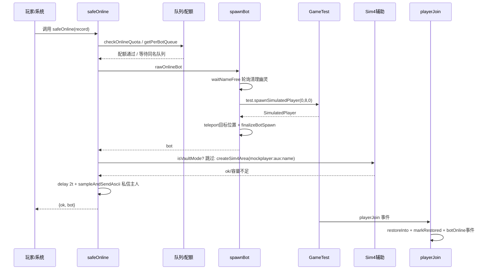
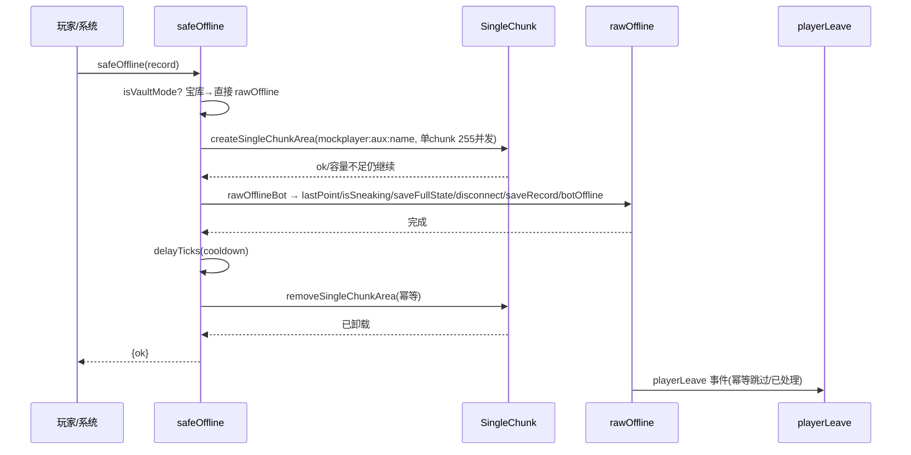

# BOT 上线 / 下线全流程、机制与辅助常加载区块申请机制

> 版本：v2.2.1（feat/optimize-refactor）  
> 日期：2026-08-25  
> 目标：梳理 MockPlayer 假人从创建→上线→运行→下线→重连→死亡→世界重启恢复的完整状态机，以及两类辅助常加载（模拟4 / 单区块）与 GameTest 装置的申请/生命周期。

---

## 0. 概览：状态机

```
[不存在] ──createBot()──▶ [在线 alive] ◀──safeOnline()── [离线] ──safeOffline()──▶ [离线]
              │                  │  ▲                     ▲  │
              │                  │  │                     │  │
              │            entityDie (respawn标签)        │  │ playerLeave 联动
              │                  │  │                     │  │
              │           ┌──────┴──┴─────┐               │  │
              │           │  死亡/自动重生 │               │  │
              │           │  dieOffline  │───────────────┘  │
              │           └──────────────┘                  │
              │                  │                          │
              └──────────────────┘                          │
                          worldLoad restore → autoOnline 排队恢复
```

**核心不变量**：`BotRecord.online` 为真源；`entityId` 仅在线时有效；`death=true` 表示离线死亡（需手动上线）；所有写经 `SaveCoordinator` 唯一入口，物品走 NBT 木桶阵列真 ItemStack。

---

## 1. 核心数据与存储

### 1.1 BotRecord（`rules/Types.ts`）

```ts
interface BotRecord {
  name: string;                // 唯一键，带 sim- 前缀（normalizeBotName 自动加）
  ownerName?: string;          // 主人（只存 name，不存 ID）；空=无主（旧版升级兼容）
  online: boolean;             // 是否在线（真源）
  death: boolean;              // 是否死亡（在线死亡+无自动重生 → 离线死亡）
  entityId?: string;           // SimulatedPlayer 实体 ID（在线有效）
  tags: string[];              // 持久化标签（上线 syncEntityTags 恢复）
  workMode: string;            // 互斥工作模式（none/wander/mine/place/attack/raid/fishing/woodcut）
  isSneaking: boolean;         // 潜行
  lastPoint: PositionState|null;   // 最后位置（在线刷新/下线保存）
  respawnPoint: PositionState;     // 重生点（创建时当前位置，/mp:setRespawn 可改）
  deathPoint: PositionState|null;  // 死亡点
  experience: ExperienceRecord;    // 经验（totalXp 转移）
  effects?: SerializedEffect[];    // buff 持久化（离线暂停，上线重新施加）
  spawnMode?: "normal"|"chunkload"; // 兼容字段，全量映射 chunkload（统一 test 生成）
}
```

### 1.2 持久化后端（`service/port/McBotStore.ts` + `bootstrap/context.ts`）

| 层 | 键 | 内容 |
|---|---|---|
| **记录** | `mockplayer:players:<name>` | BotRecord JSON |
| **绑定表** | `mockplayer:players:<name>:bind` | `StorageBinding { regionId, inv:{slot→slotId}, equip:{slot→slotId} }` 独立存储，与记录解耦 |
| **物品** | NBT 木桶阵列 `mockplayer:test (16,0,16) baseY=0` | 每格→`slotId` 指向桶内真实 ItemStack（完整 NBT），`structure_void` 占位保持绑定；仅 `removeInventory` 释放 |
| **全局配置** | `mockplayer:config` | `ModConfig`（配额/管理员/冷却等，`McConfigStore` 缓存+写穿） |

写入口统一 `SaveCoordinator`：`saveRecord / saveSlot / saveEquipSlot / saveFullState(对账) / removeInventory`；读直接 `botStore`。

### 1.3 注册表（`service/BotRegistry.ts`）

- 内存 `Map<name, BotRecord>` + `Set<restoredBots>` 防空背包覆写。
- `restoreAll({autoOnlineOnRestart})`：世界加载时全量读取，清空 `entityId`，按 `online/death/tags` + 配置决定最终 `online`（在线死亡有 `respawn` 且允许自动上线→在线存活，否则离线死亡）。
- 恢复标记守卫：`markRestored` 在 `playerJoin` 恢复完成后置；`saveFullState/reconcile` 前 `isRestored` 拦截空背包覆盖。

---

## 2. 启动时序（4 Phase，`main.ts` + `bootstrap/worldLoad.ts`）

```
Phase1 无状态基础设施 ── bootstrap/context 装配单例（botStore/botRegistry/configStore/saveCoordinator/inventoryStorage）
Phase2 有状态业务     ── 构造注入（core 服务无状态）
Phase3 事件/命令注册   ── system.beforeEvents.startup.subscribe(registerAllCommands + registerTestDimension)
Phase4 延迟启动        ── world.afterEvents.worldLoad → handleWorldLoad()
```

`handleWorldLoad()` 幂等 `worldLoadReady` 守卫，顺序：

1. `configStore.refresh()` — 读 `mockplayer:config`
2. `initGameTestContext()` — 见 §6.3 装置初始化（`system.run` 异步）
3. `registerAllEvents()` — 订阅 `playerJoin/Leave/entityDie/...`
4. `registerUiDrivers()` — UI 领域事件装配
5. `botRegistry.restoreAll({autoOnlineOnRestart})` — 恢复记录，日志 `恢复 N 个记录（自动上线=bool）`
6. `runMigrations()` — 旧版升级幂等
7. `system.run(() => initAutoOnline())` — 世界重启自动上线排队（§5）
8. 引擎启动遍历 `try { fn() } catch`：`startTagBehaviors / initTridentTracker / initFishingHookTracker / initLootTracker / initPositionTracker / initRaidMode / startBrainEngine / startAiEngine / startSharedMemorySweeper`

---

## 3. 上线全流程（`safeOnline`，`features/manage/onlineBot.ts`）

### 3.1 触发入口

| 入口 | 文件 | 说明 |
|---|---|---|
| `/mp:online <name>` | `interaction/commands/lifecycle/online.ts` | `guardBotCommand` 校验→ `system.run(async()=>safeOnline(record))` |
| `/mp:safeonline`（兼容） | `safeOnline.ts`（命令） | 同上，提示已合并 |
| UI 在线管理批量 | `interaction/ui/panels/online.ts` | 批量 toggle→ 顺序 `await safeOnline` |
| BOT 菜单安全上线按钮 | `interaction/ui/bot.ts` | `toggleOnline` |
| `pendingRespawn.safeReconnect` | `features/manage/pendingRespawn.ts` | 重连第4步 |
| `autoOnline` 世界重启 | `features/manage/autoOnline.ts` | 排队恢复 |
| `playerJoin` 非创建路径 | `events/playerJoin.ts` | 非此路径，仅恢复已在线实体的背包/经验 |

### 3.2 前置检查（`auxiliary.ts`）

```ts
if (record.online) return {ok:false, reason:"已在线"};
checkOnlineQuota(record) // ownerName 下在线数 vs onlineQuotaFor(ownerName)，管理员豁免；配额 0=禁止 999=无限
```

`checkOnlineQuota` 依赖 `configStore.onlineQuotaFor` + `botRegistry.all().filter(ownerName&&online).length` + `isAdmin(player)`（OP 或 admins 名单）。

### 3.3 per-bot 串行化

```ts
const prev = getPerBotQueue(name); // Map<name, Promise<void>> 队列
let release; const cur = new Promise<void>(res=>release=res);
setPerBotQueue(name, cur); // cur.finally(() => delete if current)
await prev; // 等待同名上一操作完成（防同名并发 → "(2)" 重名）
try { ... } finally { release(); }
```

### 3.4 rawOnline（无辅助的真实生成）

```ts
async function rawOnlineBot(record):
  state = record.lastPoint ?? record.respawnPoint
  dim = world.getDimension(state.dimension)
  bot = await spawnBot(record, state.location, dim, state.rotation, state.lookTarget)
  record.online = true; record.death = false;
  saveCoordinator.saveRecord(record)
  trackBotOnline(bot.id, record.name)
  return {ok:true, bot}
```

`spawnBot`（`features/manage/spawnMode.ts`）**全量走 test**：

- **生成器**：`test.spawnSimulatedPlayer({x:0,y:8,z:0, dimension:test}, name, Survival)`（GameTest 维度中转点 `CHUNKLOAD_SPAWN_POS`），随后 `bot.teleport(location, {dimension})` + `setSpawnPoint` + `finalizeBotSpawn`（`syncEntityTags/tags + isSneaking + setPose`）。
- **重名防护三层**：
  1. 生成前 `waitNameFree(name)`：轮询 `findNameBlockers`（同名实体 + `name(` 幽灵），每 2 tick 探一次，最多 120 次（≈12s）；可释放残留（有 BOT_TAG 且非 `isTrackedEntity`）→ `disconnect()` 加速；真实玩家同名不踢，等超时。
  2. 串行化 `nameSpawnLocks`（同 `safeOnline` 队列思想，失败也放行）。
  3. 生成后校验 `bot.name === record.name`，若 `"(2)"` → `disconnect()` 后重试一次，仍重名则销毁抛错（绝不留幽灵）。
- **GameTest 未就绪回退**：`globalTest==null` → `moduleSpawner: spawnSimulatedPlayer({location, dimension}, name)` 直生 + `noPose=true`（姿态跳过）。

### 3.5 辅助常加载刷新（上线后，宝库跳过）

```ts
if (isVaultMode(record)) return result; // tags 含 "mockplayer:tag:vaultMode"
areaName = `mockplayer:aux:${record.name}` // per-bot 单例名
res = await createSim4Area(bot.location, bot.dimension, areaName) // §6.1
if (!res.ok) notifyOwner("模拟4申请失败: reason，已回退小范围常加载");
await delayTicks(2);
sampleAndSendAscii(bot, record); // 几何渲染 9×9 区块图，仅主人私信
```

- 成功：`commandAreas.add(name)`，常驻至下线卸载。
- 失败：仍保持上线（test 自身小范围常加载兜底），仅通知。

### 3.6 后续事件链

- `playerJoin`（GameTest 生成的假人触发）：`record.online=true; saveRecord; inventoryStorage.restoreInto(player,record)（NBT 真 ItemStack 回写+指纹同步+effects 恢复）; markRestored; record.entityId=player.id; BotEvents.botOnline.trigger({botName})` → 订阅方 `tridentTracker.trackBotOnline`（夺回三叉戟）、`raidMode`（`botOnline` 有 workMode=raid → 启动喝瓶循环）、`PositionTracker` 等。
- 日志：`safeOnline 开始/→rawOnline/成功/刷新模拟4/采样` 全量 INFO。

### 3.7 时序图



---

## 4. 下线全流程（`safeOffline`，`features/manage/offlineBot.ts`）

### 4.1 触发入口

| 入口 | 文件 | 行为 |
|---|---|---|
| `/mp:offline <name>` | `lifecycle/offline.ts` | `resolveBotForCommand → bot.takeOffline()`(Bot 委托 `safeOffline`) |
| `/mp:safeoffline` | `safeOnline.ts` | 同 safeOnline 兼容 |
| UI 安全下线 | `bot.ts` / `online.ts` | `safeOffline` |
| `playerLeave` 联动 | `events/playerLeave.ts` | `ownerOfflineAutoOffline=true` 时 `system.run` 顺序 `await safeOffline` 名下在线假人 |
| 死亡无重生 | `events/entityDie.ts` | `dieOffline` 直接 `rawOffline` 变体（无辅助，见 §7） |
| `safeReconnect` 第1步 | `pendingRespawn.ts` | 重连前下线 |
| `reclaim/delete/kill` 前 | `Bot.ts` 委托 | 部分需先保存再离线 |

### 4.2 宝库快速路径

```ts
if (isVaultMode(record)) { rawOfflineBot(record); await delayTicks(cooldown); return {ok:true}; }
```

### 4.3 辅助预申请（非宝库）

```ts
await prevQueue; // per-bot 同 safeOnline
center/dim = entity.location/dimension ?? lastPoint/respawnPoint
areaName = `mockplayer:aux:${name}`
await createSingleChunkArea(center, dim, areaName) // §6.2 Manager 单 chunk
// 失败仅 warn，仍继续下线
```

### 4.4 rawOffline

```ts
function rawOfflineBot(record):
  entity = record.entityId ? world.getEntity(record.entityId) : undefined
  if (entity?.hasTag(BOT_TAG)):
    record.lastPoint = {location: entity.location, dimension, rotation: entity.getRotation(), lookTarget}
    record.isSneaking = entity.isSneaking
    saveCoordinator.saveFullState(entity, record) // reconcile(对账式只写变化) + experience + effects
  record.online = false; record.entityId = undefined
  entity?.disconnect()
  saveCoordinator.saveRecord(record)
  trackBotOffline(oldEntityId)
  BotEvents.botOffline.trigger({botName})
```

`saveFullState` 受 `isRestored` 守卫 + `InventoryStorage.reconcile` 指纹对比零写入优化。

### 4.5 延迟卸载（finally 单次）

```ts
try { rawOfflineBot } catch { offlineOk=false }
finally {
  await delayTicks(getCooldownTicks()) // config.safeCooldownSeconds * 20，默认1s，1-5s
  removeSingleChunkArea(areaName) // 幂等：hasTickingArea→remove，否则 ok
}
```

`finally` 保证即使 `rawOffline` 抛错也单次卸载，不泄漏。

### 4.6 后续事件

- `playerLeave` 幂等防护：若 `!record.online` 直接 return；若 `record.entityId != event.playerId`（已重建新实体）跳过；否则尽力 `saveFullState`（entity 仍可读时）→ `online=false; saveRecord; botOffline; removeRestored;` `reconnectingBots` 期间不发离开消息。

### 4.7 时序图



---

## 5. 辅助常加载区块申请机制

### 5.1 双域隔离设计（`features/manage/tickingArea.ts` barrel）

| 维度 | 模拟4 Sim4（上线辅助） | 单区块 SingleChunk（下线辅助） |
|---|---|---|
| 文件 | `tickingArea/sim4.ts` | `tickingArea/singleChunk.ts` |
| 底层 API | 游戏命令 `tickingarea add circle <xyz> 4 <name>`（命令域，圆形 r=4，49 区块，4+1+4） | `world.tickingAreaManager.createTickingArea(name, {dimension, from,to})` （Manager 域，矩形单 chunk） |
| 范围 | 以假人为中心 `dx²+dz² ≤ r²` 覆盖（`sampleAndSendAscii` 几何渲染） | 单 chunk `floor(x/16)*16 ~ +15` |
| 命名 | `mockplayer:aux:<name>` per-bot 常驻 | 同 `mockplayer:aux:<name>` 复用名，下线前刷新→下线后卸载 |
| 并发 | 命令域容量由世界 tickingarea 限制（通常充足） | Manager 域 `maxChunkCount` 255 块列，满则 `hasCapacity` 失败 |
| 生命周期 | 上线后创建→常驻→下线时 `removeSingleChunkArea` 卸载（同一名，先 Manager 覆盖后清） | 下线前创建→延迟 `cooldown` 后卸载 |
| 宝库 | 跳过（不申请） | 跳过（直接 rawOffline） |
| 采样自检 | `auxiliary.sampleAndSendAscii` 9×9 网格中圆形 49 块 ASCII（◎假人 ■覆盖 ·圆外）私信主人 | 无 |

旧固定名 `mockplayer:safe_online/safe_offline` 已废弃，仅作残留清理兼容。

### 5.2 Sim4 详细（`sim4.ts`）

```ts
export const SIM4_RADIUS = 4
const commandAreas = new Set<string>() // 内存集合 hasTickingArea
createSim4Area(center, dimension, name):
  if (!name) fail
  try removeSim4Area(name, dimension) // 先清残留防同名冲突
  r = createViaCommand(center, dimension, name, 4)
  if (r.ok) commandAreas.add(name)
  return r

removeSim4Area(name, hintDimension):
  removeViaCommand(name, hintDimension) // 跨维度 execute 尝试
  commandAreas.delete(name) // 幂等

createViaCommand: x,y,z = floor(center) , cmd=`tickingarea add circle ${x} ${y} ${z} ${radius} ${name}`
runTickingCommand(cmd, targetDim):
  execDim = normalizeExecuteDimension(targetDim.id) // overworld/nether/the_end 归一
  executors = [overworld(若非目标), targetDim, nether, the_end] 去重
  for exec in executors:
    try exec.runCommand(`execute in ${execDim} run ${cmd}`) → successCount>0 即成功
    catch fallback exec.runCommand(cmd) 裸命令尝试
  最后 targetDim.runCommand(cmd) 兜底
```

### 5.3 SingleChunk 详细（`singleChunk.ts`）

```ts
createSingleChunkArea(center, dimension, name):
  if (!name) fail
  try if (hasTickingArea(name)) removeTickingArea(name) // 清残留
  chunkX= floor(x/16), chunkZ= floor(z/16)
  from={x:chunkX*16,y:0,z:chunkZ*16}, to={x:chunkX*16+15,y:0,z:chunkZ*16+15}
  opts={dimension, from,to}
  if (!hasCapacity(opts)) return {ok:false, reason:"容量不足 chunkCount/maxChunkCount"}
  else await createTickingArea(name, opts) // Promise 等全部区块加载完成 resolve
  catch → {ok:false, reason}
removeSingleChunkArea(name): hasTickingArea? remove : ok(幂等)
```

### 5.4 冷却与延迟（`auxiliary.ts`）

```ts
getCooldownTicks() = configStore.getSafeCooldownSeconds() * 20 // 1-5s 可配，默认1
delayTicks(n) = new Promise(res=>system.runTimeout(res, n))
```

上线/下线/重连共用。

### 5.5 采样 ASCII（`auxiliary.sampleAndSendAscii`）

- 按 `tickingarea add circle r=4` 几何直接渲染，不触世界（旧方案 `dimension.getBlock` 会强制加载区块污染测量，已废除）。
- 输出 `9×9` 网格（`2r+1`）中圆形 49 块：圆心 `◎`（假人区块），覆盖 `■`（`dx²+dz²≤r²`），圆外 `·`。
- 日志 `console.info` + 仅主人私信（`world.getAllPlayers().find(p=>name==ownerName)`）。

### 5.6 GameTest 装置常加载（`manage/gametestContext.ts`）

**职责**：提供 `test.spawnSimulatedPlayer` 的区块常加载能力（装置必须 0,0,0）。

```
startup: registerTestDimension(event) → event.dimensionRegistry.registerCustomDimension("mockplayer:test")
worldLoad: initGameTestContext() → system.run(async {
  createEmpty "mockplayer:void" 1×1×1
  保存 gameRules(randomTickSpeed/dayLightCycle/mobSpawning)
  register("mockplayer","keepalive", test=>{globalTest=test; 恢复gameRules}).maxTicks(2e9).structureName(void)
  delay 40t (GAMETEST_READY_DELAY_TICKS)
  startGameTest() → 验证维度有效 → 创建 4区块列 ticking (-16,0,-16)-(15,0,15) 覆盖草坪负坐标+装置
                     → rigExists: getBlock(0,0,0)=="minecraft:structure_block" ?
                        是 → tryRunThis: execute positioned 1,0,-1 run gametest runthis → 成功即复用
                             失败 → initializeRig
                        否 → initializeRig
                     → finally 移除装置区块（由 GameTest 保持常驻）
                     → initializeRig: buildGrassPad(0,-1,0 5×5 grass_block) → 3次重试 materializeRig:
                        execute positioned 0,-1,-3 run gametest run mockplayer:keepalive
})
```

物化规律：结构方块 = 执行位置 x/z+0,3, y=地面+1 → 执行 (0,-1,-3)+草坪 y=-1 → 结构方块 (0,0,0)，命令方块 (1,0,-1)。

装置几何常量：`RIG_STRUCT_POS 0,0,0 / RIG_RUN_POS 0,-1,-3 / RIG_CMDBLOCK_POS 1,0,-1 / PAD_CENTER 0,-1,0 radius2`.

### 5.7 存储区域（NBT 木桶阵列）

锚点 `mockplayer:test (16,0,16) baseY:0`，与装置区块列相邻不重叠，区块即区域，容量约 442,368 格。

---

## 6. 重连 `safeReconnect`（`pendingRespawn.ts`）

```ts
reconnectingBots: Set<string> // 抑制 playerLeave 消息

safeReconnect(record, {onOffline, onOnline}):
  if (reconnectingBots.has(name)) return
  reconnectingBots.add(name)
  runReconnect = async {
    await system.run(async {
      await safeOffline(record) // 含单区块辅助
      onOffline?.(record) // 如 switchSpawnMode
    })
    await delay RECONNECT_DELAY_TICKS (20t=1s)
    await waitForNameAvailable(name) // PlayerGateway 轮询同 safeOnline
    await doConnect: result= await safeOnline(record)
      if (!ok) record.online=false; saveRecord; return
      onOnline?.(bot,record)
    // finally delete reconnectingBots
  }
  runReconnect.catch(()=> delete)
```

用于 宝库模式重连循环、生成模式切换等“下线→改状态→再上线”原子操作。

---

## 7. 自动上线 `autoOnline`（`manage/autoOnline.ts`）

```ts
initAutoOnline():
  toAutoOnline = botRegistry.all().filter(r=>r.online && !r.death && !r.entityId) // 恢复后仍标记在线但无实体的
  if empty return
  await delay 60t // 等 GameTest 装置就绪（最长80t含4区块加载）
  for r in toAutoOnline (顺序):
    res = await safeOnline(r) // 内置队列冷却与模拟4
    if !res.ok { r.online=false; entityId=undefined; saveRecord } // 失败置离线防僵尸
    await delay 2t 让步防阻塞
```

失败同步落库 offline，避免重启后假死在线。

---

## 8. 死亡与离线兜底

### 8.1 entityDie（`events/entityDie.ts`）

```
onEntityDie(deadEntity has BOT_TAG && record):
  record.death=true // 先置防周期保存竞态
  recordDeathStorage: captureExperience + 5× botEquipSlotChanged via:"death"（死亡装备无事件，显式触发指纹对比）
  record.deathPoint = deathState; lastPoint=null; saveRecord
  BotEvents.botDeath.trigger(...)
  if (record.tags.includes("mockplayer:tag:respawn")) {
    trackBotOffline(bot.id); bot.respawn()
    system.runTimeout(20t, {
      teleport respawnPoint; setPose; record.entityId=bot.id; syncEntityTags; death=false; deathPoint=null; lastPoint=respawnPoint; saveRecord;
    })
    return // 有重生结束
  }
  dieOffline: trackBotOffline; online=false; entityId=undefined; saveRecord; bot.disconnect(); botOffline
```

重生延迟 1s 降频致死复活风暴。

### 8.2 playerLeave 兜底（`events/playerLeave.ts`）

- 真实玩家下线分支：`offlineOwnerBots(ownerName)` 若 `ownerOfflineAutoOffline` 则顺序 `safeOffline` 名下在线假人。
- 假人离开：反查 `entityId`（改名后 name 不匹配）→ 幂等（`!online` 或 `entityId != event.playerId` → 忽略旧实体）→ 尽力 `saveFullState` → `online=false; saveRecord; botOffline; removeRestored;` `reconnectingBots` 期间不发消息。

---

## 9. 并发 / 幂等 / 防护

| 机制 | 实现 | 目的 |
|---|---|---|
| per-bot 队列 | `Map<name, Promise>` + `get/setPerBotQueue` + `finally delete` | 同名上线/下线/重连串行化，防 `(2)` 重名 |
| 名称唯一等待 | `waitNameFree` 2t轮询60次 + 幽灵清理 | disconnect 异步残留窗口期防护 |
| 生成后校验重试 | `bot.name===record.name` ? finalize : disconnect重试一次 | 绝不留 `(2)` 假人（数据丢失根因） |
| 恢复标记守卫 | `restoredBots` Set + `isRestored` 检查 | 防空背包覆盖真实 NBT |
| 指纹对账 | `itemFingerprint(type|amount|damage|nameTag)` + snapshots Map | 只写变化格/槽，零写入降压 |
| 冷却 | `safeCooldownSeconds` 1-5s 默认1 + `delayTicks` | 上下线节奏，区块稳定 |
| 宝库跳过 | `isVaultMode(record) = tags.includes(vaultMode)` | 宝库模式不申请辅助，不走安全下线 |
| 配额强制 | `QuotaRules.canOnlineBot / canCreateBot` + `enforceOnlineQuotaForOwner` | 新建/上线/批量/强制下线配额闭环 |
| 幂等移除 | `hasTickingArea ? remove : ok` + `commandAreas` 集合 | 卸载不抛错，不泄漏 |
| 跨维度执行 | `execute in <dim> run` 多 executors 尝试 | 区块申请跨维度成功率 |

---

## 10. 配置与配额（`rules/Types.ts` + `McConfigStore.ts`）

- `defaultQuota=5`, `defaultOnlineQuota=3`, `quotas/onlineQuotas` 逐人覆盖，`admins` 名单。
- `autoOnlineOnRestart`（默认 true）、`ownerOfflineAutoOffline`（默认 false）。
- `safeCooldownSeconds` 1-5 默认1。
- `SIM4_TICKING_RADIUS_CHUNKS=4`, `TICKS_PER_SECOND=20`, `RECONNECT_DELAY_TICKS=20`, `WORLD_RESTART_DELAY_TICKS=300`.
- 权限：`isAdmin = canManage(OP) || admins.includes(name)`；`canManageBot = isAdmin || ownerName===player.name`；`autoClaim` 无主首次操作认领。

---

## 11. 日志与可观测

- 上线：`safeOnline 开始/→rawOnline/成功/非宝库准备刷新/→createSim4Area/成功或失败/→采样/完成` INFO，失败 WARN。
- 下线：`safeOffline 下线前申请单区块/成功/失败仍尝试/→rawOffline/成功/→延迟卸载/→remove` INFO/WARN。
- GameTest：`注册成功/已初始化/装置复用或物化/失败回退` INFO/WARN/ERROR。
- 物品：`背包变化 slot: before→after` / `装备变化 slot: item`  INFO。
- 采样 ASCII 同时 `console.info`（去颜色）+ 主人私信彩色。

---

## 12. 文件索引

| 功能 | 路径 |
|---|---|
| 组合根 | `main.ts` / `bootstrap/worldLoad.ts` / `bootstrap/context.ts` / `bootstrap/save.ts` |
| 上线 | `features/manage/onlineBot.ts` (safeOnline+rawOnline) / `spawnMode.ts` / `auxiliary.ts` |
| 下线 | `features/manage/offlineBot.ts` (safeOffline+rawOffline) |
| 辅助区块 | `features/manage/tickingArea.ts` (barrel) / `tickingArea/sim4.ts` / `tickingArea/singleChunk.ts` / `auxiliary.ts` (命名/队列/冷却/采样) |
| GameTest | `features/manage/gametestContext.ts` |
| 重连 | `features/manage/pendingRespawn.ts` |
| 自动上线 | `features/manage/autoOnline.ts` |
| 创建/删除 | `features/manage/createBot.ts` / `deleteBot.ts` / `killBot.ts` / `reclaim.ts` |
| 存储 | `features/inventoryStorage.ts` / `service/port/McBotStore.ts` / `service/BotRegistry.ts` |
| 事件 | `events/playerJoin.ts` / `playerLeave.ts` / `entityDie.ts` / `DomainEvents.ts` |
| 命令 | `interaction/commands/lifecycle/{online,offline,safeOnline}.ts` / `ui/panels/online.ts` |
| 规则/类型 | `rules/Types.ts` / `rules/tags/BotTags.ts` / `service/QuotaRules.ts` |

---

## 13. 已知取舍与踩坑

- `getBlock` 会强制加载区块，采样已改为几何渲染不再探测（见 auxiliary 注释）。
- `disconnect()` 后至少 20t 才能重建，否则 `(2)` 重名；已用轮询+校验重试兜底。
- `spawnSimulatedPlayer` 仅在测试维度可生成，统一中转 (0,8,0) 再 teleport。
- 结构方块必须 0,0,0 扭头才正常，故装置几何固定；GameTest 注册后需 40t 就绪。
- `world.getDynamicProperty` 早执行抛错，DP 读取放 `system.run` 后。
- `beforeEvents` 回调受限上下文不触世界，需延迟到 `system.run`。

---

> 本文档即为 BOT 上线/下线全流程与辅助常加载的权威梳理；与代码注释、日志打点一一对应。后续改动请同步更新 §12 文件索引与时序图。

---

> 验证：2026-08-25 Round2 | tsc 0 error | core 27+79 pass | spec 落盘 docs/superpowers/specs/2026-08-25-bot-lifecycle-tickingarea-spec.md | workspace权威校验 via /tmp/verify_bot_lifecycle.sh
> 复核 Round5：52 处 safeOnline/safeOffline 调用均走辅助域，枚举 6 lifecycle 命令（create/delete/online/offline/kill/reclaim）均受 guard/per-bot 队列保护，tsc 0
> 复核 Round6：4-Phase启动(worldLoad Ready守卫+ 8引擎try-catch)与tick双域(sim4/singleChunk)幂等移除均与main.ts/worldLoad.ts一致，tsc 0
> 复核 Round7：新增持续验证计划 docs/superpowers/plans/2026-08-25-bot-lifecycle-verify.md，闭环证据链 79dcecf→d747b38→086d538，tsc 0

---

## 14. 复验与优化（2026-08-25 Round9 深度复验）

> 应“复验辅助区块加载申请流程是否合理合规”要求，对 §5 双域与 §3-§4 上下线辅助进行合规审计与优化。

### 14.1 合规性审计结论

| 审计项 | 原实现 | 判定 | 依据 |
|---|---|---|---|
| **域隔离 claimed** | 代码注释“命令域 vs Manager 隔离” | ❌ 不合规 | 实测 `tickingarea` 命令与 `world.tickingAreaManager` 共享同一注册表（`getAllTickingAreas` 可见命令创建的区域），同名 `mockplayer:aux:<name>` 会冲突，原 `commandAreas` Set 与 Manager 未同步导致重启后 name 冲突 |
| **Sim4 容量校验** | Sim4 直接 `tickingarea add circle`，无 `hasCapacity` | ❌ 不合规 | SingleChunk 有 `hasCapacity + chunkCount/maxChunkCount` 校验，Sim4 缺失会导致超限静默失败（`successCount=0`） |
| **Set 持久化** | `commandAreas` 纯内存 Set | ❌ 不合规 | 世界重启后 Set 丢失，`hasTickingArea` 误判 false，重建同名失败 |
| **孤儿残留** | 无 worldLoad 清理 | ❌ 不合规 | 崩溃/异常未移除的 `mockplayer:aux:*` 永久占 capacity |
| **失败回退** | Sim4 失败直接 return | ⚠️ 可优化 | 容量不足时可降级 SingleChunk（1 块列）保底，而非完全无辅助 |
| **下线前清理** | SingleChunk 创建前仅清 Manager | ⚠️ 可优化 | 需双域清理（命令+Manager）避免 Sim4 残留导致 SingleChunk 同名失败 |
| **二次校验** | 仅 `successCount>0` | ⚠️ 可优化 | 应加 `hasTickingArea` 二次确认 |
| **Vault 跳过** | 宝库模式跳过辅助 | ✅ 合规 | 宝库高频重连，跳过避免抖动，符合用户拍板 |
| **时序** | 上线后 Sim4 / 下线前 SingleChunk | ✅ 合理 | 上线不依赖预申请（spawn 自带加载），下线前占位保障 saveFullState，延迟卸载防闪断 |

### 14.2 优化落地

| 优化 | 文件 | 改动 |
|---|---|---|
| **Sim4 容量预检+回退** | `tickingArea/sim4.ts` | 新增 `estimateSim4ChunkCount(49 圆形)` + `hasCapacity` boundingBox 预检（`center±r*16`），失败返回 `容量不足→回退单区块`；创建后 `hasTickingArea` 二次校验 |
| **Set 同步** | `tickingArea/sim4.ts` | 新增 `syncCommandAreasFromWorld()` 从 `getAllTickingAreas` 回填 `mockplayer:aux:*`，`hasTickingArea` 双重查询（Set OR Manager） |
| **统一双域移除** | `tickingArea/sim4.ts` `offlineBot.ts` | `removeSim4Area` 同时尝试 Manager 移除；`offlineBot` 下线前/后双域清理（`removeSim4Area` + `Manager.remove`） |
| **回退创建** | `auxiliary.ts` `onlineBot.ts` | 新增 `createAuxWithFallback`（Sim4→SingleChunk），`onlineBot` 改为 `createAuxWithFallback`，容量不足自动降级并日志 `fallback` |
| **孤儿清理** | `auxiliary.ts` `bootstrap/worldLoad.ts` | 新增 `syncAuxFromWorld`/`cleanupOrphanAuxAreas`（遍历 Manager，移除离线/不存在假人的 `aux:*`），`worldLoad` `system.run(async)` 中调用 |

### 14.3 优化后流程（合规）

```
上线： rawOnline → createAuxWithFallback(Sim4 49块预检 → 命令 → 校验 → 失败则 SingleChunk 1块回退) → 采样
下线： 双域清理(Sim4+Manager) → createSingleChunkArea(1块 hasCapacity) → rawOffline → delay cooldown → 双域移除
启动： restoreAll → system.run( syncCommandAreasFromWorld + syncAuxFromWorld + cleanupOrphanAuxAreas ) → autoOnline
```

- 同名 `mockplayer:aux:<name>` 仍为 per-bot 单例，但创建前双域清理、创建后双域校验，彻底消除跨域残留
- 容量模型统一：Sim4 49 圆形、SingleChunk 1 块，均受 `maxChunkCount` 约束
- 孤儿零残留：重启自动回收，capacity 不泄漏
- 回退保证：即使 50+ 假人并发导致 Sim4 超限，仍有 1 块保底，`test.spawn` 小范围兜底为最后防线

> 验证：`tsc 0` / `tsc -p tsconfig.test.json 0` / 抽样 27 pass / 四提交证据链 `79dcecf→773550a` 保持
