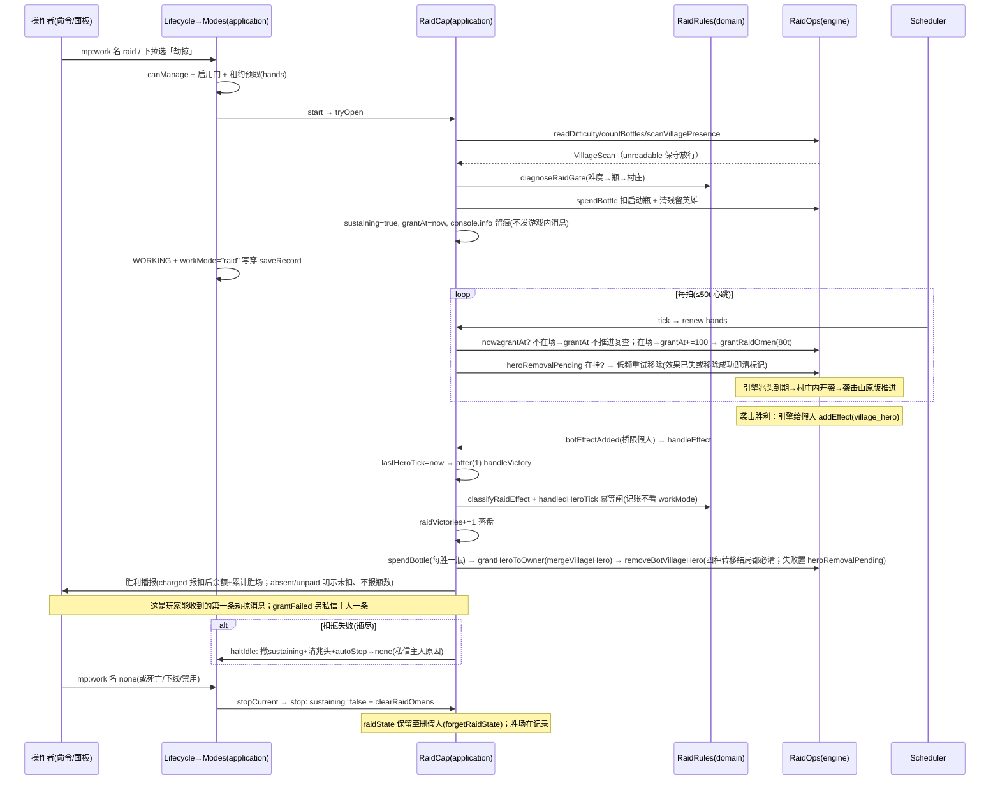

# 劫掠（raid）功能介绍与流程

> 一句话：假人**原地挂机**常驻施加「袭击之兆」buff，周期性到期即引发袭击，胜利后自动记账扣瓶、把「村庄英雄」叠加转移给主人并清除假人 buff，前置条件（非和平难度/背包有不祥之瓶/身处村庄）缺失时自动停摆落回空闲。

文中 `文件 · 符号` 标注均对应 `scripts/` 下当前实现，逐条与代码行为核对。工作模式中文名以 `domain/Catalog.ts` 的 `WORK_MODES` 表 `raid` 条目 label「劫掠」为准。

## 0. 概念速览

**劫掠**是一个工作模式（`WorkMode = "raid"`）：假人**不移动、不攻击、不选目标**——它只做一件事：按节拍往自己身上施加短时效的 `minecraft:raid_omen`（袭击之兆）。兆头到期时若假人在村庄范围内，**袭击由原版引擎自己生成与推进**；假人作为袭击参与方，胜利时引擎给参与玩家（含假人）挂 `minecraft:village_hero`（村庄英雄）——脚本层正是用这个 **effectAdd 事件作为胜利的唯一识别信号**，随后完成记账（胜场 +1、扣一瓶）、英雄转移（叠给主人并从假人身上移除）、播报三件事。

**两条使用前置（必须让使用者知道）**：

1. **假人要在村庄范围内原地挂机**——袭击在兆头到期时按假人所在位置判定，假人离场（死亡/下线）就没有开袭主体，也没有胜利信号；
2. **袭击生物需由假人击杀才算得胜**——本模式零战斗（不扫目标、不挥拍、不导航），胜负全凭原版机制，**所以胜场不保证**。

正因如此，**开张不做任何游戏内播报**：能否开袭、能否打赢都不由本能力决定，播报一个"劫掠启动"等于替引擎做了一个不确定的承诺。玩家能收到的第一条劫掠消息就是真正打赢的那一条。开张事实（闸门通过、扣瓶后余额）只留 `console.info`；前置不满足被拒时的三句中文原因仍原样回显（那是确定事实）。

- 目录定义：`domain/Catalog.ts` 的 `WORK_MODES` 表 `raid` 条目——label「劫掠」，help「原地常驻施加袭击之兆引发袭击（需在场挂机+村庄+非和平+不祥之瓶；本模式不攻击，胜场不保证）」，`requiresLeases: ["hands"]`，`tier: "heavy"`。该 help 由 `interface/Commands.Behavior.ts` 的 `mp:work <名> list` 目录渲染，`interface/Panels/HelpGuide.ts` 另有「劫掠模式专有说明」段承载完整前置说法。
- 瓶费模型（`domain/RaidRules.ts` 的 `RAID_BOTTLE_COST` 常量，头注定案）：**启动扣一瓶，此后每次胜利再扣一瓶**；扣不动（无瓶）即停。施加兆头本身不喝瓶（`engine/RaidOps.grantRaidOmen` 是一次 `addEffect`，与瓶子物品无关）。
- 施加节拍（`domain/RaidRules.ts` 常量组）：每 `RAID_OMEN_GRANT_INTERVAL_TICKS = 100`（5 秒）施一次 `RAID_OMEN_GRANT_DURATION_TICKS = 80`（4 秒）的 Lv.1 兆头（`RAID_OMEN_GRANT_AMPLIFIER = 0`，假人常驻刷袭不抬波次强度）。时长短于间隔留出的 20t 到期窗就是"兆头到期 = 开袭时刻"的机制窗口。
- 三道开张闸门（`domain/RaidRules.diagnoseRaidGate`，判定顺序即成本升序）：① 难度非和平（`isPeacefulDifficulty`，只拦和平，简单照样放行）→ ② 背包有不祥之瓶（`countBottles ≥ 1`）→ ③ 村庄存在感知（`scanVillagePresence`：32 格村民半径查询 + ±16/±8 床方块批量采样，村民或床任一命中即在村庄；查询抛穿按 `unreadable` **保守放行**，区块未加载 ≠ 没有村庄）。
- 适用场景：在村庄边放置假人持续刷袭击，收割战利品并给主人累积村庄英雄 buff。

## 1. 术语速查

| 术语                        | 指代                                                                                                                                                                                                    | 位置                                                                                                                                                      |
| --------------------------- | ------------------------------------------------------------------------------------------------------------------------------------------------------------------------------------------------------- | --------------------------------------------------------------------------------------------------------------------------------------------------------- |
| 相位机 SUSTAIN              | 本能力唯一相位——"心跳续租 + 到点施兆头"的循环，其余状态全在按假人键控的 raidState（D-01：能力全局单例、零实例字段）                                                                                     | `application/Capabilities/Raid.ts` 的 `RaidCap` 类与 `RaidCapPhase` 类型                                                                                  |
| `RaidFlowState`             | 单假人劫掠流程状态：`sustaining`（持续位）/ `grantAt`（下次施兆头 tick）/ `lastHeroTick` 与 `handledHeroTick`（胜利幂等对）/ `heroRemovalPending`（村庄英雄移除失败待心跳重试的置位标记）               | `domain/RaidRules.ts` 的 `RaidFlowState` 接口与 `createRaidFlowState()`                                                                                   |
| `Runtime.raidState`         | raidState 的宿主：botId 键控 Map，**切模式/下线不清、仅删假人清**（`forgetRaidState`，防 botId 复用同名重建继承）                                                                                       | `application/Runtime.ts` 的 `raidStates` 字段、`Composition.ts` 的 `botDeleted` 订阅                                                                      |
| `raidVictories`             | 累计胜场持久账（跨会话/重启），随 `BotRecord` 落盘；旧档缺失/脏值静默归零                                                                                                                               | `domain/Record.ts` 字段、`engine/RecordStore.sanitize()`                                                                                                  |
| 胜利信号 effectAdd          | 引擎给假人挂 `village_hero` 触发的效果添加事件——本能力全部胜利判定的唯一来源                                                                                                                            | `engine/Bridges.ts` 的 `onEffectAdd`（`instanceof Player + isBotEntity` 双闸限假人）→ `main.ts` 的 `onBotEffectAdded` → `BotEventBus` 的 `botEffectAdded` |
| 村庄英雄合并                | 转移规则：`Effect.duration` 按引擎定义是**施加时的总时长**（不是剩余时长），合并即两侧总时长相加（封顶 `VILLAGE_HERO_MAX_DURATION`）、等级取高、下限 1 tick（`addEffect` 时长界 [1, 2e7]，给 0 会抛错） | `domain/RaidRules.mergeVillageHero()`                                                                                                                     |
| hands 租约                  | 手部资源独占（HOLD，TTL 100t、心跳 50t 续租）；**不申请 motion/gaze**——劫掠不占走位与视角                                                                                                               | `RaidCap.requires()`、`domain/Leases.ACTION_HOLD_TTL_TICKS`                                                                                               |
| `RAID_HEARTBEAT_TICKS = 50` | 心跳醒距：保证 hands 租约续期与 grantAt 到点判定都 ≤TTL 半程                                                                                                                                            | `application/Capabilities/Raid.ts` 常量                                                                                                                   |

## 2. 启用与配置入口

```
/mp:work <假人名> raid          ──→ Lifecycle.changeWorkMode → Modes.change（在线即开张/离线预置）
/mp:work <假人名> 劫掠           ──→ 中文别名同效（domain/Catalog.modeAliasMap()）
/mp:work <假人名> [无参|list]    ──→ 渲染模式目录（raid 条目带 help 前置说明）
假人面板 →「行为」→ 工作模式下拉「劫掠」（黄色警示色）──→ 同上 changeWorkMode
管理面板 → 全局配置「⚠ 劫掠模式」开关                  ──→ workModeEnabled.raid（禁用即停：在线假人批量回空闲）
```

- 命令：`interface/Commands.Behavior.ts` 的 `BEHAVIOR_COMMANDS` 表 `mp:work` 条目（枚举值表由 Catalog 派生）；成功回执"已切换为 劫掠"，开张被拒时**原样回显三道闸门给出的中文原因**（`Modes.refuse` 分支）。
- 面板：`interface/Panels/Behavior.ts` 的 `showBehaviorPanel()` 与 `modeColor()`（raid 条目按 `color.warn` 黄色标注）；纪律"开关先写、后切模式"。
- 管理门：`interface/Panels/Admin.ts` 的 `MODE_META` 表 `raid` 条目与 `showGlobalConfig()`（toggle `wm_raid`；提交回调里本次 true→false 则逐个在线假人 `changeWorkMode(…, "none")` 即停）。
- 帮助文案：`interface/Panels/HelpGuide.ts` 劫掠条目。
- **无逐假人配置项**：节拍/瓶费/英雄叠加规则全部写死在 `domain/RaidRules.ts` 常量组；唯一配置面是全局 `workModeEnabled.raid`（`domain/Config.ts` 的 `workModeEnabled` 字段，默认表由 `defaultEnabledModes()` 生成——目录内全部模式默认开，`Admin.ts` MODE_META tooltip 文案已统一为"默认开启"口径）。
- 前置资源由主人自备：假人背包里的**不祥之瓶**（`OMINOUS_BOTTLE_ID = minecraft:ominous_bottle`，经物品栏/仓库系统放入即可，能力只读账不生成）与假人所在位置（村庄范围内）。

## 3. 启动序列（`Modes.change` → `RaidCap.start`，`application/Modes.ts` 的 `change()`）

```
changeWorkMode(viewer, botId, "raid")              （Lifecycle：存在性 + canManage）
 └─ Modes.change(botId, "raid", now)
     ├─ config.workModeEnabled.raid 关 → 拒「该模式已被管理员禁用」
     ├─ 无会话（离线）→ 只写穿 record.workMode + saveRecord（预置，下次上线回挂）
     ├─ 状态非 ACTIVE/WORKING → 拒「当前状态不可切换模式」
     ├─ 同模式且上下文在位 → 幂等成功
     ├─ stopCurrent(session)：先停旧能力
     ├─ 租约预取：hands 以 HOLD/TTL 100t acquire；被占 → 撤租约拒「所需资源被占用（持有者：X）」
     ├─ 建上下文 {mode:"raid", phase:{name:"INIT",…}, data:{}}
     ├─ RaidCap.start：
     │    ├─ cap 缺失返「能力上下文缺失」
     │    ├─ tryOpen（闸门 → 扣启动瓶 → 置持续）：
     │    │    ├─ 闸门不过（diagnoseRaidGate）→ 日志 + clearRaidOmens 清残留兆头 → 回中文原因
     │    │    ├─ spendBottle 扣不到（判定后瓶被拿走/容器瞬态）→ 回无瓶原因
     │    │    ├─ 残留 village_hero 先移除（不移除则下次胜利不再触发 effectAdd，断信号链；
     │    │    │    移除失败置 heroRemovalPending，由心跳节拍重试）
     │    │    └─ st.sustaining=true、st.grantAt=now、console.info 留痕（扣后余额）——不发游戏内消息
     │    └─ 全过 → 相位 SUSTAIN、nextWakeAt = now+1（下一拍即施首轮兆头）
     │    start 返错 → 撤租约、卸上下文、workMode 写穿 none、原因回显
     └─ transitTo("startWork") → WORKING；record.workMode="raid" 写穿保存；emit botWorkModeChanged
```

**闸门只在"开张"时判**：`start`（首次开启）与 `reopen`（持续位丢失自愈）各判一次；进入 SUSTAIN 后运行期不做周期性闸门重判（头注定案"不挂低频重判"），运行中失效的唯一出口是胜利扣瓶失败（§5）。

## 4. 执行流程：SUSTAIN 单相位 + 胜利旁路

### 4.1 心跳主循环（`RaidCap.tick()`）

主循环由 Scheduler 唯一驱动（`application/Scheduler.runSession()`）：每 tick 先 `leases.expire`，再对 `state === "WORKING"` 且 `now >= capability.phase.nextWakeAt` 的会话回调 `cap.tick`。tick 同步、短、无 await、无自旋（F-18/D-05）。

每一拍：

1. **记录在位检查**：`runtime.record(botId)` 已移除 → 本拍直接 return（管线负责收会话）。
2. **续租心跳**：`leases.renew("hands", "raid", now, ACTION_HOLD_TTL_TICKS)`——醒距 50t < TTL 100t，续租与节拍判定都靠这个心跳。
3. **持续位校验**：`st.sustaining` 为假（回挂失败/切模式竞态丢位）→ `reopen()`：重新走一遍 tryOpen，过闸则继续（`setPhase 1t`），不过闸则 `haltIdle`（撤持续位 + 清兆头 + `capHost.autoStop` 落空闲并私信主人）。
4. **到点施兆头**：`now >= st.grantAt` 时——`botAlive` 假（死亡/下线瞬态）则 `st.grantAt` **不推进**、不施兆头、不置停，按 50t 心跳复查，回到场即到点续施；在场则**先推进** `st.grantAt = now + 100` 再执行 `grantRaidOmen`（一次 `addEffect(RAID_OMEN, 80, amplifier 0)`），失败只 `console.warn`（本拍跳过，下拍节拍照走）。同一到点拍顺带重试 `heroRemovalPending`（村庄英雄移除失败标记）：效果已不在身或移除成功即清标记——按 100t 节拍低频重试，胜利信号链不再因一次移除失败长期断掉。
5. **排下一拍**：`setPhase(min(50, max(1, st.grantAt - now)), "SUSTAIN")`——即恒定 ≤50t 心跳，到点拍自然命中。

```
Modes.change("raid") ─→ tryOpen 扣瓶 ─→ [SUSTAIN, grantAt=now]
        │ Scheduler: WORKING 且 now ≥ nextWakeAt（每 ≤50t 一拍）
        ▼
   tick: renew hands → sustaining? ──否──→ reopen（闸门重判）
        │是                                  ├─ 过 → 继续 SUSTAIN
        now ≥ grantAt? ──是──→ botAlive 假 → grantAt 不推进、心跳复查
        │                       └─ 在场 → grantAt+=100 → grantRaidOmen 一次（80t 短时效）
        │                          （heroRemovalPending 待移除村庄英雄同拍 100t 低频重试）
        ├─ 不过 → haltIdle（清兆头+autoStop 落空闲）
        └─（未到点）排下一拍
   （永循环，直至手动停止/死亡/下线/禁用/tick 抛穿/胜利扣瓶失败）
```

### 4.2 胜利旁路（`handleEffect` → `handleVictory`）

引擎侧袭击胜利 → 假人获得村庄英雄 → `Bridges.onEffectAdd`（限假人实体）→ `main.ts` 桥 → `botEffectAdded` 领域事件 → `RaidCap` 构造期订阅的 `handleEffect()`：

1. 过滤：记录不在/workMode 非 raid/typeId 空/`classifyRaidEffect` 非 `village-hero` → 忽略（兆头自施事件不参与决策）。
2. `st.lastHeroTick = clock.now()`，`clock.after(1, handleVictory)` **延迟一拍**离开事件回调上下文。
3. `handleVictory()`（幂等闸：`st.handledHeroTick >= st.lastHeroTick` 直接 return；**胜利记账不看当前 workMode**——`after(1)` 执行前才切模式的迟到事件照样计胜并清英雄）：
   - `record.raidVictories += 1` → `saveGate.saveRecord` 落盘（失败只告警）；
   - **实体不在场（死亡/下线瞬态）只记账**：不读背包、不移除、不扣瓶、不移植英雄，按 `fee="absent"` 播报"假人不在场，本瓶未扣"后返回（不在场读瓶恒 0，故不报瓶数；假人无站位快照，该条消息经 `notifyStatus` 的离场退回分支按名字直达主人，不会因取不到快照而丢掉）；
   - 在场：**先扣瓶再播报**（`charged = st.sustaining ? spendBottle : false`）→ `grantHeroToOwner(record, hero)`（返回 `HeroTransfer`：主人在场则 `mergeVillageHero` 合并后 `grantVillageHero` 叠加并世界公告；主人不在线则世界公告"未能转移"；假人无主则静默；**效果写入失败返回 `grantFailed`**）→ `removeBotVillageHero`（**无论转移成功与否都必移除**——挂身 40 分钟则下次胜利不再触发 effectAdd，断整个信号链；失败置 `heroRemovalPending` 由心跳节拍重试）→ 胜利播报（`fee = charged ? "charged" : "unpaid"`；英雄读不到时该条明说"本轮村庄英雄效果读取失败，未能转移"）→ `grantFailed` 另私信主人 `HERO_GRANT_FAILED_MESSAGE`（本轮仅计入胜场，下一轮照常）；
   - 扣瓶先于停摆判定：`st.sustaining && !charged` → `haltIdle`（瓶尽：胜场与英雄已记账转移，不吞本轮胜利）；`charged` 则 `st.grantAt = clock.now()`（兆头续上不断档）。

要点（均为代码事实）：

1. **零目标选择、零战斗动作**：能力不扫敌对实体、不调 `attacker.swing`、不导航、不写视角——袭击的生成/推进/胜负判定全在原版引擎，脚本只是"施兆头的节拍器 + 胜利的信使"。劫掠与定点攻击/导航能力**没有任何代码衔接**（衔接点在 §6 所述的全局子系统层）。由此两条对外口径：假人须在村庄内**原地挂机**，且**袭击生物需由假人击杀才算得胜**，本模式不代劳战斗，**胜场不保证**；该前置写在 `Catalog` help 与 `HelpGuide` 专有说明里，开张时不播报（见 §0）。
2. **村庄感知的距离口径**：村民 32 格一次半径查询、床 ±16(x/z)/±8(y) 一次 `getBlocks` 批量采样（y 更厚会把体积抬到 5 万格成慢日志源，`engine/RaidOps.scanVillagePresence` 常量注）；命中即短路不计数。
3. **实体瞬态三处显形**：tick 到点拍 `botAlive` 假**不推进 grantAt、心跳复查**、tryOpen 里 `countBottles` 不可读按 0（保守拒启）、`handleVictory` 的"离场只记账"（absent 口径不报瓶数）——全部**不置停、不清位**，回到场自然续。
4. **幂等防重**：英雄事件按 tick 戳对（lastHeroTick/handledHeroTick）去重，专防 `removeEffect` 失败等重复事件把胜场/瓶费/叠加双计（`RaidFlowState` 字段注）。

## 5. 停止与结束条件

| 触发                                                | 路径                                                                                                                              | 现场清理                                                                                                                                                                                                                      |
| --------------------------------------------------- | --------------------------------------------------------------------------------------------------------------------------------- | ----------------------------------------------------------------------------------------------------------------------------------------------------------------------------------------------------------------------------- |
| 手动切回空闲/其它模式（`mp:work <名> none` / 面板） | `Modes.change → stopCurrent`（`Lifecycle.changeWorkMode()`）                                                                      | `RaidCap.stop`：撤 `sustaining` + `clearRaidOmens`（RAID_OMEN/BAD_OMEN 双清，尽力而为）；租约由 stopCurrent 强制 `releaseBy` 撤净；**raidState 条目保留**（handledHeroTick 等随假人存活，防切回后继承错账）；胜场在记录上不丢 |
| 瓶尽（启动无瓶/胜利扣瓶失败）                       | `tryOpen` 拒启 或 `handleVictory → haltIdle`                                                                                      | `haltIdle`：撤持续位 + 清兆头 + `capHost.autoStop` → `Composition` 实现私信主人原因 + `modes.change("none")` 写穿落空闲                                                                                                       |
| 闸门失效（reopen 重判不过）                         | tick 的 sustaining 丢失分支 → `reopen → haltIdle`                                                                                 | 同左（和平难度/无瓶/不在村庄三句中文原因之一回传主人）                                                                                                                                                                        |
| 下线管线                                            | `Lifecycle` 下线首步冻结撤能力 `stopCurrent`                                                                                      | 会话销毁、兆头清、sustaining 撤；raidState 不清（下次上线回挂）                                                                                                                                                               |
| 死亡                                                | `handleDeath → stopCurrent` → DYING；autoRespawn 则 `respawnTail → attachAfterRestore → start → tryOpen` **重新开张（再扣一瓶）** | 死亡清场；回挂失败私信主人并落空闲（`Lifecycle.respawnTail()`）                                                                                                                                                               |
| 管理员禁用 raid                                     | `Admin.showGlobalConfig()` 提交回调对在线假人批量切 none                                                                          | 同手动停止                                                                                                                                                                                                                    |
| 能力 tick 抛穿                                      | `Scheduler.runSession` catch → `stopCurrent` + `workMode="none"` 写盘 + 错误日志                                                  | tick 内原子调用各自 try-catch，实际抛穿只可能来自续租/框架层；只停该假人                                                                                                                                                      |
| 删除假人                                            | `Lifecycle` 删除管线                                                                                                              | `Composition` 的 `botDeleted` 订阅 `runtime.forgetRaidState(botId)` **全清状态**（唯一全清口，防 botId 复用同名重建继承）                                                                                                     |

## 6. 与其它子系统的交互

- **Clock / Scheduler**（`engine/Clock.ts`、`application/Scheduler.ts`）：唯一时钟与唯一驱动者；等待全表达为 `phase.nextWakeAt`（D-05），胜利处理的"等一拍"用 `clock.after(1)` 出事件上下文。
- **租约（Leases）**：仅 hands HOLD 100t、心跳 50t 续租（`RaidCap.requires()`/`tick()`）。不占 motion/gaze——劫掠假人可被跟随/闲逛等走位能力之外的事物移动（见 §7 位置漂移限制）。
- **Events / 桥**：`botEffectAdded` 是本能力唯一的事件入边（`application/Events.ts` 的 `BotEventMap`、`engine/Bridges.ts` 的 `onEffectAdd`、`main.ts` 的 `onBotEffectAdded`）；出边仅 `botWorkModeChanged` 数据留档。**播报不走事件总线**——`notifyStatus` 直接经 `notifyOwnerAndNearby`（主人不限距离 + 64 格内真人按实体 id 去重）与 `broadcastWorld`（英雄转移公告）；假人离场取不到站位快照时退回 `notifyOwner` 按名字私信主人，消息不因快照缺失而丢。
- **SaveGate / 记录**：胜场经 `saveGate.saveRecord(record)` 落盘；`spendBottle` 写容器后调 `inventoryChanged` 报脏（Composition 回挂钩子 mark inventory）——扣瓶可持久。`engine/EntityOps.ts` 的 `EXCLUDED_EFFECTS` 把 village_hero/bad_omen/raid_omen 列为**流程性效果不序列化**：上下线导出不搬运它们，防止恢复重施干扰劫掠检测链。
- **攻击（AttackCap/Attacker）**：零衔接——假人不打袭击者，袭击胜负全凭原版机制（村民/铁傀儡/玩家防御 + 参与判定）。
- **导航（mover/Navigate）**：零衔接——不申请 motion、不走路；mover 仅被 `notifyStatus` 只读借用 `snapshotOf` 取实体当下维度与坐标（跨维传送后播报不喊空维）；`snapshotOf` 与 `botAlive` 同源（都是 `botOf + botValid`），故假人离场时它必然返回 null——这正是 `notifyStatus` 需要主人私信退回分支的原因。
- **ToolGuard（`engine/ToolGuard.ts`）**：无直接关系——劫掠不挥武器；仅当袭击者打伤假人时，受伤桥触发装备五槽耐久复查（`main.ts` 的 `onBotHurt → persistEquipmentCheck`），护甲损耗照常由全局守护兜底，劫掠能力侧零感知。
- **Common.ts（CapabilityHost.autoStop）**：劫掠**重度使用**——haltIdle 的"前提缺失自动停机"出口（区别于 attack 永不自停）。
- **旧版迁移（`domain/Migrate.ts`）**：旧 `raidMode` 行为标签映射为 raid 且**优先定案**（LEGACY_TAG_MODE 表与 `raid 优先 break`）；旧档无胜场账，`raidVictories` 从 0 起。

## 7. 已知限制与引擎约束

- **开张后不重判闸门**：进入持续后假人被推挤/自行走出村庄，兆头照施（无袭击可引发、无胜利可触发、也就不再扣瓶）——能力不会自动停，靠手动停止/死亡重开张/禁用收场；村庄感知只在 start/reopen 两个口子执行。
- **开张不发游戏内消息，也没有"这一轮没开成袭击"的反馈**：启动瓶照扣，之后既无胜场也无提示，使用者只能从"胜场数不涨"反推前置不满足或假人已离场——这是"唯一确定的是胜利"口径下的有意取舍，代价由上面两条前置提示（Catalog help / HelpGuide 专有说明）承担。死亡自动重生会走 `attachAfterRestore → start → tryOpen` **再扣一瓶**，连续送死等于连续扣瓶。
- **不转移则无胜利信号**：袭击胜利的识别完全依赖"假人身上新挂 village_hero"这一事件——假人当时不在场（死亡/下线瞬态）该轮只记账胜场，英雄留在原地等下一轮事件；主人不在线时英雄无法转移（世界公告明示）。
- **英雄移除失败不再断链**：`removeBotVillageHero` 失败置 `heroRemovalPending` 标记，随 SUSTAIN 每 100t 到点拍低频重试（tryOpen 启动前清理残留失败同置此标记）——效果已不在身或移除成功即清标记；village_hero 挂身 40 分钟期间下一次胜利不再触发 effectAdd、整条旁路静默停摆的旧断点已闭合。
- **胜利必然清场**：`removeBotVillageHero` 在转移之后无条件执行——叠给主人成功、主人不在线、无主、甚至效果写入失败四种结局都要清，因为英雄挂身 40 分钟期间下一次胜利不再触发 effectAdd，整条胜利旁路会静默停摆；叠失败的结局另私信主人 `HERO_GRANT_FAILED_MESSAGE`（本轮只计胜场）。
- **波次强度恒 Lv.1**：`RAID_OMEN_GRANT_AMPLIFIER = 0` 写死，假人常驻不抬波次（不叠加喝瓶数的坏兆头升级路径）。
- **扣瓶语义**：对背包**第一个**不祥之瓶做最小改动（堆叠减量/=1 清槽），不换位；主手恰为瓶子时该槽原位被改动（`engine/RaidOps.spendBottle` 注"不碰主手"指不换位不清主手其它物品）。不祥之瓶不可堆叠时逐槽消耗。
- **胜利播报口径**：`raidVictoryReport` 两个维度分叉——英雄侧：读到 `EffectInfo` 报"获得村庄英雄 Lv.N（约 M 分钟）"，读不到报"本轮村庄英雄效果读取失败，未能转移"（不编造等级）；瓶费侧按 `RaidVictoryFee` 三分叉——`charged`"本瓶已扣，剩余 N 瓶"、`absent`"假人不在场，本瓶未扣"、`unpaid`"本瓶未扣"，扣没扣字样与实况一致，未扣不报数。
- **F-18 tick 纪律**：施兆头/扣瓶各一次原子调用，等待唯一经 nextWakeAt；`scanVillagePresence` 是开张拍里最慢的调用（批量 getBlocks 已限体积），运行拍零世界扫描。
- **D-01 纪律**：`RaidCap` 单例零实例字段，跨拍状态全在 `Runtime.raidState`（botId 键控）与 `session.capability.phase`，胜场在 `record.raidVictories`——新增状态不得挂类字段。
- **性能分级 heavy**：多人同开常驻节拍的提示见 `Admin.ts` MODE_META tooltip（"默认开启"口径已与 `defaultEnabledModes()` 全开实况一致）。

## 8. 时序图（启用→常驻循环→胜利→停止）


