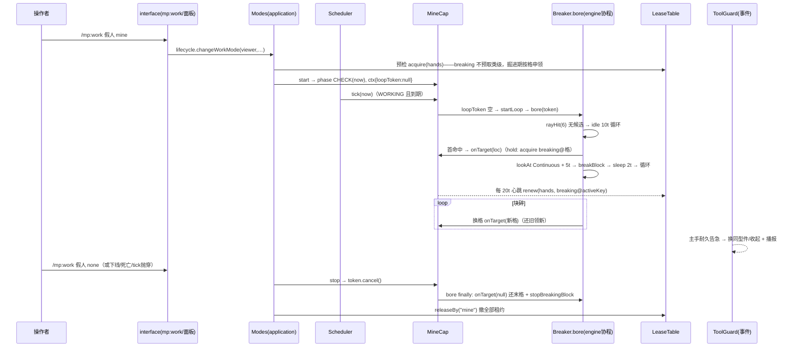

# 定点挖掘（mine）功能介绍与流程

> 一句话:假人原地不动、不转向，沿准星方向持续连挖正前方 6 格内命中的方块，直到手动停止。

> 假人"原地不动、沿准星射线连挖"的工作模式。文中 `文件 · 符号` 标注均对应 `scripts/` 下当前实现，逐条与代码行为核对。

## 0. 功能介绍

**定点挖掘**是工作模式之一（`record.workMode = "mine"`）：假人保持在原地，**永不移位、永不转向**，持续破坏准星射线（6 格内）第一命中的可挖方块，块碎后下一拍自然落到后方块改挥，块间零空挡（`application/Capabilities/Mine.ts` 头注、`domain/Catalog.ts` 的 `WORK_MODES` 表 `mine` 条目）。

- 目录文案：`定点挖掘` / "持续挖掉正前方准星命中的方块（不动·不转向）"（`domain/Catalog.ts` 的 `WORK_MODES` 表 `mine` 条目）。
- 典型场景：对着矿脉/方块墙挂机连挖、劈山开洞——假人面向哪里，就一直朝那个方向掘进。
- **永不停机哲学**：bore 协程无超时永不自退；无候选/瞬态失效只是停挥低息重探；"磨不动"（工具劣质、耐久耗尽前）就地续挥，**绝不拉黑停挖**（`Mine.ts` 头注、`domain/MineRules.ts` 头注）。
- **逐格选工具**：每格开挥前按命中方块类型从背包选优主手工具（石/矿→镐、土→铲、木→斧、叶→锄剪；不可归类则保持当前主手），选优健康优先、无健康件退告急件、无该策略工具徒手（`Mine.ts` 的 `ensureTool` 常量、`domain/MineRules.ts` 的 `toolStrategyForBlock`、`engine/ToolKit.ts` 的 `makeEnsureToolForBlock`→`domain/HarvestRules.ts` 的 `pickToolSlot`）；硬度预测仍不做，由节拍自证。
- **缺工具不停摆 + 报警**：目标方块需要工具（可归类）但背包无合适件时，保持**徒手继续挖**，并按 botId 节流（≥200t）经 `engine/Hooks.ts` 的 `onMiningNoTool`→`Composition.ts` 把报警送**假人主人**（文案取 `domain/HarvestRules.ts` 的 `toolStrategyLabel` 如"镐"），掘进绝不因缺工具停摆。

### 前置条件（代码事实）

| 项        | 要求                                                                                                                                                                      | 出处                                                                                                                                         |
| --------- | ------------------------------------------------------------------------------------------------------------------------------------------------------------------------- | -------------------------------------------------------------------------------------------------------------------------------------------- |
| 假人      | 存在记录且可管理（主人或管理员）；离线允许"预置"，下次上线生效                                                                                                            | `application/Lifecycle.ts` 的 `changeWorkMode()`、`application/Modes.ts` 的 `change()` 离线预置支                                            |
| 全局开关  | `config.workModeEnabled.mine` 未被管理员禁用（**默认开**，`defaultEnabledModes()` 默认表全模式开；tier=base）                                                             | `domain/Catalog.ts` 的 `WORK_MODES` 表 `mine` 条目与 `defaultEnabledModes()` 函数、`domain/Config.ts` 的 `GlobalConfig.workModeEnabled` 字段 |
| 租约      | 类级预取仅 `hands`（HOLD，同会话内与他能力互斥预检）；`breaking` **不预取类级租约**，由 bore 换格时 `hold()` 按格申领（格级键互斥判定，预取阶段不产生键为 `""` 的类级账） | `MineCap.requires()`、`MineCap.hold()`、`Modes.change()` 租约预取循环                                                                        |
| 位置/朝向 | 无任何校验——假人当前朝向即掘进方向，启用前请摆好头                                                                                                                        | （`MineCap.start()` 无位置检查）                                                                                                             |
| 工具/耐久 | 每格开挥前按方块类型选主手工具（选优健康优先，无该策略工具则徒手照挖并按 botId 节流报警给主人）；掘进中主手耐久告急另由 ToolGuard 事件驱动换同型件 | `engine/ToolKit.ts` 的 `makeEnsureToolForBlock`/`alertNoTool`、`domain/HarvestRules.ts` 的 `pickToolSlot`、`engine/ToolGuard.ts` 的 `guard()` 私有方法 |
| 世界      | 射线内（≤6 格）需有候选方块；区块未加载读不到时按"无目标"处理循环重探                                                                                                     | `engine/Atomic.ts` 的 `rayHit()`、`engine/Breaker.ts` 的 `bore()` 无候选分支                                                                 |

## 1. 启用 / 配置入口

```
/mp:work <假人名> mine          ──→ lifecycle.changeWorkMode → modes.change(botId,"mine")
假人面板 →「行为菜单」→ 工作模式下拉选"定点挖掘" ──→ 同上（Panels/BotPanel.ts 的 showBotPanel()「行为菜单」按钮 → Panels/Behavior.ts 的 showBehaviorPanel() workMode 下拉与提交）
管理员全局配置 →「⛏ 定点挖掘」启停开关      ──→ config.workModeEnabled.mine（Panels/Admin.ts 的 MODE_META 表 mine 条目）
```

- 命令：`mp:work <假人> [模式id|list]`（`interface/Commands.Behavior.ts` 的 `BEHAVIOR_COMMANDS` 表 `mp:work` 条目）。参数枚举由目录派生（模式 id，如 `mine`）；执行侧再查 `modeAliasMap()`，中文名"定点挖掘"亦可解析（`mp:work` 的 `execute()`、`domain/Catalog.ts` 的 `modeAliasMap()`）。无参/`list` 渲染目录（当前高亮、禁用标注）。
- 面板：行为面板下拉仅列 `workModeEnabled` 允许的模式（`Panels/Behavior.ts` 的 `showBehaviorPanel()`）；节拍类参数**不入面板**（`Panels/Behavior.ts` 头注）。
- 权限：`changeWorkMode` 统一过 `canManage`——非主人且非管理员拒绝（`Lifecycle.changeWorkMode()`）。
- **无可调参数**：挖掘距离 `REACH = 6`（`Mine.ts` 的 `REACH` 常量）、心跳醒距 20t（`Mine.ts` 的 `HEARTBEAT_POLL_TICKS` 常量）、挥击节拍 `MINE_SWING_TICKS = 2`、空探间隔 `IDLE_RECHECK_TICKS = 10` 全部写死为常量，注释明示"写死不入配置"（`domain/MineRules.ts` 的节拍常量段）。没有范围/深度/目标方块过滤——除排除清单外可挖即挖。
- 离线预置：无会话时只写穿记录 `workMode`，下次上线/复活尾段 `attachAfterRestore` 回挂生效（`Modes.change()` 离线预置支与 `Modes.attachAfterRestore()`、`Lifecycle.online()`/`Lifecycle.respawnTail()` 回挂点）。

## 2. 启动序列（Modes 编排，`application/Modes.ts` 的 `change()`）

```
modes.change(botId, "mine", now)
 ├─ 记录不存在 / 模式被禁用 → 拒绝（中文原因 + console.warn 留痕，change() 的 refuse() 出口）
 ├─ 状态闸门：仅 ACTIVE/WORKING 可切（none 额外允许 DYING）
 ├─ stopCurrent(旧能力)：stop 幂等清场 + releaseBy 撤租约
 ├─ mine.requires()=[hands] 逐项 acquire HOLD 预检（breaking 不预取类级——
 │    类级键为 ""，预取会留一笔无主可续的死账；格级冲突由 bore 期 hold() 申领时判定）
 │    冲突 → releaseBy 回滚 → 拒"所需资源被占用（持有者：…）"
 ├─ 建 capability={mode:"mine", phase:{CHECK,nextWakeAt:now}, data:{}}
 ├─ MineCap.start：ctxOf 挂 data["mine"]={loopToken:null, activeKey:""}
 │    返回原因"能力上下文缺失"则整体落空闲（cap 缺失属编程异常）
 ├─ transitTo("startWork")、record.workMode="mine"、saveGate.saveRecord
 └─ events.emit("botWorkModeChanged")（无全服播报，仅 console.warn 日志）
```

D-01 纪律：`MineCap` 全局单例（`Composition.ts` 装配段 `modes.register(new MineCap())` 注册）、**零实例字段**，全部私有状态挂 `session.capability.data["mine"]`（`Mine.ts` 头注、`MineCtx` 接口与 `start()` 的 ctxOf 段）。

## 3. 执行流程：心跳相位机 + 常驻掘进协程

挖掘是**双层结构**：application 侧只有 CHECK/DIG 两个名义相位、心跳 20t 一跳的薄壳；真正的逐 tick 掘进节奏在 engine 侧 `breaker.bore` 常驻协程里（`Mine.ts` 头注、`engine/Breaker.ts` 的 `bore()`）。

### 3.1 Scheduler 驱动（`application/Scheduler.ts` 的 `runSession()`）

每 tick 全局时钟广播（`engine/Clock.ts` 的 `start()`）后，会话调度判 `state===WORKING && now >= phase.nextWakeAt` 才回调 `cap.tick`；逐会话异常隔离。tick 本体同步、短、无 await；唯一触世界的例外：**本拍若触发协程自愈发起，`bore` 的同步段会读射线并可能开挥**，掘进节拍随后由常驻协程自持，tick 回调本身不等待、不自旋（F-18，`Mine.ts` 的 `tick()` 注释口径）。

### 3.2 `MineCap.tick`（`Mine.ts` 的 `tick()`）

```
tick(session, now):
 ├─ ctx.loopToken 为 null → startLoop 发起/自愈重启常驻协程
 ├─ leases.renew("hands", ttl=100)
 ├─ ctx.activeKey 非空 → leases.renew("breaking", ttl=100, key=当前格)
 └─ setPhase(20, "DIG")  → 下个心跳约 20t 后
```

- **自愈**：协程无论以何种方式结束（正常 resolve / 异常 reject），`retire()` 把 `loopToken` 置回 null（仅仍属主才销标，绝不清掉新协程的标），下个心跳自动重启（`MineCap.startLoop()`，"异常尾不杀模式"）。协程异常另留日志 `掘进协程异常 bot=…`（`startLoop()` 的 catch 分支）。

### 3.3 常驻掘进协程 `breaker.bore`（`Breaker.ts` 的 `bore()`）

参数由 Mine 侧给定：`maxDistance=6, isCandidate=isMineCandidate, onTarget=hold, idleTicks=10, swingTicks=2, token`（`startLoop()` 的 bore 调用参数）。

```
bore 循环（每轮）:
 1. 与 breakAt/chain 同互斥域：该 bot 已有在途破坏 → 直接 return
    （属偶发竞态兜底；模式互斥下正常不会撞上）
 2. botOf/botValid 失败（实体瞬态/重连窗口）→ onTarget(null) 归还末格 →
    sleep(idleTicks=10t) 重探 continue
 3. 实体句柄对账：bot.id 与上一轮记录（lastEid）不同＝实体被替换（死亡重连/
    重生尾）——旧句柄的 lookAt 锚定已失效 → 复位 aimed、清末格重锚，
    下轮重瞄（自发重连后不再对着旧方向歪挖）
 4. rayHit(bot, 6)：准星射线第一命中块（引擎 getBlockFromViewDirection，
    Atomic.ts 的 rayHit()，floor 取整 F-25）
 5. 无命中 或 !isMineCandidate(hit.id) → 同上归还+低息 10t 重探
    ——液体流入=原块已碎，计入 gone 判定，故液体必须在候选层排除（Breaker.ts 的 LIQUID_IDS 常量与 isGone()、MineRules.ts 头注）
 6. 命中格变化（moved）→ onTarget(loc) 换格：先释放旧格 breaking 租约再
    申领新格（见 §3.4）；换格时若属主判定失败（他人在途）→ sleep(1t) 快频重试
 7. 锁定候选格且 aimed 未置：lookAtLocation(hit.center, LookDuration.Continuous)
    锚定 + 5t 扭头等待，aimed 置位——**同一实体句柄生涯只瞄这一次**，此后永不
    重瞄；仅实体替换（步骤 3）复位重锚（必须 Continuous：Instant 约 2s 引擎自回中，F-06）
 8. 开挥前按命中格 `hit.id` 选主手工具（`ensureTool` 每格一次，换格或首瞄后开挥拍触发，
    toolEnsured 标位防逐 tick 全背包扫描；异常 catch 不拦掘进）
 9. bot.breakBlock(loc)，catch 静默下拍射线重判
 10. sleep(swingTicks=2t) 回 1
 退出：仅 token.cancelled（能力 stop）——finally 归还末格 onTarget(null)、
 stopBreakingBlock() 唯一一次收尾（掘进全程不 stop，块间零空挡）
```

节拍表：挖掘/放置 2t、攻击 8t（`MineRules.ts` 的节拍常量段）；各假人独立相位机互不干扰。

### 3.4 breaking 逐格租约缝 `hold`（`Mine.ts` 的 `hold()`）

bore 换格/开挥前回调，Mine 层在此做租约的"还旧领新"：

- 键 = `blockKey(x,y,z)`（`domain/Leases.ts` 的 `blockKey()`）；breaking 在租约表中**按格细粒度共存**（同格互斥、异格并行，`domain/Leases.ts` 的 `LeaseTable` 类注释与 `breaking` 字段），HOLD 带 TTL=`ACTION_HOLD_TTL_TICKS`(100t)（`Leases.ts` 的 `ACTION_HOLD_TTL_TICKS` 常量）。
- 射线移开/无目标（loc=null）→ 释放当前格租约、`activeKey=""`、返回 false。
- 对准**不走 gaze 租约**：首格锚定后射线钉死属掘进原子内聚语义（`MineCap.requires()` 注释）；stop 时无需视角中性化（`MineCap.stop()` 注释）。引擎侧注视残留由 TTL 过期 + Scheduler `leases.expire` 兜底撤销（`runSession()` 的 `leases.expire` 段、F-06）。

## 4. 停止 / 结束条件

挖掘模式**自身没有"达标"概念**（无深度/数量目标，永不自退），退出全部来自外部：

| 路径                    | 行为                                                                                                                       | 出处                                                         |
| ----------------------- | -------------------------------------------------------------------------------------------------------------------------- | ------------------------------------------------------------ |
| 切到 `none`/其他模式    | `stopCurrent` → `MineCap.stop`：cancel token（幂等），bore finally 自扫 stopBreakingBlock + 末格租约；releaseBy 撤全部租约 | `Mine.ts` 的 `stop()`、`Modes.change()` 调用 `stopCurrent()` |
| 下线管线                | doOffline 步骤 1 冻结撤能力（同 stop 序）                                                                                  | `Lifecycle.offline()`                                        |
| 死亡                    | `stopCurrent` → DYING；自动重生尾段 `attachAfterRestore` 回挂挖掘                                                          | `Lifecycle.handleDeath()`/`Lifecycle.respawnTail()`          |
| 上线半途失败 / 在途离场 | `abortOnline`/epoch<1 撤销管线均 `stopCurrent`                                                                             | `Lifecycle.abortOnline()`、`Lifecycle.handleLeave()`         |
| **能力 tick 抛穿**      | Scheduler 捕获 → `stopCurrent` + `record.workMode="none"` 落空闲 + console.error                                           | `Scheduler.runSession()` 的 tick try-catch 分支              |
| 管理员禁用模式          | 只拦**新的**切换（`Modes.change()` 的禁用闸）；已在线运行的挖掘不受追溯影响                                                | `Modes.change()`                                             |

注意 `stop` 与协程竞态的安全设计：stop 先销 token，bore 退出时 `retire` 只在"仍属主"时清标——停后不会被心跳误启（`tick()` 与 `startLoop()` 的注释）。

## 5. 与其他子系统的交互

- **导航/移动**：零交互。挖掘不申领 `motion` 租约，假人不走位不转头；朝向来自上线时恢复的 home 姿态（yaw/pitch）。
- **注视租约**：不走 gaze（§3.4）；`requires()` 仅 hands+breaking（`MineCap.requires()`）。
- **ToolGuard（工具耐久守护）**：事件驱动的常驻守护，与挖掘**解耦**——库存变化事件（含耐久损耗）转发 `toolGuard.onInventoryChanged`（`main.ts` 的 `boot()` 中 `installBridges` 的 `onBotInventoryChanged` 回调），主手工具耐久告急（<5% 或剩余 <10 点，`domain/ToolRules.ts` 的 `isDurabilityCritical()` 与阈值常量）时换同型健康件或保护性收起，60t 冷却防递归风暴（`ToolGuard.ts` 的 `GUARD_COOLDOWN_TICKS` 常量与 `guard()`）。换件结果经 `botToolGuardFired` 事件全服播报（`Composition.ts` 的 `setAtomicHooks` 中 `onToolGuardFired` 钩子、`interface/Notify.ts` 的 `installNotify()` 订阅段）。挖掘**已接入** `ensureTool` 逐格择优换装（`BoreOptions.ensureTool` 字段、`bore()` 换格开挥前调用、`engine/ToolKit.ts` 的 `makeEnsureToolForBlock`）：每格按命中方块类型选主手工具，耐久告急另由本守护同型兜底。
- **掉落物/资源回收**：`breakBlock` 的掉落物由引擎就地生成，**挖掘不含掉落磁吸**（磁吸是采集族的 `DropSuction`，目录 requires 对照 `Catalog.ts` 的 `WORK_MODES` 表采集族条目）；掉落物靠假人自身碰撞拾取或留在原地，日后可用 `/mp:reclaim` 或回收面板取回假人身上部分（见《资源回收.md》）。
- **保存门控 SaveGate**：模式切换即 `saveGate.saveRecord` 写穿 `workMode`（`Modes.change()` 的保存段）；经验回写走 Scheduler 周期任务——`XP_SYNC_TICKS=100`，注释点名"挖掘经验挂在实体上，不回写则面板显示上线前快照"（`Scheduler.ts` 的 `XP_SYNC_TICKS` 常量与 `syncExperience()`）；RESTORING 冻结窗由 SaveGate epoch 双挡（F-26/ADR-5），挖掘能力只在 epoch 提交后的 ACTIVE/WORKING 态才被回挂。
- **日志/播报**：切换成功仅 `console.warn` 游戏日志 + `botWorkModeChanged` 事件（Notify 未订阅该事件，无全服刷屏）；命令/面板有即时回执（`mp:work` 的 `execute()` 回执段、`showBehaviorPanel()` 提交回执段）。帮助文案见 `interface/Panels/HelpGuide.ts` 的 `SECTIONS` 表（定点挖掘条目与挖矿 FAQ）。

## 6. 候选方块规则（`domain/MineRules.ts`）

排除清单只防两类死循环，**不做任何"挖不动"预测**（`MineRules.ts` 头注）：

- 技术方块/引擎拒破：基岩、屏障、命令方块族、结构方块/空隙/拼图、`moving_block`、传送门族、火族、`light_block*` 前缀（覆盖 0..15 变体）等——`breakBlock` 永不消失，准星撞上即无限空挥（`MineRules.ts` 的 `NON_MINEABLE_EXACT`/`NON_MINEABLE_PREFIXES` 排除表）。
- 空气/液体：`air`/`cave_air`/`void_air`/水/熔岩及流动变体——液体计入破坏原子的 gone 判定（`Breaker.ts` 的 `LIQUID_IDS` 常量与 `isGone()`），不判液体会"隔山打牛"续挖目标后方无关方块（秒报 broken 后同格再现即永循环）。
- 其余全部收为候选，**含植被**（可破即破，用户规格 2026-09-27 永不停机）；离线单测 `tests/domain.M5Rules.test.ts` 的"挖掘候选"用例双向锁定该口径。

## 7. 已知限制与引擎约束

| 约束          | 说明                                                                                                                                   | 编号/出处                                                                                     |
| ------------- | -------------------------------------------------------------------------------------------------------------------------------------- | --------------------------------------------------------------------------------------------- |
| tick 回调纪律 | 心跳薄、同步、无 await——重活全在时钟 sleep 驱动的协程里；仅自愈发起拍的本拍同步段会触世界（bore 起手读射线/开挥），tick 不等待不自旋   | F-18（`Mine.tick()` 注释、`domain/Capability.ts` 头注）                                       |
| 注视回中      | 首瞄必须 `LookDuration.Continuous`；引擎租约化注视防残留焊死                                                                           | F-06（`Breaker.breakAt()`/`bore()` 的 lookAt 段、`Modes.stopCurrent()` gaze 中性化段）        |
| 坐标取整      | 射线命中格一律 `Math.floor`（round 在负半轴错位）                                                                                      | 代码注 F-25（`engine/Atomic.ts` 的 `blockFloor()`）                                           |
| 生成体旋转锁  | 装置出生即转离，朝向由 teleport 定型后才开挖                                                                                           | F-01/F-02（AGENTS 速查、`Lifecycle.respawnTail()` 的 teleport 定型段）                        |
| 空背包恢复窗  | epoch 提交前 SaveGate 挡一切保存，模式回挂在提交之后                                                                                   | F-26/ADR-5（`domain/Session.ts` 的 `epoch` 字段、`Lifecycle.online()` 的 epoch 提交与回挂段） |
| 方向不可调    | 同一实体句柄生涯内不重瞄、不走位；实体被替换（重连/重生）后重锚也只是照**当前准星**重瞄，不改方向——想换方向只能停下切 none、转向、再开 | `Mine.ts` 头注、`Breaker.bore()` 的实体对账段                                                 |
| 无进度目标    | 无深度/数量/方块类型过滤参数；对面是圆石墙就一路挖穿                                                                                   | `MineRules.ts` 头注、§1                                                                       |
| 无掉落磁吸    | 挖出的掉落物不主动归拢（与采集族不同）                                                                                                 | §5                                                                                            |
| 区块依赖      | 射线区未加载读不到 → 视为无候选，10t 低息空探，不报错                                                                                  | `Breaker.bore()` 的无候选分支                                                                 |
| 耐久无预告    | 挖掘按格择优换装，健康优先、无该策略工具则徒手；掘进中告急另靠 ToolGuard 事件守护同型兜底；换装/守护异常仅日志不拦挖                    | `bore()` 的 ensureTool 调用 try-catch、`pickToolSlot` 两段式、`ToolGuard.onInventoryChanged()` |

## 8. 时序图（启用后一次完整掘进）


