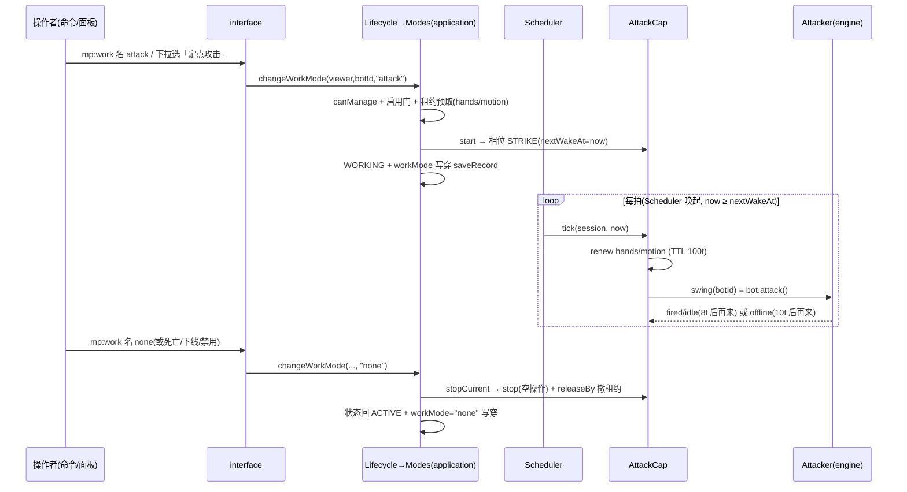

# 定点自动攻击（attack）功能介绍与流程

> 一句话:假人原地不动、不转向，按固定节拍持续向面朝方向近战挥击，挂在刷怪点位上自动清扫走近的实体。

> 假人"定点三件套"（挖掘/放置/攻击）之一的近战盲挥管线。文中 `文件 · 符号` 标注均对应 `scripts/` 下当前实现，逐条与代码行为核对。设计口径见 `../../../../docs/mockplayer/03-详细设计/04-能力体系与调度.md` §3.3 与 `11-归档源码对齐差异审查.md`【缺47/缺48、差异#53】。

## 0. 功能介绍

**定点攻击**是一个工作模式（`WorkMode = "attack"`）：假人**原地不动、不转向**，按固定节拍持续向正前方发起一次引擎近战挥击（`bot.attack()`）。命中归属（头部射线拾取、挥击扫击范围、敌我判定）**全部在引擎侧**，脚本层不选目标、不回读确认、不写视角——即"盲挥"（`engine/Attacker.ts` 与 `application/Capabilities/Attack.ts` 各自头注）。

- 目录定义：`domain/Catalog.ts` 的 `WORK_MODES` 表 `attack` 条目——label「定点攻击」，help「持续向正前方近战挥击（不动·不转向·盲挥）」，`requiresLeases: ["hands", "motion"]`，`tier: "base"`。
- 适用场景：在刷怪场/怪物洞口等固定点位摆放假人，让它朝一个方向持续清扫走近的实体。
- 前置条件（以代码为准）：
  1. 假人**在线**（会话处于 ACTIVE/WORKING 才能起跑；离线只允许预置模式，见 §2）；
  2. 操作者通过 `canManage`（管理员或主人；无主假人仅管理员，`domain/Permissions.ts` 的 `canManage()`、`application/Lifecycle.ts` 的 `changeWorkMode()`）；
  3. 管理员未禁用该模式（`workModeEnabled.attack`，默认**开**，`domain/Catalog.ts` 的 `DEFAULT_ON` 常量）。
  - **主手物品不做校验**：空手、拿方块照样挥（伤害按引擎规则）；武器耐久由 ToolGuard 全局守护兜底（§6）。
  - **朝向归主人**：能力永不转向，启动前把假人摆成想要的朝向即可（盲挥固有语义，设计 04 章 §3.3）。

## 1. 术语速查

| 术语                        | 指代                                                                                                                                        | 位置                                                                                                                 |
| --------------------------- | ------------------------------------------------------------------------------------------------------------------------------------------- | -------------------------------------------------------------------------------------------------------------------- |
| 相位机 STRIKE               | 本能力唯一相位——"每拍挥一下"的循环，相位即全部状态（D-01：能力全局单例、零实例字段）                                                        | `application/Capabilities/Attack.ts` 的 `AttackCap` 类                                                               |
| 挥击原子 `attacker.swing`   | 单次 `bot.attack()` 的发起与结果回报：`fired`（挥出）/ `idle`（引擎冷却未起挥，无伤害语义）/ `offline`（实体不可用/抛穿）                   | `engine/Attacker.ts` 的 `SwingResult` 类型与 `Attacker.swing()` 方法                                                 |
| `ATTACK_INTERVAL_TICKS = 8` | fired/idle 后的连点节拍（tick），**写死不入配置**（用户规格【缺47/缺48】，旧逐假人"动作间隔"配置项已整删）                                  | `domain/MineRules.ts` 的节拍常量段                                                                                   |
| `IDLE_RECHECK_TICKS = 10`   | offline（实体瞬态）时的低息重探间隔                                                                                                         | `domain/MineRules.ts` 的 `IDLE_RECHECK_TICKS` 常量                                                                   |
| hands / motion 租约         | 手部与移动资源的独占租约（HOLD，TTL 100t 每拍续租）；motion 仅**占位防走位类能力互踩**，本能力自身不导航                                    | `application/Capabilities/Attack.ts` 的 `requires()` 与 `tick()`、`domain/Leases.ts` 的 `ACTION_HOLD_TTL_TICKS` 常量 |
| 定点三件套                  | mine/place/attack 统一"不动·不改视角·机械重复"模型（规格修订 2026-09-27，差异#53：attack=盲挥，d.ts 目标由头部射线拾取，脚本侧无需/无法瞄） | `application/Capabilities/Attack.ts` 头注                                                                            |

## 2. 启用与配置入口

```
/mp:work <假人名> attack          ──→ lifecycle.changeWorkMode → modes.change（在线即起跑/离线预置）
/mp:work <假人名> 定点攻击         ──→ 中文别名同效（domain/Catalog.ts 的 modeAliasMap()）
/mp:work <假人名> [无参|list]      ──→ 渲染模式目录（当前高亮、禁用标注）
假人面板 →「行为」→ 工作模式下拉「定点攻击」 ──→ 同上 changeWorkMode
管理面板 → 全局配置「⚔ 定点攻击」开关        ──→ workModeEnabled.attack（禁用即停：在线假人批量回空闲）
```

- 命令：`interface/Commands.Behavior.ts` 的 `BEHAVIOR_COMMANDS` 表 `mp:work` 条目（`execute()`），枚举值表由 Catalog 派生；成功回执"已切换为 定点攻击"，失败原样回显拒绝原因。
- 面板：`interface/Panels/Behavior.ts` 的 `showBehaviorPanel()`（下拉项按 `workModeEnabled` 过滤、`workMode` 单选下拉、提交走 `changeWorkMode`）。纪律"开关先写、后切模式"。
- 管理门：`interface/Panels/Admin.ts` 的 `MODE_META` 表（attack 条目与 tooltip）、`showGlobalConfig()`（toggle `wm_attack`；提交回调里本次 true→false 的模式，逐个在线假人 `changeWorkMode(…, "none")` 即停）。
- 无任何节拍/目标/物品配置项——参数就是"模式 id = attack"这一个开关。

## 3. 启动序列（`Modes.change`，`application/Modes.ts` 的 `change()`）

```
changeWorkMode(viewer, botId, "attack")            （Lifecycle.changeWorkMode()：存在性 + canManage）
 └─ Modes.change(botId, "attack", now)              （不经 Mailbox，同步切换）
     ├─ config.workModeEnabled.attack 关 → 拒「该模式已被管理员禁用」
     ├─ 无会话（离线）→ 只写穿 record.workMode + saveRecord + 日志，
     │    下次上线/复活尾段 attachAfterRestore 回挂生效
     ├─ 状态非 ACTIVE/WORKING → 拒「当前状态不可切换模式」
     ├─ 同模式且上下文在位 → 幂等成功
     ├─ stopCurrent(session)：先停旧能力
     ├─ 租约预取（D-02 冲突即拒）：hands、motion 各以 HOLD/TTL 100t acquire；
     │    任一被占 → 撤已得租约、拒「所需资源被占用（持有者：X）」
     ├─ 建上下文 {mode:"attack", phase:{name:"INIT", nextWakeAt:now}, data:{}}
     ├─ AttackCap.start：cap 缺失返「能力上下文缺失」拒绝启动；
     │    否则相位直接置 STRIKE、nextWakeAt = now（当拍即可被调度）（AttackCap.start()）
     │    start 返错 → 撤租约、卸上下文、workMode 落 none、原因回显（change() 的 start 拒绝分支）
     └─ transitTo("startWork") → WORKING；record.workMode="attack" 写穿保存；
        console.warn 切换日志；emit botWorkModeChanged
```

`botWorkModeChanged` 事件仅数据侧声明（`application/Events.ts` 的 `BotEventMap` 表），**无播报订阅**——切换的对外显形是命令/面板回执 + 游戏日志。

## 4. 执行流程：STRIKE 单相位节拍循环

主循环由 Scheduler 唯一驱动（`application/Scheduler.ts` 的 `runSession()`）：每 tick 先做租约过期清理，再对 `state === "WORKING"` 且 `now >= capability.phase.nextWakeAt` 的会话回调 `cap.tick`。tick 同步、短、无 await、无自旋（F-18/D-05）。

每一拍（`AttackCap.tick()`）：

1. **防御早退**：`session.capability` 缺失或相位名不是 `STRIKE` → 本拍直接 return（不清能力，等下一拍）。
2. **续租心跳**：`leases.renew("hands")` 与 `renew("motion")`，TTL 重置为 `ACTION_HOLD_TTL_TICKS = 100`（`AttackCap.tick()` 续租段、`domain/Leases.ts` 的 `ACTION_HOLD_TTL_TICKS` 常量与 `renew()`）。
3. **发起挥击**：`attacker.swing(botId)`（`Attacker.swing()`）——
   - `botOf(botId)` 经 EntityGateway 解析实体（`engine/Atomic.ts` 的 `botOf()`），取不到或 `bot.isValid` 假/抛 → `offline`；
   - `bot.attack()` 返回 `true` → `fired`（引擎已起挥，命中与否引擎自判）；返回 `false` → `idle`（引擎冷却未起挥，无伤害语义）；
   - `attack()` 抛穿（死亡/断连瞬态）→ 按 `offline` 处理，**不外抛**。
4. **排下一拍**（`setPhase`，`tick()` 末调用、`Attack.ts` 模块级 `setPhase()`）：

```
结果           nextWakeAt            语义
────────────────────────────────────────────────
fired   ┐
        ├─ now + ATTACK_INTERVAL_TICKS(8)   连点节拍，fired/idle 不区分（循环照跑）
idle    ┘
offline     now + IDLE_RECHECK_TICKS(10)    低息重探——实体瞬态（死亡尾/重连窗）
                                            不清能力，回来了继续挥
```

文字流程图：

```
Modes.change("attack") ─→ [STRIKE, nextWakeAt=now]
        │ Scheduler: WORKING 且 now ≥ nextWakeAt
        ▼
   tick: 续租 hands/motion → swing(botId)
        │                       │ bot 取不到/isValid 假/attack() 抛
        │ fired 或 idle         ▼
        │  （8t 后再来）      offline（10t 后再来，能力不退）
        ▼
   （永循环，直至手动停止/死亡/下线/禁用/tick 抛穿）
```

要点（均为代码事实）：

1. **零注视、零导航**：能力不申请 gaze 租约、不写 yaw/pitch、不调 mover（`Attack.ts` 头注与 `requires()`）。假人被玩家推挤转头也不校正——下一拍按当前头向盲挥，命中归属引擎现算（差异#53 定案：attack 维持盲挥，`AIM/注视撤销`）。
2. **无目标感知**：不扫实体、不判存活、不记账——"击杀 N 只后停"之类语义不存在；空挥无伤、误伤身前友邻是盲挥模型固有语义（设计 04 章 §3.3）。
3. **fired/idle 都算成功一拍**：`idle`（冷却空转）不打断、不降速，与 `fired` 同排 8t——引擎冷却节奏由引擎自己管（`Attack.ts` 头注与 `tick()` 注释"fired/idle 不影响循环/连点节拍"）。
4. **单例零字段**：`AttackCap` 无任何实例状态，各假人节拍完全独立、互不影响（D-01，`Attack.ts` 头注）。

## 5. 停止与结束条件

| 触发                                                   | 路径                                                                                                                                                                                                     | 现场清理                                                                                                                                                                                    |
| ------------------------------------------------------ | -------------------------------------------------------------------------------------------------------------------------------------------------------------------------------------------------------- | ------------------------------------------------------------------------------------------------------------------------------------------------------------------------------------------- |
| 手动切回空闲（`mp:work <名> none` / 面板下拉「空闲」） | `Modes.change → stopCurrent`（`change()` 的 to-"none" 分支）                                                                                                                                             | `stop()` 空实现（挥击同步瞬时、无在途任务、视角从未书写无需中性化，`AttackCap.stop()`）；租约由 `stopCurrent` 强制 `releaseBy` 撤净（`Modes.stopCurrent()` 撤租约段）；workMode="none" 写穿 |
| 切换到其它模式                                         | 同上（先停 attack 再起新模式）                                                                                                                                                                           | 同左                                                                                                                                                                                        |
| 下线管线                                               | `Lifecycle` 下线管线首步"冻结撤能力" `stopCurrent`（`Lifecycle.offline()`）                                                                                                                              | 会话销毁上下文随亡；物品/姿态经导出管线落仓                                                                                                                                                 |
| 死亡                                                   | `handleDeath → stopCurrent`（`Lifecycle.handleDeath()`）→ DYING；自动重生则尾段 `attachAfterRestore` **回挂重跑** attack（`Lifecycle.respawnTail()`）                                                    | 死亡清场、重生回挂；回挂失败私信主人原因并落空闲（`respawnTail()` 回挂失败通报段）                                                                                                          |
| 管理员禁用 attack                                      | `Admin.ts` 的 `showGlobalConfig()` 提交回调对在线假人批量切 none                                                                                                                                         | 同手动停止                                                                                                                                                                                  |
| 能力 tick 抛穿                                         | `Scheduler.runSession()` catch → 错误日志 + `Modes.forceIdle()`（统一口径：`stopCurrent` 卸能力 → 状态迁移 stopWork、workMode="none" 写穿并广播 `botWorkModeChanged`——状态与事件同步落定，不留 WORKING） | swing 内部已全量 try-catch，实际抛穿只可能来自续租/框架层；细粒度语义——只停该假人该能力，不牵连他人                                                                                         |
| offline 结果                                           | **不是停止条件**：10t 低息重探，能力保持（`tick()` 的 offline 分支）                                                                                                                                     | 死亡/下线另有管线负责清场，与 swing 的 offline 分支互不越权                                                                                                                                 |

注意区分：租约 TTL（100t）只防"忘续租焊死资源"，Scheduler 每 tick `leases.expire` 撤销过期租约（`runSession()` 的 `leases.expire` 段、F-06）；attack 无 gaze HOLD，过期撤销无视角中性化副作用。

## 6. 与其它子系统的交互

- **Clock / Scheduler**（`engine/Clock.ts`、`application/Scheduler.ts`）：唯一时钟与唯一驱动者；attack 的一切"等待"都表达为 `phase.nextWakeAt`（D-05），逐会话 `runSession` 整体 try-catch 隔离（`tick()` 的会话循环 try-catch）。
- **租约（Leases）**：启动预检 hands+motion（`Modes.change()` 租约预取循环）、每拍续租、卸载 `releaseBy` 必撤。motion 占位的目的是与跟随/钓鱼/闲逛/宝库/采集等走位能力**互斥显形**（冲突直接拒绝启动而非运行中打架；`AttackCap.requires()`）。
- **ToolGuard（耐久换械全局守护）**：攻击损耗主手武器耐久 → `PlayerInventoryItemChange` 事件桥触发守护（`engine/ToolGuard.ts` 的 `onInventoryChanged()`）；`_sword` 在关注后缀表内（`domain/ToolRules.ts` 的 `TOOL_SUFFIXES` 常量），告急（<5% 或剩余<10）自动换同型健康件、无件保护性收起，60t 冷却防递归（`ToolGuard.ts` 的 `GUARD_COOLDOWN_TICKS` 常量与 `guard()`），播报经 `botToolGuardFired` 事件（`interface/Notify.ts` 的 `installNotify()` 订阅段）。**攻击能力侧零感知**——换械后下一拍 swing 自然打在新手物品上（`Attack.ts` 头注）。
- **注视 / Gaze**：完全无关——不申请 gaze、不写视角，`stopHold` 清理链路（Scheduler/Modes 中 gaze 分支）对本能力是空转。
- **SaveGate / 记录**：模式切换即 `saveRecord` 写穿 `workMode`（`Modes.change()` 的保存段），因此重启/离线后假人"记得"自己是攻击模式，上线自动回挂；运行期 Scheduler 每 100t 回写经验（杀怪涨的 XP 走 `syncExperience`，`Scheduler.ts` 的 `XP_SYNC_TICKS` 常量、`runSession()` 回写段与 `syncExperience()`）并 debounce 冲刷脏字段。
- **Events / Notify**：`botWorkModeChanged` 仅作领域事件留档；模式启停无游戏内广播（命令/面板回执为准）；ToolGuard 换械有全局播报（上条）。
- **Common.ts（能力共享件）**：`CapabilityHost.autoStop` 是"前提缺失自动停机"出口（`application/Capabilities/Common.ts` 的 `CapabilityHost` 接口）——**attack 不使用它**：盲挥无前提可失，永不自停；`ctxOf` 命名空间约定 attack 也不挂私有 data（相位即全部状态）。

## 7. 已知限制与引擎约束

- **盲挥固有语义**：空挥无伤、可能误伤身前友邻、打不到身后/侧身目标——摆放朝向归主人（设计 04 章 §3.3；差异#53 定案"attack 维持盲挥"，`docs/mockplayer/11-归档源码对齐差异审查.md:53`）。
- **节拍 8t 写死**：`ATTACK_INTERVAL_TICKS`（`MineRules.ts` 的节拍常量）不入配置、不可热调（用户规格【缺47】删逐假人动作间隔、【缺48】逐动作定值），且 **fired 与 idle 同排**——真实挥击频率受引擎近战冷却支配，8t 只是脚本发起尝试的下限间隔。
- **无命中回读**：swing"不选目标、不回读确认——定点机械语义"（`Attacker.swing()` 注释），不存在 D-04 式"回读自证"；假人视角/位置被外力改变不检测不纠正。
- **实体瞬态不清能力**：`offline` 低息重试专防死亡尾/重连窗误杀能力（`Attack.ts` 头注）；但假人真正死亡/下线由生命周期管线负责 `stopCurrent`，两路不冲突。
- **tick 纪律 F-18**：挥击必须同步瞬时调用（`bot.attack()` 引擎语义，`Attacker.ts` 头注）；任何耗时逻辑都不允许进本节拍循环。
- **D-01 纪律**：能力全局单例、零实例字段，状态只存 `session.capability`（`Attack.ts` 头注）——新增状态一律走相位/data，不得加类字段。
- **版本沿革提醒**：旧版"定点攻击=自动转向打附近实体"与逐假人间隔配置均已作废（差异#53、【缺47/缺48】）；`docs/mockplayer/01-功能文档.md:43` 的"自动转向"表述是旧口径，以本实现（盲挥）为准。

## 8. 时序图（启用→常驻循环→停止）


