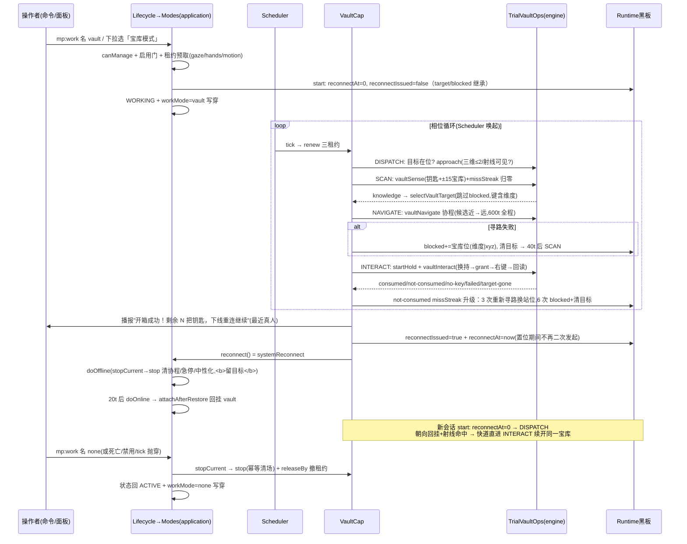

# 宝库模式（vault）功能介绍与流程

> 一句话:假人在自身 ±15 格内自动感知试炼宝库，优先不详宝库，寻路到宝库正面站位并用背包钥匙开箱（钥匙真消耗靠总量回读验证），每开成一次即触发系统重连、上线后继续开同一宝库，直到钥匙用尽或宝库全部开完。

> 文中 `文件 · 符号` 标注均对应 `scripts/` 下当前实现，逐条与代码行为核对。设计口径见 `../../../../docs/mockplayer/`（03-详细设计、04-知识底座 C-04、11-归档差异审查【异8/缺43/缺49/缺58/缺59】）。**注意与"物品仓 ItemVault"无关**——后者是假人离线物品存档，见 `docs/features/资源回收.md` §0 术语表（该文以"离线物品仓回收"为主题，本篇只讲工作模式 `vault` 本身）。

## 0. 概念速览

| 术语                 | 指代                                                                                                                                                                                                                                                                                                                                        | 位置                                                                                                                                                                           |
| -------------------- | ------------------------------------------------------------------------------------------------------------------------------------------------------------------------------------------------------------------------------------------------------------------------------------------------------------------------------------------- | ------------------------------------------------------------------------------------------------------------------------------------------------------------------------------ |
| 宝库模式             | 工作模式 `WorkMode = "vault"`，Catalog 目录 label「宝库模式」、help「扫描并自动寻路开启试炼宝库」、`requiresLeases: ["gaze","hands","motion"]`、`tier: "heavy"`                                                                                                                                                                             | `domain/Catalog.ts` 的 `WORK_MODES` 表 `vault` 条目                                                                                                                            |
| 相位机               | 本能力全部状态：INIT → DISPATCH → SCAN / NAVIGATE → INTERACT → RECONNECT 六相位，靠 `phase.name + nextWakeAt` 流转（D-01：能力全局单例、零实例字段）                                                                                                                                                                                        | `application/Capabilities/Vault.ts` 的 `VaultCap` 类与 `VaultPhase` 类型                                                                                                       |
| 宝库黑板（流程状态） | 跨会话存活的 `target/targetKind/targetKey/blocked/reconnectAt/reconnectIssued/missStreak` 等——开箱成功触发的系统重连会销毁会话，目标必须活到重连上线（续开同一宝库）；**仅删假人清**，不持久化（世界重启即失，重扫即可）                                                                                                                    | `domain/VaultRules.ts` 的 `VaultFlowState` 接口与 `application/Runtime.ts` 的 `vaultStates` Map（`Runtime.vaultState()` 惰性建、`Runtime.forgetVaultState()` 挂 `botDeleted`） |
| 感知快照             | 一次 sense 的完整世界状态：背包两档钥匙计数 + ±15 格立方内宝库分类近→远预排序 + 感知时假人坐标；决策的唯一输入                                                                                                                                                                                                                              | `domain/VaultRules.ts` 的 `VaultKnowledge`，世界侧采集在 `engine/TrialVaultOps.ts` 的 `vaultSense()`                                                                           |
| 封锁表               | `blocked: Record<vaultBlockKey, 存在标记>`——键 = `vaultBlockKey()` 含维度（异维同坐标不共用一格），寻路失败（目标被拆/四周无可站位）与开箱 6 连败未扣钥匙都记该格，选目标时同类内跳过、让位次近可达者；**全封锁时整表自解**下轮重轮询（临时障碍自愈），target-gone 定点解除（开箱成功不再回删——选目标本就跳过封锁位，该写入是冗余，已移除） | `domain/VaultRules.ts` 的 `selectVaultTarget()` 过滤、`VaultCap.harvestNav()`/`VaultCap.interact()` 写入、`VaultCap.scan()` 自解分支                                           |
| 正面站位             | 宝库开箱必须面对钥匙孔正面（侧面/背面点击=**假成功**）：站立候选取 `minecraft:cardinal_direction` 反方向 1~~2 格（正面优先），四向 1~~2 格环兜底；朝向数学纯化单测                                                                                                                                                                          | `domain/VaultRules.ts` 的 `frontStandCandidates()` / `fallbackStandCandidates()` / `orderStandCandidates()`，`tests/domain.Vault.test.ts` 锁死口径                             |
| 系统重连             | 开箱真消耗后能力自断重连（下线 → 20t → 上线）：模拟真人离场，引擎才结算宝库掉落；系统意图无主人打扰播报、配额记主人名下、无主假人亦可完成                                                                                                                                                                                                   | `Lifecycle.systemReconnect()`（经 Mailbox 投递，`RECONNECT_DELAY_TICKS = 20`），装配在 `Composition.ts` 注册 `VaultCap` 时以回调解耦注入                                       |
| 假成功回读           | 点击 API 返回 true 但两种钥匙总量未减少 = 宝库冷却/掉落动画中或站位未对正面——按 `missStreak` 连败升级：未满 3 次 20t 后继续点，3 次播报并重新寻路调整正面站位，6 次播报并封锁该宝库格、清目标换点；开箱成功或重选目标即归零。消耗判定权威是 `countKeyTotal` 总量基准回读（知识底座 C-04 旧版教训的修复）                                    | `engine/TrialVaultOps.ts` 的 `vaultInteract()`、`application/Capabilities/Vault.ts` 的 `VAULT_MISS_ESCALATE` 三档分流与 `domain/VaultRules.ts` 的 `VaultInteractResult` 五态   |

## 1. 功能介绍

**宝库模式**是一个工作模式：假人周期性感知周身 ±15 格立方内的 `minecraft:vault` 方块，按"不详宝库 + 不详钥匙优先；普通宝库只认普通钥匙（不详不可替代）"的规则选出目标，寻路到其正面（或就近直插交互），主手换持钥匙右键开箱；每成功消耗一把钥匙即下线重连一次，上线自动续开同一宝库，循环往复。

- 目录定义：`domain/Catalog.ts` 的 `WORK_MODES` 表 `vault` 条目（中文别名「宝库模式」由 `modeAliasMap()` 派生）。
- 适用场景：试炼密室（Trial Chambers）批量清宝库——假人替你消耗钥匙、跑坐标、开箱重连的机械劳动。
- 前置条件（以代码为准）：
  1. 假人**在线**（离线只预置模式，`Modes.change()` 的无会话分支）；
  2. 操作者 `canManage`（管理员或主人，`Lifecycle.changeWorkMode()`）；
  3. 管理员未禁用（`workModeEnabled.vault`，**默认开**——`defaultEnabledModes()` 全目录一律默认 true，【缺59】口径）；
  4. 背包有对应钥匙（`minecraft:trial_key` / `minecraft:ominous_trial_key`，缺则 idle 节流通知，见 §4 SCAN）；
  5. ±15 格内有未冷却的宝库（区块未加载采不到，等下次重扫）。
- gaze/hands/motion 三租约启动预取，任一被占（如跟随、其它走位能力）直接拒绝启动（`Modes.change()` 租约预取段，D-02）。

### 节拍常量一览（全部写死，不入配置）

| 常量                                            | 值 (t)    | 语义                                                                   | 位置                                                             |
| ----------------------------------------------- | --------- | ---------------------------------------------------------------------- | ---------------------------------------------------------------- |
| `SCAN_RADIUS`                                   | 15        | 感知立方半边长（y clamp -64~320）                                      | `engine/TrialVaultOps.ts`                                        |
| `VAULT_ARRIVE_DISTANCE`                         | 2         | DISPATCH 分流到达判定（快道①，**三维直线距口径**，垂直落差计入）       | `application/Capabilities/Vault.ts`                              |
| `VAULT_SIGHT_DISTANCE`                          | 3         | 近距可视免寻路闸（**三维口径**，垂直落差计入）                         | `domain/VaultRules.ts`                                           |
| `VAULT_MISS_ESCALATE`                           | 3         | not-consumed 连败升级阈值：3 次重新寻路换站位、6 次（=2×）封锁换目标   | `application/Capabilities/Vault.ts`                              |
| `ARRIVE_DISTANCE`（engine）                     | 2         | 寻路到位判定（三维，离宝库或离站位任一达标）                           | `engine/TrialVaultOps.ts` 的 `vaultNavigate()`/`watchApproach()` |
| `VIEW_MAX_DIST`                                 | 8         | 视线射线最大距离（可视直交 + 开箱取面）                                | `engine/TrialVaultOps.ts`                                        |
| `VAULT_SCAN_COOLDOWN_TICKS`                     | 40        | 无目标/感知空/选不出/封锁自解后的重扫冷却                              | `application/Capabilities/Vault.ts`                              |
| `VAULT_INTERACT_COOLDOWN_TICKS`                 | 20        | 交互尝试节拍（远超 F-13 的 ≥4t interact 节流底线）                     | 同上                                                             |
| `VAULT_NOTIFY_COOLDOWN_TICKS`                   | 200       | 节流通知窗（同假人全消息共一窗；开箱成功播报不受节流）                 | 同上                                                             |
| `VAULT_UNREAD_TICKS`                            | 20        | 实体瞬态不可读重探                                                     | 同上                                                             |
| `VAULT_NAV_POLL_TICKS`                          | 20        | NAVIGATE 在途轮询醒距（心跳续租 + 结果收割）                           | 同上                                                             |
| `VAULT_RECONNECT_POLL_TICKS`                    | 50        | RECONNECT 心跳（< ACTION_HOLD_TTL=100 保证租约不断）                   | 同上                                                             |
| `VAULT_RECONNECT_BUDGET_TICKS`                  | 120       | 重连预算（下线+20t+上线 ≈40t；超时=重连半途失败 → 回 INTERACT 继续点） | 同上                                                             |
| `NAVIGATE_POLL_TICKS`                           | 10        | 导航协程轮询                                                           | `engine/TrialVaultOps.ts`                                        |
| `NAVIGATE_STALL_TICKS`                          | 200       | 单候选停滞判定（离站位距离连续无进展 ≈10 秒即换候选）                  | 同上                                                             |
| `NAVIGATE_TIMEOUT_TICKS`                        | 600       | **全程预算**：多候选换航不重置（≈30 秒极端兜底）                       | 同上                                                             |
| `GAZE_HOLD_TTL_TICKS` / `ACTION_HOLD_TTL_TICKS` | 200 / 100 | gaze / hands·motion 租约 TTL，每拍续租                                 | `domain/Leases.ts`                                               |
| `CLICK_PERMIT_TTL_TICKS`                        | 2         | 有意交互许可窗（开箱点击不被自家误点闸拦下）                           | `domain/ClickGuard.ts`                                           |

## 2. 启用与配置入口

```
/mp:work <假人名> vault           ──→ lifecycle.changeWorkMode → modes.change（在线即起跑/离线预置）
/mp:work <假人名> 宝库模式         ──→ 中文别名同效（domain/Catalog.ts 的 modeAliasMap()）
/mp:work <假人名> [无参|list]      ──→ 渲染模式目录（当前高亮、禁用标注）
假人面板 →「行为」→ 工作模式下拉「宝库模式」 ──→ 同上 changeWorkMode
管理面板 → 全局配置逐项开关 wm_vault ──→ workModeEnabled.vault（禁用即停：在线假人批量回空闲）
```

- 命令：`interface/Commands.Behavior.ts` 的 `BEHAVIOR_COMMANDS` 表 `mp:work` 条目，值表由 Catalog 派生；成功回执"已切换为 宝库模式"，失败原样回显拒绝原因（资源被占/管理员禁用/状态不可切）。
- 面板：`interface/Panels/Behavior.ts` 的下拉项按 `workModeEnabled` 过滤；纪律"开关先写、后切模式"。
- 管理门：`interface/Panels/Admin.ts` 的 `MODE_META.vault`（tooltip「扫描并自动寻路开启试炼宝库，含交互与系统重连。事件驱动，开销低」）与 `showGlobalConfig()` 的 `wm_vault` toggle；提交回调里本次 true→false 的在线假人逐个 `changeWorkMode(…, "none")` 即停。
- **误点拦截联动**：假人自发点击功能方块被全局守护拦截（`domain/ClickGuard.ts` 的 `judgeBlockClick()`），拦截名单写死在 `CLICK_GUARD_BLOCKED_BLOCKS`、无管理员开关。宝库 `minecraft:vault` **不入名单**——开箱本就是要打开它，路过假人也不会无故右键宝库，纳入名单反而与有意开箱冲突。宝库开箱走 `engine/TrialVaultOps.ts` 的 `vaultInteract()` 主动 `useItemInSlotOnBlock`，自家守护对其一律放行（名单外直接判不拦，无需许可窗；发起前仍 `grant` 只是与其它有意交互同口径的保险，不影响结果）。
- **无逐假人配置项**：半径/节拍/超时全部为上表写死常量；钥匙供给靠往假人背包放钥匙（面板可直接放包，物品读写走 `minecraft:inventory` 组件直读直写口径，F-12）。

## 3. 启动序列（`Modes.change`，`application/Modes.ts` 的 `change()`）

```
changeWorkMode(viewer, botId, "vault")              （Lifecycle.changeWorkMode()：存在性 + canManage）
 └─ Modes.change(botId, "vault", now)
     ├─ config.workModeEnabled.vault 关 → 拒「该模式已被管理员禁用」
     ├─ 无会话（离线）→ 只写穿 record.workMode + saveRecord，上线尾段 attachAfterRestore 回挂
     ├─ 状态非 ACTIVE/WORKING → 拒「当前状态不可切换模式」
     ├─ 同模式且上下文在位 → 幂等成功
     ├─ stopCurrent(session)：先停旧能力（stop 幂等清场，见 §5）
     ├─ 租约预取：gaze(HOLD,TTL 200)/hands/motion(HOLD,TTL 100) acquire；
     │    任一被占 → 撤已得租约、拒「所需资源被占用（持有者：X）」
     ├─ 建上下文 {mode:"vault", phase INIT, data:{}}
     ├─ VaultCap.start(session, now)：
     │    cap 缺失返「能力上下文缺失」拒绝启动；
     │    ctxOf 在 data["vault"] 命名空间建会话级 ctx（仅一个寻路协程槽 {token,result}）；
     │    vaultState(botId) 的 reconnectAt = 0 且 reconnectIssued = false ——重连等待标记与
     │    发起标记在新会话起点归零（重连闭环达成）；
     │    相位置 INIT、nextWakeAt = now（当拍即可被调度）
     │    start 返错 → 撤租约、卸上下文、workMode 落 none、原因回显
     └─ transitTo("startWork") → WORKING；record.workMode="vault" 写穿保存；
        console.warn 切换日志；emit botWorkModeChanged
```

注意**黑板不在此重建**：`Runtime.vaultState()` 按 botId 键控、跨会话存活，`start()` 只归零 `reconnectAt`/`reconnectIssued` 两个重连字段——目标/封锁表从上一会话（可能是刚被重连销毁的那个）原样继承，这正是"上线自动续开同一宝库"的实现基座。D-01 纪律：`VaultCap` 零实例字段，会话级状态挂 `capability.data`，跨会话黑板挂 `Runtime.vaultState`。

## 4. 执行流程：六相位机 + 三个 engine 原子

主循环由 Scheduler 唯一驱动（`application/Scheduler.ts` 的 `runSession()`）：每 tick 先租约过期清理，再对 `state === "WORKING"` 且 `now >= phase.nextWakeAt` 的会话回调 `cap.tick`。tick 同步、短、无 await、无自旋（F-18）；一切"等待"表达为 `nextWakeAt`（D-05），唯一例外是 NAVIGATE 的寻路协程——异步发起、同步收割（结果只写纯布尔进 ctx 槽位）。

`VaultCap.tick()` 头部固定动作：记录已删（`runtime.record()` undefined）→ 停摆 return（等管线收会话）；随后**无条件续租** gaze(200)/hands(100)/motion(100)——包括 NAVIGATE 在途与 RECONNECT 心跳，保证任何相位租约都不过期（RECONNECT 醒距 50t < TTL 100t）。

### 4.1 DISPATCH（分流闸，三道快道）

```
loc = mover.locationOf(botId)          实体瞬态不可读 → 20t 后回 DISPATCH（VAULT_UNREAD_TICKS）
st.target 为空                         → SCAN（去感知选目标）
st.target 在位（approach()）：
  ① distance3d(loc, target) ≤ 2          → INTERACT（三维快道，垂直落差计入）
  ② distance3d < VAULT_SIGHT_DISTANCE(3)
     且 vaultInSight(botId, target) 射线命中该格   → INTERACT（免寻路直开，【缺49】）
  否则 → gaze.stopHold（导航期撤销注视防干扰）→ startNav
```

快道②的"看得见"侧在 `engine/TrialVaultOps.ts` 的 `vaultInSight()`：`rayHit`（maxDistance 8）命中块 floor 坐标与目标同格且 typeId 仍是宝库才 true；读取失败/未命中一律 false → 照常寻路，绝不因误判跳过导航后对不准。重连场景天然受益：上次开箱 HOLD 注视朝向由下线管线 `readPose` 采集、上线回挂，重连上线首帧视线即对着同一宝库——看得见就不必走。

### 4.2 SCAN（感知 + 选目标 + idle 诊断）

1. `vaultSense(botId)`（`engine/TrialVaultOps.ts`）一次采齐：
   - `scanKeys()`：`inventoryContainer()` 组件**直读** `minecraft:inventory`（F-12 口径，不走界面），逐槽按 typeId 分类计数普通/不详钥匙；
   - `scanVaults()`：`BlockVolume` ±15 格立方（y clamp -64~320），`dimension.getBlocks({includeTypes:["minecraft:vault"]})` 一次采集；逐块 `readVaultKindIn()` 读 `ominous` block state 分类——**必须验 typeId**（宝库被拆后 getBlock 可能仍返回方块，只读 state 会对错误方块卡死，知识底座 C-04）；两表各按水平距离近→远排序；
   - 异常/实体不可用 → undefined → 20t 后回 SCAN 重探。
2. 感知采齐先归零 `st.missStreak`（未扣连败计数按目标重选轮重头计）；`selectVaultTarget(knowledge, st.blocked)`（domain 纯函数）：不详宝库+不详钥匙 → 普通宝库+普通钥匙 两段短路；同类内跳过封锁位取最近（封锁键含感知快照的 `dimensionId`）。
3. 选不出：
   - **封锁表非空** → 附近宝库全被封锁：`st.blocked = {}` **整表自解**，40t 后重扫（临时障碍自愈，死磕位由重扫冷却隔开）；
   - 封锁表本来就空 → `diagnoseVaultIdle()` 四分支缺因（no-key / no-vault / no-ominous-key / no-trial-key）→ `sayThrottled()` 通知（200t 共窗），40t 后重扫。文案表在 `Vault.ts` 的 `IDLE_MESSAGES` 常量。
4. 选中 → 写黑板 `target/targetKind/targetKey` → 直接 `approach()`（站位取感知坐标，零额外世界读）。

### 4.3 NAVIGATE（协程发起 + 20t 轮询收割）

`startNav()`：新 `CancelToken` 挂 ctx 槽位，异步 `vaultNavigate(botId, target, token)` 的 `.then` 只写纯结果（续体纪律 F-18；会话亡后写入孤立 ctx 无害），`.catch` 记 result=false + console.warn；相位置 NAVIGATE、20t 醒距（心跳续租在 tick 头，本相位自身不碰世界）。

`vaultNavigate()`（`engine/TrialVaultOps.ts`，自检查取消条件、永不抛穿）：

```
入口验证：实体失效 / 目标方块被拆被替换（isVaultBlockIn）→ false
起点到位闸：distance3d(假人, 宝库) ≤ 2 → 直接 true（零寻路，缺43 ②）
站立候选表 standCandidatesOf()：
  读宝库 cardinal_direction → frontStandCandidates（反方向 1~2 格，正面优先）
  + fallbackStandCandidates（四向 1~2 格双环，近环先）
  → orderStandCandidates（domain 纯函数：可站过滤 + vaultBlockKey 去重 + 离假人水平近→远）
    可站判据 isStandable()：格内严格 minecraft:air（cave_air 不算）+ 下方非 air
  读不到朝向 → 只剩兜底环；全表空（四周全实心/悬空）→ false
全程预算 deadline = 发起时 currentTick + 600（换候选不重置）
逐候选试航（近→远）：
  每轮先验：token 取消 / 实体失效 / 宝库换航间隙被拆 / 已靠进宝库 ≤2（到位）→ 相应短路
  stopMoving() 清残留 → navigateToLocation(站位中心, speed 1)
  非 isFullPath / 抛 → 跳过该候选（continue）
  watchApproach()：10t 轮询，到达=离站位或**离宝库本身** ≤2（3D，双判——终点阻塞停半路也判成功）；
    离站位距离连续无进展累计 ≥200t = 停滞 → 报 false 换下一候选；
    途中宝库被拆/实体失效/token 取消/过 deadline → false
全候选耗尽或预算尽 → false
```

`harvestNav()` 收割：result=true → INTERACT；false → **封锁该宝库位**（`st.blocked = {...st.blocked, [vaultBlockKey(target, 假人当下dimensionId)]: ""}`——键含维度、值仅作存在标记）、清目标三元组、40t 后 SCAN 重扫——"不可达换点不死磕"（缺43 ③）。

注意本能力**不经 `Mover.navigate()`**：Mover 的统一判据（≤16 格上限、静止判定等）与本场景"距离≤2/无进展 200t/换候选"不同源，故 `TrialVaultOps` 自管协程监测（文件头纪律注释），但急停/取位仍用 `engine/Mover.ts` 的 `mover.stop()/locationOf()/snapshotOf()`。

### 4.4 INTERACT（冷却门 + 换持 + 点击 + 回读验证）

`VaultCap.interact()` 顺序：

1. `st.reconnectAt > 0` → 绝不二次交互（防多消耗钥匙），转 RECONNECT；
2. `now < lastInteractAt + 20` → 睡到冷却满（wake=差额 tick）；
3. 记 `lastInteractAt = now`；record/self/target/keyType 任一缺失 → 回 DISPATCH；
4. `gaze.startHold(botId, blockCenter(dim, target))`——**维度取实体当下真值**（`record.dimensionId` 是下线快照，错维会取到别的世界的方块）；持续注视宝库中心，HOLD 租约周期重注（F-06）；
5. `vaultInteract(botId, target, keyType)`（`engine/TrialVaultOps.ts`）：

```
① 目标复验 readVaultKindIn()（typeId+state）——被拆/被替换 → "target-gone"
② 主手换持 ensureMainhand()：三级降级——slot 0 已是 → 选主手回读确认；
   swapItems(i,0) 成功；再失败 → 手动双写（读两槽 → setItem(0,钥匙)，成功再
   setItem(i,原slot0内容)；只前一半成功会两格各留一份钥匙，故必须回滚 slot0，
   回滚也失败则不换持、试下一槽——防丢也防复制）；全败 → "no-key"
③ 记基准 baseline = countKeyTotal()（两种钥匙总量之和，消耗判定权威）
④ botClickGuard.grant(botId)（开 2t 许可窗，自家误点闸不误拦本次有意交互）
⑤ 右键使用 useItemInSlotOnBlock(0, target, face)——face 取视线命中面
   （getBlockFromViewDirection，宝库开箱必须命中钥匙孔正面）；
   失败退空手 interactWithBlock 兜底（face 按宝库相对方位算）——不消耗钥匙但覆盖个别版本引擎差异
   两通道都 false → "failed"
⑥ 回读验证：total = countKeyTotal()；total < baseline → "consumed"；
   total ≥ baseline → "not-consumed"（点击成功但钥匙没扣 = 宝库冷却/掉落动画中，假成功）
```

6. 五态分流（`VaultCap.interact()` 的 switch）：

| 结果           | 能力层动作                                                                                                                                                                                                                                                                                                                                                          |
| -------------- | ------------------------------------------------------------------------------------------------------------------------------------------------------------------------------------------------------------------------------------------------------------------------------------------------------------------------------------------------------------------- |
| `consumed`     | 连败计数归零（`missStreak = 0`）→ **立即播报**"开箱成功！剩余 N 把钥匙，下线重连继续"（不受节流窗）→ 仅当 `reconnectIssued` 未置位才置位 + `st.reconnectAt = now` + `this.reconnect(botId)`（= `Lifecycle.systemReconnect`，经 Mailbox：`doOffline("reconnect")` → 20t → `doOnline`；置位期间不再二次发起，防积压窗口双重下线）→ RECONNECT 相位                     |
| `not-consumed` | `missStreak+1` 三级升级：**未满 3** → 不通知、不放弃——20t 后继续点击（真冷却/动画终会放行）；**满 3** → 播报"开箱多次未扣钥匙，重新寻路调整站位"（200t 节流窗）+ `gaze.stopHold` + `startNav` 重新寻路到正面站位候选（不封锁、不换库）；**满 6** → 播报"该宝库多次开箱未扣钥匙，封锁该宝库并更换目标" + 封锁该格（键含维度）+ 连败归零 + 清目标三元组 → 40t 后 SCAN |
| `no-key`       | 节流通知"背包没有XX钥匙，请放入背包后重试"→ 20t 后再试（主手换持失败≈背包确实没该钥匙）                                                                                                                                                                                                                                                                             |
| `failed`       | 节流通知"使用钥匙开宝库未成功，请调整假人位置后重试"→ 20t 后再试（保留目标）                                                                                                                                                                                                                                                                                        |
| `target-gone`  | 节流通知"目标宝库已不存在，重新搜索附近宝库"→ 解除该位封锁（方块没了封锁作废）→ 清目标 → `gaze.stopHold` → 40t 后 SCAN                                                                                                                                                                                                                                              |

### 4.5 RECONNECT（心跳等待，防半途失联）

正常路径下系统重连的 `doOffline` 会走 `stopCurrent → VaultCap.stop` 销毁会话——能力在 RECONNECT 相位的本地驻留只是给"重连已发起但会话还没被收走"的窗口期一个不交互的等待态。会话若因重连半途失败仍存活：50t 心跳续租，`now ≥ reconnectAt + 120` 判定重连预算耗尽 → `reconnectAt = 0` 且 `reconnectIssued = false` → 回 INTERACT 继续开箱节拍（此时 `interact()` 的重连守卫已解除；若那次重连实际仍排着队、稍后落地，由新会话 `start()` 再清一次，幂等）。重连成功路径：新会话 `start()` 把 `reconnectAt`/`reconnectIssued` 归零、INIT→DISPATCH，黑板 target 原样存活 → 快道②命中（朝向随姿态回挂）→ 续开同一宝库。

### 4.6 文字总流程

```
Modes.change("vault") ─→ INIT ─→ DISPATCH ─(无目标)─→ SCAN ─选不出─→ 诊断/自解 ─40t─→ SCAN
                          │▲(有目标,三维≤2)│                   └──选不出且封锁满──→ 整表自解
                          │└─(近距可见)────┴→ INTERACT ←──────────┐
                          └─(远且不可见)→ NAVIGATE(协程+20t收割) ─┤成功→ INTERACT
                                                                 └失败→ 封锁该位+清目标 → SCAN
INTERACT: 20t 节拍 → vaultInteract 五态（SCAN 重选目标时 missStreak 归零）
  consumed → 播报+置发起标记重连 → RECONNECT(50t 心跳,120t 预算) → [会话销毁→重连上线→start] 回 DISPATCH
  not-consumed → 连败升级：<3 回 INTERACT；3 次重新寻路换站位；6 次封锁该位+清目标 → SCAN
  failed/no-key → 20t 后回 INTERACT；target-gone → 40t 后 SCAN
```

## 5. 停止与结束条件

| 触发                                                    | 路径                                                                                                                                                        | 现场清理                                                                                                                                                                                                                                                                                               |
| ------------------------------------------------------- | ----------------------------------------------------------------------------------------------------------------------------------------------------------- | ------------------------------------------------------------------------------------------------------------------------------------------------------------------------------------------------------------------------------------------------------------------------------------------------------ |
| 手动切回空闲/其它模式（`mp:work <名> none` / 面板下拉） | `Modes.change → stopCurrent`                                                                                                                                | `stop()`：取消寻路协程 token（`sleepTicks` 经 `token.signal` 提前返回）+ 重置 ctx.nav 槽 + `mover.stop` 急停 + `gaze.stopHold` 注视中性化。**幂等**：ctx 缺失直接返回。**黑板目标不在此清**——系统重连也走 stop，目标必须存活到重连上线；清目标只发生在 target-gone/寻路失败/未扣 6 连败封锁换点/删假人 |
| 下线管线（含系统重连的 doOffline）                      | `Lifecycle.doOffline` 首步"冻结撤能力" `stopCurrent`                                                                                                        | 同上；物品/姿态经导出管线落仓（ItemVault，见 `资源回收.md`）                                                                                                                                                                                                                                           |
| 死亡                                                    | `handleDeath → stopCurrent` → DYING；自动重生则尾段 `attachAfterRestore` 回挂重跑                                                                           | 回挂失败私信主人原因并落空闲                                                                                                                                                                                                                                                                           |
| 管理员禁用 vault                                        | `Panels/Admin.ts` 的 `showGlobalConfig()` 提交回调对在线假人批量切 none                                                                                     | 同手动停止                                                                                                                                                                                                                                                                                             |
| 能力 tick 抛穿                                          | `Scheduler.runSession()` catch → `stopCurrent` + `workMode="none"` 写盘 + 错误日志                                                                          | 内部原子已全量 try-catch，实际抛穿只可能来自续租/框架层                                                                                                                                                                                                                                                |
| 记录被删                                                | `tick()` 头部 `runtime.record()` 为 undefined → 停摆                                                                                                        | 黑板由 `Composition` 的 `botDeleted` 监听 `runtime.forgetVaultState(botId)` 清除（同名重建不继承旧目标/封锁）                                                                                                                                                                                          |
| 钥匙耗尽（常态终结）                                    | **不是停止条件**：SCAN 选不出 → `diagnoseVaultIdle()` = no-key/no-ominous-key/no-trial-key → 200t 节流通知"请放入钥匙"，能力保持 40t 轮询等补钥匙，永不自停 | 玩家补钥匙进背包即恢复；切模式或下线才真正清场                                                                                                                                                                                                                                                         |

## 6. 与其它子系统的交互

- **Clock / Scheduler**（`engine/Clock.ts`、`application/Scheduler.ts`）：唯一时钟与唯一驱动者；全部等待表达为 `nextWakeAt`（D-05），寻路协程 `sleepTicks` 亦经 `clock.sleep`；逐会话 try-catch 隔离（F-18）。
- **租约（`application/Modes.ts` + `domain/Leases.ts`）**：启动预取 gaze/hands/motion 三件套（冲突即拒 D-02）；每拍 renew（gaze TTL 200 / hands·motion 100）；卸载 `releaseBy` 必撤，gaze HOLD 的 release/过期即 `gaze.stopHold` 中性化（F-06，`Modes.stopCurrent()` 与 `Scheduler.runSession()` 两处兑现）。RECONNECT 心跳 50t < TTL 100t 专防重连等待期租约断。
- **Gaze（`engine/Gaze.ts`）**：交互期 HOLD 持续注视宝库中心（`startHold` 即发 Continuous 且引擎侧周期重注）；导航期 `stopHold` 撤销——注视是开箱时动作，导航期保留注视会干扰寻路（`VaultCap.approach()`）。
- **Mover（`engine/Mover.ts`）**：只用 `locationOf/snapshotOf/stop`；导航本体走 `TrialVaultOps.vaultNavigate` 自管协程（判据不同源，见 §4.3）。
- **ClickGuard（`engine/ClickGuard.ts` + `domain/ClickGuard.ts`）**：宝库 `minecraft:vault` 不在写死的拦截名单内，故 `vaultInteract` 的开箱右键天然不被自家 `playerInteractWithBlock` 拦截；发起前 `botClickGuard.grant()` 只是与其它有意交互同口径的保险（名单外本就放行）。
- **Lifecycle / Mailbox**：`consumed → systemReconnect` 是唯一"能力驱动的系统级重连"（无在途守卫回执、不打扰主人播报、配额记主人、无主假人亦可完成）；在途互斥由能力层 RECONNECT 守卫负责。宝库模式**豁免常加载**：上线尾段共享辅助区入队与下线 disconnect 前单区块保活都以 `record.workMode !== "vault"` 短路（`Lifecycle` 上线步骤 10 / 下线步骤 4）——重连节奏快，区域申请反成拖累。
- **EntityOps 通知**：全部播报经 `EntityOps.notifyNearestRealPlayer()`——发**同维度水平最近的真实玩家**（`[模拟玩家][宝库] <名> <详情>` 前缀），无人可发则静默；播报维度/坐标取 `mover.snapshotOf` 当下真值而非 record 快照。
- **ItemVault（物品仓）**：无直接关系。开箱掉落的战利品进假人背包（引擎结算），背包物品在下线/死亡时经导出管线入物品仓——那条链路归 `资源回收.md`；`Panels/BotPanel.ts` 背包页签的 `vaultSlots`、`SavePolicy` 的 `permitVaultRead` 均指物品仓，勿与本能力混淆。
- **SaveGate / 记录**：模式切换即 `saveRecord` 写穿 `workMode="vault"`，世界重启后假人"记得"自己是宝库模式、上线自动回挂重扫；黑板（目标/封锁）不持久化——重启后从空黑板重扫，行为正确。运行期 Scheduler 100t 经验回写照常。
- **Events**：`botWorkModeChanged` 仅领域留档；开箱成功/缺钥匙等运行期显形只靠节流播报。

## 7. 已知限制与引擎约束

- **假成功有三档升级出口**：`not-consumed` 按连败计数 `missStreak` 裁决——未满 3 次继续点（冷却/动画终会放行）；3 连败判定疑似站位偏侧/偏高，播报并重新寻路调整正面站位（快道①已改三维口径，"停半路判到位"拿到的坏站位同样被这档覆盖）；6 连败封锁该宝库位、清目标换点——不再无限点击且无通知。
- **一次只开一把**：单假人单目标串行；`consumed → 重连`期间不掉落在背包持续累积，多假人同点抢开依赖引擎裁决，脚本无协调层。
- **钥匙口径**：消耗判定是**两种钥匙总量之和**——若个别版本引擎行为异常消耗了错误种类的钥匙，同样判成功（回读设计只保证"扣了东西"，不核对扣的是哪把，`countKeyTotal()` 注释口径）。
- **感知视野**：未加载区块的宝库 `getBlocks` 采不到（等重扫）；±15 立方之外的宝库需要假人先走近——本能力不会跨维度、不会追任意远距离目标。
- **朝向约定**：正面站位 = `minecraft:cardinal_direction` **反方向** 1~2 格，该口径由 `tests/domain.Vault.test.ts` 锁死并经归档 VaultPorts 实证传承（11-差异审查），改动前必读 04-知识底座，勿凭直觉翻转。
- **interact 节流（F-13）**：交互节拍 20t，满足引擎 interact ≥4t 节流底线（归档对读记录"交互：4t 节流一致"）。
- **封锁表粒度**：键 = `dimensionId|x,y,z`（`vaultBlockKey()`——维度 id 由 `vaultSense()` 采进 `VaultKnowledge.dimensionId`，`harvestNav`/`interact` 写入处取实体当下真值），异维同坐标不再共用一格；站立点去重等单一维度语境省略维度、仅坐标键。表随黑板活在内存，世界重启即失（可接受——重扫自愈）。
- **tick 纪律 F-18 / D-01 / D-05**：tick 同步短无 await；协程只写纯结果；能力零实例字段，状态在 `capability.data`（会话级）+ `Runtime.vaultState`（跨会话）。
- **版本沿革**：±15/40/20/2/200/600/8/200 常量逐值对位归档（11-差异审查【异8】）；【缺43】三点优化（最近可达站位、近距直交、封锁换点）、【缺49】近距可视免寻路闸为新版增量。

## 8. 时序图（启用→开成一轮→重连续开→停止）


