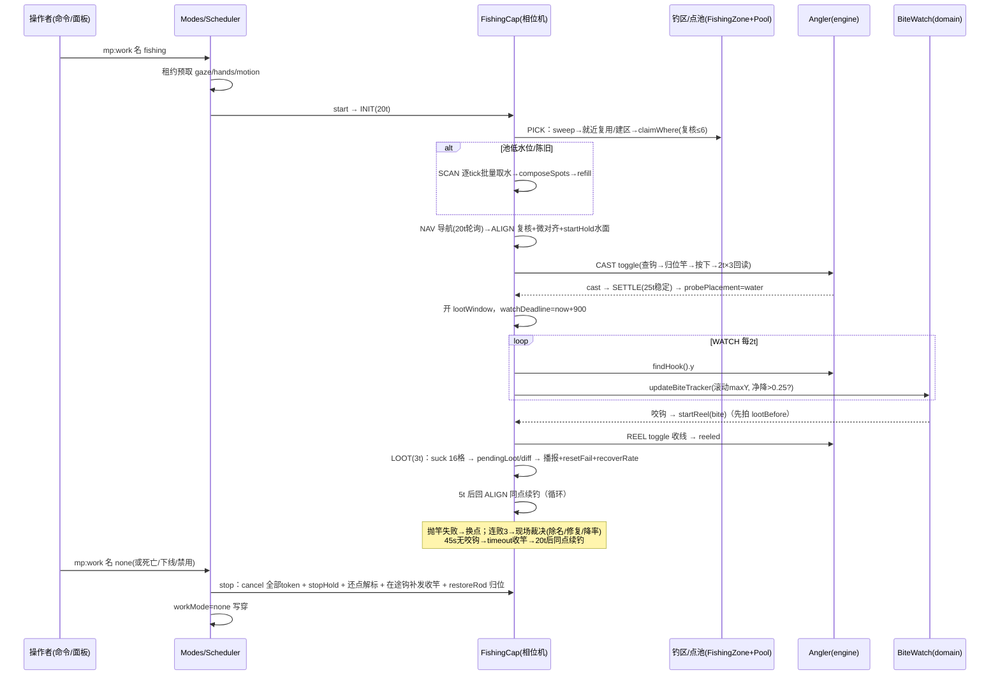

# 自动钓鱼（fishing）功能介绍与流程

> 一句话：假人在附近水域一次性批量扫描水面、组装并共享"钓区/钓点池"，就近选点走过去朝水面格抛竿，用滚动最高点判据监视浮漂咬钩，咬钩即收竿入账战利品并同点续钓，45 秒无鱼则正常收竿换节奏——整条"寻点→走到→对齐→抛竿→盯漂→收竿→吸取"链路自动循环。文中 `文件 · 符号` 标注均对应 `scripts/` 下当前实现，逐条与代码行为核对。设计口径见 `docs/mockplayer/`（一次性批量水面扫描 + 咬钩判定；钓点对象化管理）。

## 0. 概念速览

| 术语                                                        | 指代                                                                                                                                                                                                               | 位置                                                                                                                                      |
| ----------------------------------------------------------- | ------------------------------------------------------------------------------------------------------------------------------------------------------------------------------------------------------------------ | ----------------------------------------------------------------------------------------------------------------------------------------- |
| 相位机 INIT→PICK→SCAN→NAV→ALIGN→CAST→SETTLE→WATCH→REEL→LOOT | 本能力全部状态即相位；同点续钓走 LOOT→ALIGN 回环                                                                                                                                                                   | `application/Capabilities/Fishing.ts` 的 `FishPhase` 类型与 `FishingCap.tick()`                                                           |
| 钓鱼区 FishZone                                             | 一次批量扫描产出的钓点集合 + 共享点池 + 覆盖盒；支持就近复用、x/z 间隙 ≤16 并区、空区宽限 600t 后消散                                                                                                              | `domain/FishingZone.ts` 的 `FishZone` / `FishingZones` 类、`ZONE_MERGE_DISTANCE` / `ZONE_REUSE_MAX_DIST` / `ZONE_EXPIRE_GRACE_TICKS` 常量 |
| 钓点 FishSpot                                               | 站位格（可站立的岸边格）+ 瞄准水面格（星级 = 沿邻水方向延伸的连续水面格数，≤5）+ 成功率 rate                                                                                                                       | `domain/FishingSpot.ts` 的 `FishSpot` / `AimResult` 类型、`extendAim()` / `AIM_MAX_LEVEL` 常量                                            |
| 共享点池 SharedPool                                         | 多假人独占认领/归还的钓点队列（容量 32、重扫水位线 3、连败阈值 3、按 星级→成功率→距心 排位）；单飞行扫描标防并发重扫                                                                                               | `domain/Pool.ts` 的 `SharedPool` 类、`DEFAULT_POOL_CAP` / `DEFAULT_REFILL_THRESHOLD` 常量、`rankFishSpots()`                              |
| 一次性批量水面扫描                                          | 寻点手段：以假人当下站位为中心 ±16 水平 / ±8 层高的立方窗，RegionScanner 逐 tick 一片（≤1500 格）`getBlocks` 取水 + 列顶正上方精确空气筛，扫完即弃、结果灌池复用——不是每次抛竿都重扫                               | `engine/Scanner.ts` 的 `RegionScanner` 类与 `SCAN_SLICE_CELLS` 常量、`Fishing.ts` 的 `scan()`、`scanRect()`                               |
| 咬钩判定（滚动最高点）                                      | 稳定期后每 2t 采浮漂 y，`drop = maxY − y > 0.25` 即咬钩；入水先沉后浮的误判由 25t 稳定期挡掉                                                                                                                       | `domain/BiteWatch.ts` 的 `updateBiteTracker()`、`BITE_DROP_THRESHOLD` / `BITE_CHECK_TICKS` / `STABILIZE_TICKS` 常量                       |
| 同键开关 toggle                                             | 基岩版鱼竿右键同键抛/收：`Angler.toggle` 先查钩实体真值定方向，按下后 2t×3 回读验证；竿从非 0 槽换进槽 0 时记下原槽（`rodHome`），收尾 `restoreRod` 双 setItem 换回原位（主手已非竿/原槽已有竿则只清记录不动背包） | `engine/Angler.ts` 的 `Angler.toggle()/restoreRod()`、`VERIFY_PROBE_TICKS` / `VERIFY_PROBE_ROUNDS` 常量（F-17）                           |
| 鱼钩归属标签                                                | 自有钩 = 带 `mp:fisher:<假人名>` 标签的 fishing_hook（`ProjectileTracker` 在 entitySpawn 时认领）；查询半径 40（鱼线最长 32 留漂移余量）                                                                           | `domain/ClaimRules.ts` 的 `makeFisherTag()`、`domain/FishingSpot.ts` 的 `HOOK_QUERY_RADIUS` 常量、`engine/Angler.ts` 的 `findHook()`      |
| hookKey 钩账                                                | 在途鱼钩归属的点位键；换点后旧点残钩绝不作本点复用，CAST 预检按归属分流（复用 or 先收回）                                                                                                                          | `Fishing.ts` 的 `FishCtx.hookKey` 字段与 `cast()` 归属核对段                                                                              |
| gaze HOLD 注视租约                                          | 抛前把身体 yaw 转向水面格中心并 Continuous 周期重发注视（TTL 200t 每拍续租），朝向决定落点（F-06）                                                                                                                 | `engine/Gaze.ts` 的 `Gaze.startHold()` / `stopHold()`、`domain/Leases.ts` 的 `GAZE_HOLD_TTL_TICKS` 常量、`Fishing.ts` 的 `align()` 末段   |
| 战利品窗口 lootWindow                                       | SETTLE 确认入水才开窗、REEL/LOOT/失败即闭窗——抛竿换竿的槽位变化不入账；事件主记 + 背包快照 diff 回退                                                                                                               | `Fishing.ts` 的 `FishCtx.lootWindow` 字段、`collectLoot()`、`domain/Fingerprint.ts` 的 `lootFingerprint()` / `diffLootCounts()`           |
| 成功率 rate（非闸门）                                       | 新点 100%，同点连败满 3 且结构仍在 → 降 25% 档；钓上一尾回升一档；除名永远由结构判据说了算                                                                                                                         | `domain/FishingSpot.ts` 的 `decayRate()` / `recoverRate()` / `FISH_RATE_STEP` 常量、`Fishing.ts` 的 `adjudicate()`                        |

## 1. 功能介绍

**自动钓鱼**是一个工作模式（`WorkMode = "fishing"`，`domain/Catalog.ts` 的 `WORK_MODES` 表：label「自动钓鱼」，help「共享点池选点、走到、抛收竿」，`requiresLeases: ["gaze", "hands", "motion"]`，`tier: "heavy"`）：假人自行在水域边找可站立钓点，走到位、转向水面、抛竿、盯漂、咬钩收竿、吸取渔获，同点续钓；钓不到就换点/换区，全程无人值守。

- 适用场景：水边挂机产鱼（食物/经验来源，配合猫狗喂食、 farmer 等），多假人可共用同一片水域的钓点池互不抢点。
- 前置条件（以代码为准）：
  1. 假人**在线**（ACTIVE/WORKING 才起跑；离线只预置 `record.workMode`，上线尾段 `attachAfterRestore` 回挂，`application/Modes.ts` 的 `change()` 离线分支）；
  2. 操作者通过 `canManage`（管理员或主人，`domain/Permissions.ts`）；
  3. 管理员未禁用该模式（`config.workModeEnabled.fishing`，`domain/Catalog.ts` 的 `defaultEnabledModes()` 默认全开）；
  4. 背包里有鱼竿——**缺竿不停机**：PICK 相位每轮 `angler.hasRod()` 检查，缺竿只播报"没有鱼竿，请放入竿"并 50t 后重查（`Fishing.ts` 的 `pick()`、`engine/Angler.ts` 的 `hasRod()`）。
  - gaze/hands/motion 三租约任一被其它能力占用时启动被拒（冲突即拒，D-02）。
- 钓点几何口径（组装/自证/现场复核共用同一份判据，`domain/FishingSpot.ts` 的 `composeStandCandidates()` / `auditStand()` / `judgeStandSpot()`）：水面格（含流动水）水平 8 邻找支撑（支撑层 = 水面层或高 1 格两形并收），站位 = 支撑上方 1 格；要求站位格与头顶格**精确 minecraft:air**（cave_air 不算）、支撑安全实心（非熔岩/火/岩浆块、非空气非液体）、邻水成立。瞄准 = 朝最近相邻水面方向在水面层延伸连续水面，格数即星级（≤5）。

## 2. 启用与配置入口

```
/mp:work <假人名> fishing           ──→ Lifecycle.changeWorkMode → Modes.change（在线即起跑/离线预置）
/mp:work <假人名> 自动钓鱼           ──→ 中文别名同效（domain/Catalog.ts 的 modeAliasMap()）
/mp:work <假人名> [无参|list]        ──→ 渲染模式目录（当前高亮、禁用标注）
假人面板 →「行为」→ 工作模式下拉「自动钓鱼」 ──→ 同上 changeWorkMode
管理面板 → 全局配置「⚠ 自动钓鱼」开关      ──→ workModeEnabled.fishing（禁用即停：在线假人批量回空闲）
/mp:fishspot [坐标] [半径]           ──→ 管理员诊断：一次性扫描并列出钓点（不进池、不起能力）
/mp:fish <假人>                      ──→ 管理员诊断：就地一次钓鱼（抛竿→稳定→盯漂→收竿，不寻点不导航）
```

- 命令：`interface/Commands.Behavior.ts` 的 `BEHAVIOR_COMMANDS` 表 `mp:work` 条目；诊断命令在 `interface/Commands.Admin.ts` 的 `mp:fishspot` / `mp:fish` 条目（fishspot 用 `RegionScanner` + `spotScanner.composeSpots` + `FISH_DIAG_MAX_STANDS` 预算；fish 走 `Angler.fishOnce()`，结束（含失败/取消）由 finally `restoreRod` 把竿换回原槽位）。
- 面板：`interface/Panels/Behavior.ts` 的 `showBehaviorPanel()`（fishing 下拉项青色高亮）；`interface/Panels/Admin.ts` 的 `MODE_META.fishing` 条目与 `showGlobalConfig()`（toggle 先写、后切模式）。
- **配置面为零专有字段**：`domain/Config.ts` 没有钓鱼专属热配置项；一切节拍/半径/阈值都是 `domain/FishingSpot.ts` 与 `domain/BiteWatch.ts` 的模块常量（`FISH_SCAN_RADIUS=16`、`FISH_PICK_MAX_DIST=16`、`FISH_SCAN_Y_RADIUS=8`、`FISH_SCAN_BUDGET=300`、`FISH_SCAN_COOLDOWN_TICKS=120`、`FISH_RECHECK_TICKS=50`、`FISH_NOTIFY_COOLDOWN_TICKS=100`、`FISH_SPOT_STRIKES=3`、`FISH_STALE_ROUNDS=3`、`FISH_CLAIM_PROBES=6`、`FISH_COMPOSE_MAX_STANDS=256`、`FISH_ALIGN_DIST=0.8`、`FISH_ALIGN_FAIL_DIST=3`、`FISH_INIT_TICKS=20`、`FISH_BACKPACK_NEAR_FULL_GAP=2`；`BITE_CHECK_TICKS=2`、`BITE_TIMEOUT_TICKS=900`（45s）、`STABILIZE_TICKS=25`、`LOOT_SETTLE_TICKS=3`）。

## 3. 启动序列（`Modes.change`，`application/Modes.ts` 的 `change()`）

```
changeWorkMode(viewer, botId, "fishing")
 └─ Modes.change(botId, "fishing", now)
     ├─ workModeEnabled.fishing 关 → 拒「该模式已被管理员禁用」
     ├─ 无会话（离线）→ 只写穿 record.workMode + saveRecord，上线回挂
     ├─ 状态非 ACTIVE/WORKING → 拒；同模式且上下文在位 → 幂等成功
     ├─ stopCurrent(session)：先停旧能力
     ├─ 租约预取（cap.requires()：gaze HOLD/200t、hands HOLD/100t、motion HOLD/100t）
     │    任一被占 → 撤已得租约、拒「所需资源被占用（持有者：X）」
     ├─ 建上下文 {mode:"fishing", phase:{name:"INIT", nextWakeAt:now}, data:{}}
     ├─ FishingCap.start：查 record/cap 在位 → ctxOf(cap.data,"fishing",FishCtxSeed)
     │    相位置 INIT、nextWakeAt = now + FISH_INIT_TICKS(20t)（实体稳定等待）
     └─ transitTo("startWork") → WORKING；workMode 写穿 saveRecord；emit botWorkModeChanged
```

组合根在 `scripts/Composition.ts` 注册 `new FishingCap(runtime, ops, events)`；构造期一次性订阅 `botSlotChanged` 领域事件（`interface` 桥接：`main.ts` 的 `onBotInventoryChanged` → `services.events.emit("botSlotChanged", …)`），入账由 `collectLoot()` 的 mode+窗口双闸把关。

## 4. 执行流程：十相位机

主循环由 Scheduler 唯一驱动（`application/Scheduler.ts` 的 `runSession()`）：每 tick 先 `leases.expire`（gaze HOLD 过期即 `stopHold` 中性化），再对 WORKING 且 `now >= phase.nextWakeAt` 的会话回调 `cap.tick`。`FishingCap.tick()` 头部无条件续租 gaze/hands/motion 三租约（心跳式，任何等待都表达为 `nextWakeAt`，D-05；tick 同步短小无 await，F-18——异步导航/抛收竿协程经 `fireAtom()` 只把纯结果写回 ctx 槽位，取消经 `CancelToken`）。

### 4.1 INIT（20t）→ PICK（寻点主相位，`pick()`）

每轮 PICK **入口先归还上轮持点**（`dropSpot`，防冻结旧区消散），随后按序：

1. 实体/记录瞬态 → 50t 后重查；缺竿 → 节流播报 + 50t 后重查。
2. 维度取 `mover.snapshotOf()` 当下真值（`record.dimensionId` 是下线/死亡快照，跨维会走错）。
3. `zones.sweep(now)` 先清已消散空区，再 `nearest(dimId, 站位, 16)` 就近找区：
   - **无区** → `openZone()`：先判同维扫描节流（`ZONE_SCAN_COOLDOWN_TICKS=60`），过关后以当下站位建区（16 格内邻区由注册表并成一个）；**拿到池扫描标（单飞行）才 `markScanned` 推进节流戳**并接管首轮扫描——区内已有会话在扫则不吃节流戳，短等回 PICK 复用；
   - **有区** → `use(id)` 刷新使用时刻，进区内选点。
4. 区内兜底清扫：`pool.sweepClaims(holdsSpotIn)` 收死占用、`pool.sweepScanToken(sessionAlive)` 收死扫描标。
5. **现场复核认领**：`pool.claimWhere(owner, accept, 6, near)`——`near` 零成本预筛（超 16 格的远点直接转队尾不吃预算），`accept` 逐点 `spotScanner.checkStand()`（结构 + 实体占用，≤6 点/轮）；判"结构不成立"的点认领后一次性 `removeKeys` 除名。
6. 认领到点：若 `isAtStandSpot`（水平 ≤0.8 且竖直 ±1）→ 免寻路直接 ALIGN；否则播报"找到钓鱼点，前往"并发起 `mover.navigate(standCenter, speed 1)` → NAV。
7. 一无所获：分账超距/结构/占用/读不到四因留痕；**一轮内无一半径内点（noneNear）立即清退陈旧远点重扫**（`pruneFree`），其余情形"池非空却无点可认领"连计 `staleRounds`，满 3 轮同样强制重扫；低水位（`needsRefill`：空闲 <3）或陈旧 → 拿扫描标（单飞行）→ SCAN；都拿不到 → 播报节流档"附近没有可用的钓鱼点（原因分档）"，50t 后回 PICK。

### 4.2 SCAN（一次性批量水面扫描，`scan()`）

逐 tick 推进 `ctx.scanner.step(FISH_SCAN_BUDGET)`：每 tick 至多一片 `getBlocks`（切片 ≤1500 格，≈10ms/片）+ 按读块预算筛列顶正上方精确空气；33×33×17 窗约 20 tick 扫完。未完成每 1t 续命。收尾（done）后：

- 挂靠区已消散 → 丢弃候选回 PICK（不新建空区白占名额）；
- `spotScanner.composeSpots(dimId, 水面格, 当下站位, 256, 16)` 组装站位（几何在 `composeStandCandidates`，出池前逐候选 `auditStand` 自证，观测共享一份读块 memo）；
- 缺因分档播报（`classifyFishingScan`：no-water"附近没有水面"/ no-spot"有水面但 16 格内无可站立点位"/ error"水面采集失败"；采集异常不压满冷却）；
- `zone.grow(scanner.rect)` 覆盖盒据实长大（并区/就近判据用），新点一律 rate=100 灌池 → 回 PICK 认领。

### 4.3 NAV（导航轮询，`nav()`）

在途每 20t poll 一次；`arrived` → ALIGN；其它结果（`no_path`/`timeout` 等，见 `domain/NavRules.ts` 的 `NavOutcome`）与点位无关——无条件 `dropSpot` 回池重选。

### 4.4 ALIGN（站位复核 + 微对齐 + 注视，`align()`）

1. `session.entityId` 瞬态缺失 → 不进 `checkStand`（空串排除项会把假人自己误判成占位、陷入弃点死循环），短等回 PICK。`checkStand` 四判据分流：occupied → 弃点换点；**invalid → `release("spent")` 彻底除名**；unreadable（区块未加载）→ 不计罪于点，`release("ok")` 转队尾另钓别点；假人已跨维 → 弃旧区点位、`zoneId=0` 重来。
2. 距站位中心 >0.8 格：发起 ≤16 格微调导航（`fireAtom(ctx.align…)`），失败但已够近（≤3 格）容忍抛竿，仍远则弃点。
3. `mover.inWater()` 守卫——被水流冲到点位正下方水柱时不在水里抛竿，按点位失败入账。
4. 抛前朝向：`blockCenter` 取瞄准水面格中心 → `gaze.setBodyPose(computeTargetYaw)` + `gaze.startHold`（HOLD 租约化，F-06），**2t 后 CAST**（注视生效一拍再抛，朝向决定落点）。

### 4.5 CAST（抛竿，`cast()` + `engine/Angler.ts` 的 `toggle()`）

预检 `angler.hasHook()`：本点残钩（`hookKey === spot.key`）→ 走 already-cast 复用直接进 SETTLE——钩系上一轮抛出、已在水中稳定，不再空等 `STABILIZE_TICKS`（再等满 25t 会把等待期间的咬钩当基线、真上钩误报超时），隔一拍复核落点即可；他点/无主残钩 → toggle 先收回再抛（不重复计失败）。`toggle()` 查真值定方向：`findRodSlot`（槽 0 优先，背包深处也算）→ 非 0 槽双 `setItem` 互换归位（绝不吞物）→ `selectedSlotIndex=0` + `useItemInSlot(0)` → 报脏 `inventoryChanged`（竿耐久波动）→ 2t×3 回读钩存在性验证方向翻转。结果分流（`dispatchCast()`）：cast→SETTLE；reeled（竞态窗）→重来一拍；no-rod/offline→弃点回 PICK（与点无关）；no-slot/engine-refused→该点本次抛竿失败入账；verify-failed→先 `hasHook` 复核（服务器掉 tick 时钩的出现可晚于 2t×3 回读窗），有钩按抛竿成功转 SETTLE 走稳定期、不计点位失败，确无钩才记失败。

### 4.6 SETTLE（稳定期 + 落点检查，`settle()`）

抛竿确认后等 `STABILIZE_TICKS=25`（浮漂入水先沉后浮，此前坐标不可信；already-cast 复用入口例外——隔一拍即复核，不重等稳定期，见 §4.5）→ `angler.probePlacement()`（钩所在格是否水 + 钩 0.25 格内有无其他实体，判定 `judgeHookPlacement`：贴任何实体=snagged 优先于落水）：

- water → **开战利品窗口**（清空 pendingLoot、`lootWindow=true`）、初始化咬钩状态、`watchDeadline = now + 900`，2t 后 WATCH；
- landed/snagged → 须先提前收竿（残钩会使 hasHook 长期误报）再入账：发起 `early` 收竿 → REEL；
- 查无钩 → `lostHook()`（见 §6）。

### 4.7 WATCH（咬钩监视，`watch()`）

每 `BITE_CHECK_TICKS=2`：`findHook` 取钩 y（半径 40 带标签查询，WATCH 侧唯一每刻世界读，慢操作 5s 节流显形）→ `updateBiteTracker(ctx.bite, y)` 滚动最高点判净降 >0.25 → 咬钩播报"鱼上钩了"并 `startReel("bite")`；无钩 → `lostHook()`；到 deadline → "等待 45 秒无鱼上钩" `startReel("timeout")`（**超时是正常收竿，不记点位失败**）。

### 4.8 REEL（收竿，`startReel()` + `reel()`）

收竿前**先拍 `lootBefore` 背包指纹基准**（立即读必漏）。toggle 收线结果分流：reeled →（early 意图：清账走点位失败入账）bite/timeout 意图 → 3t（`LOOT_SETTLE_TICKS`，战利品入包引擎延迟）后 LOOT；cast（收竿瞬间钩已丢、toggle 改判抛竿）→ 新钩认本点账，回 SETTLE 走稳定期；verify-failed → 钩状态未知交下轮 CAST 预检分流（不重复计失败）；no-rod/offline → 弃点回 PICK。

### 4.9 LOOT（回收 + 播报 + 同点续钓，`loot()`）

闭窗后：① 吸取走 `tick()` 开头的心跳节拍（每 `FISH_SUCK_PULSE_TICKS=5` tick 一次，`Fishing.ts` 的 `suckAt`）：半径 16 内命中 `FISHING_LOOT_IDS` 渔获白名单的散件与经验球（`experienceOrbs: true` → `minecraft:experience_orb`）一并传送到发起者假人自己脚下（`engine/DropSuction.ts`）——收竿后散件会漂动、经验球晚出现，单次吸取有漏，节拍吸可反复回收；引擎物品实体不携带来源归属，只能按类型过滤，加上 60t 归属账，防止把邻位作业假人的采集掉落吸进本假人背包；② timeout 意图 → 清 pendingLoot、20t 后 ALIGN 同点续钓（无获属正常，不清失败计数）；③ bite 意图 → 战利品取事件账 `pendingLoot`（`collectLoot` 在窗口内累计 `botSlotChanged`，主手槽 0 变化不入账），事件漏收则用 `diffLootCounts(lootBefore, 当下快照)` 回退；④ 播报"钓到 …×N；背包 x/y（快满/已满预警）"；⑤ `pool.resetFail` 连败记录清零 + `recoverRate` 成功率回升一档；⑥ 5t 后回 ALIGN **同点续钓**（重对齐、重抛）。

### 4.10 失败入账（`spotFail()` → `adjudicate()`）

每次抛竿失败必换点（绝不原地补刀）：`strikeRelease` 记一笔并解占——`retry`（连败 <3）回池队尾；`due`（满 3）摘出点位：`entityId` 瞬态缺失 → 不进复核（排除项缺位会把假人自己判成占位），按世界瞬态同口径原样回池、下轮再裁；否则**当场复核裁决**：结构不成立 → 除名；周围已无水（`repairSpotAim` 失败）→ 除名；环境变了（星级/瞄准格位移）→ 修复并复位成功率回池；一切未变 → 成功率降 25% 档回池（沉同星级末尾）；世界读不到 → 原样回池。**rate 只排优先序绝不当闸门，除名永远由结构判据说了算。**

## 5. 停止与结束条件

| 触发                | 路径                                                                            | 现场清理                                                                                                                                                                                                                                                                                                                                                          |
| ------------------- | ------------------------------------------------------------------------------- | ----------------------------------------------------------------------------------------------------------------------------------------------------------------------------------------------------------------------------------------------------------------------------------------------------------------------------------------------------------------- |
| 手动切回空闲/切它模 | `Modes.change → stopCurrent → FishingCap.stop`                                  | `stop()`：取消 nav/align/cast/reel 四个在途 token、`gaze.stopHold`、`mover.stop`、闭窗、`pool.forceRelease` 还点 + `releaseScanToken`（防死会话囤点挡全区重扫）；`hookKey` 在账且带标签钩实体在场 → 补发一次收竿（`Angler.toggle` 自查方向，钩已消失不发起，防误抛新钩，fire-and-forget）并 `angler.restoreRod` 把竿归还原槽；租约由 stopCurrent `releaseBy` 撤净 |
| 下线管线            | `Lifecycle.offline → stopCurrent`                                               | 同上；钓区注册表进程内存活，全员离线即弃（重启后自然重扫）                                                                                                                                                                                                                                                                                                        |
| 死亡                | `handleDeath → stopCurrent` → DYING；自动重生尾段 `attachAfterRestore` 回挂重跑 | 回挂失败私信主人原因并落空闲                                                                                                                                                                                                                                                                                                                                      |
| 管理员禁用 fishing  | `Panels/Admin.ts` 的 `showGlobalConfig()` 提交回调批量切 none                   | 同手动停止                                                                                                                                                                                                                                                                                                                                                        |
| 能力 tick 抛穿      | `Scheduler.runSession()` catch → stopCurrent + workMode=none 写盘               | fireAtom 已将异步异常归 "error" 永不抛穿；抛穿只可能来自框架层                                                                                                                                                                                                                                                                                                    |
| 缺鱼竿              | **不是停止条件**：PICK 每 50t 重查、每 100t 节流播报，能力常驻等待放竿          | —                                                                                                                                                                                                                                                                                                                                                                 |
| 无钓点/无水         | 不是停止条件：PICK↔SCAN 自愈循环（冷却/节流/单飞行标三重闸），持续空转仅播报    | —                                                                                                                                                                                                                                                                                                                                                                 |

注意：`stop()` 主体同步清场，在途钩的补发收竿是 fire-and-forget 异步——WATCH/SETTLE 中途被停时，`hookKey` 在账且带假人标签的钩实体在场就发起一次 toggle 收线（按钩真值定方向，钩已消失则不发起），随后 `restoreRod` 归位钓竿；此前"stop 不收线、残钩滞留水中"的问题已消除。

## 6. 与其它子系统的交互

- **Clock / Scheduler**（`engine/Clock.ts`、`application/Scheduler.ts`）：唯一时钟唯一驱动；所有等待 = `phase.nextWakeAt`（D-05）。
- **租约（Leases，`domain/Leases.ts`）**：启动预取 gaze(200t)/hands(100t)/motion(100t)，每拍 renew；Scheduler `expire` 撤销过期 gaze HOLD 时联动 `gaze.stopHold` 中性化。与跟随/挖掘等能力经 hands/motion 互斥显形。
- **Gaze / Mover / EntityOps**：ALIGN 写 yaw + HOLD；NAV/ALIGN 走 `mover.navigate`（≤16 格单段、静止/超时判据在 `domain/NavRules.ts`）；`readPose`/`lootSnapshot`/`backpackUsage`/`notifyNearby` 均经 `engine/EntityOps.ts`。
- **ProjectileTracker / ClaimRules**：fishing_hook 出生即认领 `mp:fisher:<名>` 标签（`engine/ProjectileTracker.ts`、`main.ts` 的 `onProjectileSpawn`），此后"钩真值"= 带标签实体存在性——重载/竞态下内存标志说谎，实体存在是唯一可回读真值（`engine/Angler.ts` 头注）。
- **DropSuction**（`engine/DropSuction.ts`）：`tick()` 心跳每 `FISH_SUCK_PULSE_TICKS=5` tick 吸附一次，命中渔获白名单（`FISHING_LOOT_IDS`）类型的掉落物与半径内经验球（`experienceOrbs: true`）直传**发起者假人**脚下（不选"最近假人"，与采集同口径；60t 归属账防多假人反复传送）。
- **SaveGate / 记录**：模式切换写穿 `record.workMode`（重启/上线自动回挂）；toggle 后 `inventoryChanged` 报脏（竿耐久波动）；Scheduler 每 100t 回写经验（钓鱼 XP 走 `syncExperience`）。
- **ToolGuard**（`engine/ToolGuard.ts`）：`minecraft:fishing_rod` 在 `domain/ToolRules.ts` 的 `EXACT_TOOL_IDS` 关注表内——竿告急自动换同型健康件/无件保护性收起，能力侧零感知（下轮 hasRod/toggle 自然反映新手物品）。
- **Events / Notify**：`botSlotChanged`（`application/Events.ts`）驱动战利品入账；`botWorkModeChanged` 仅领域留档；游戏内播报双档（`Fishing.ts` 的 `say()`）：寻点侧 16 格半径 + 100t 节流，咬钩/钓获/缺因 7 格半径即时（`NOTIFY_RADIUS` / `SPOT_NOTIFY_RADIUS`），`console.warn` 日志镜像始终全量。

## 7. 已知限制与引擎约束

- **钓区/点池纯进程内存**（`Runtime.fishingZones`，仅进程内存活）：脚本重启即失忆，首轮必扫描；世界改动（水干/方块变化）靠现场复核 + 连败裁决 + 陈旧清退自愈，无主动监听。
- **扫描成本闸**：单片 ≤1500 格 ≈10ms/t、同维建区扫描 60t 节流、池扫描标单飞行、组装复核预算 256 站位——大水体首扫约二十 tick；扫描盒压进未加载区块抛 `UnloadedChunksError` 归"采集失败"重试，**绝不播报"附近没有水面"**（`engine/Scanner.ts` 头注）。
- **落点判定口径**：钩贴任何实体（鱼/玩家/假人，钩本体除外）都算 snagged 提前收竿——半径 0.25 是引擎约束，放大即误判游鱼（`engine/Angler.ts` 的 `probePlacement()`）。
- **不站在水里抛竿**：ALIGN 的 `mover.inWater()` 守卫按点位失败入账；水流冲击强的高水位岸边可能反复弃点。
- **咬钩判据是浮漂 y 净降 0.25**：极缓慢的入水姿态漂移理论上可误触发，稳定期 25t + 采样 2t 是实测口径（`domain/BiteWatch.ts` 头注）；45s 无咬钩收竿属正常，鱼钩上真有延迟到岸的鱼不追回。
- **超时续钓不重扫**：LOOT timeout 直接回 ALIGN 同点续抛；点位环境恶化的兜底靠连败满 3 的现场裁决，不靠水位。
- **mp:fish 诊断缝不持租约**：见 §5 注与 BUG 提示；能力侧 stop 会补发收在途钩并把竿归还原槽（见 §5 表）。
- **播报按假人当下维度**找附近玩家（跨维传送后 `record.dimensionId` 旧快照会喊错维度，`Fishing.ts` 的 `say()` 注释）。
- **D-01 纪律**：`FishingCap` 全局单例零实例字段，每假人状态全挂 `session.capability.data["fishing"]`（`FishCtx`）；异步原子一律 `fireAtom` token 化 + 纯结果回写（F-18）。

## 8. 时序图（启用→一轮钓获→停止）


