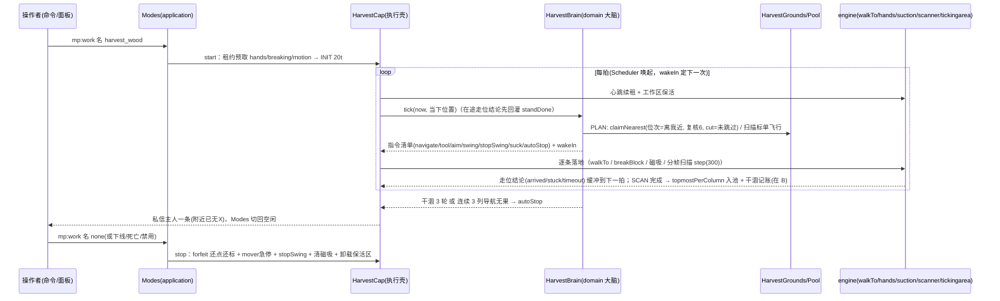

# 资源采集（harvest_wood）功能介绍与流程

> 一句话:假人按**采集大脑**（`domain/HarvestAI.ts` 的 `HarvestBrain`，逐拍状态机）采集资源——身边 16 格扫描盒找列，就近贴靠、自树基沿列真实破坏；一次选定落列就发一条走位走到底（结论由引擎位置观测回灌才换下一候选），够不着只短期跳过、连续 3 列导航无果才暂停任务；起砍窗口内掉落按拍磁吸，附近连续 3 轮扫描再无进账才判停，终态一条私信主人。工作过程只落日志。

> 一种采集对象一实例（`application/Capabilities/Harvest.HarvestCap`，id=`harvest_<kind>`），当前仅注册原木一种（`domain/HarvestRules.ts` 的 `HARVEST_KINDS` 只有 wood 行）："采什么/首格在哪/朝哪个方向续航/吸什么掉落"取 `domain/HarvestRules.ts` 的配方数据（`harvestRecipe(kind)`），"下一步做什么"全部由大脑裁决并输出**指令清单**，能力层只做机械执行与租约把守——大脑零世界访问（观测经注入的 `HarvestSenses`），故全部行为可离线 `node:test` 仿真（`tests/domain.HarvestSim.test.ts`）。文中 `文件 · 符号` 标注对应 `scripts/` 当前实现。

## 0. 行为要点（对应实机反馈的修复）

| 现象（旧）               | 现在的做法                                                                                                                                                                                                                                                                                                                                                                                                                      |
| ------------------------ | ------------------------------------------------------------------------------------------------------------------------------------------------------------------------------------------------------------------------------------------------------------------------------------------------------------------------------------------------------------------------------------------------------------------------------- |
| 身边有树却报"没有可采集" | 首格高出可达带/导航走不通只进**会话私有跳过表**（600t 到期复评，池见底无其他可领点时缩至 150t），绝不写共享池失败；共享 `blocked` 只留给"到位后反复挥拍目标格读回仍不消失"（真够不着/实不可破），连站 5 次破不掉才计（预算首格 200t、同列换站减半）                                                                                                                                                                             |
| 一直寻路、一直接近失败   | 一次选定落列只发**一条**走位走到底，不再逐拍重发：导航终点取高位 `y=330`，引擎按列投影走到该列地面；走位成败不看 `navigateToLocation` 的 `isFullPath`（它只表示没有直达终点的完整路径，可移动距离内假人仍会沿残径靠近），只由 `Mover.walkTo` 的 10t 位置观测出结论（停下且水平到位＝arrived、停下没到位＝stuck、满 100t 仍在挪＝timeout）后才换下一候选；候选用尽/整轮 400t 超时只短期跳过该列，连续 3 列导航整列无果才任务暂停 |
| 高树抬头呆立             | 列内推进出可达带（脚位 +5 格）即**整列收场转下株**（不垫脚不强爬）；残冠靠方块枯萎掉落 + 扫尾磁吸收货                                                                                                                                                                                                                                                                                                                           |
| 砍完一片即停摆误判       | 判停口径=连续 3 轮**可信**扫描零进账且视野内列全部脱离池跟踪；不可信轮（区块读不全）与"列还在他人手里/只是被我短期跳过"都不算干涸                                                                                                                                                                                                                                                                                               |
| 贴身邻株从半腰起砍漏下部 | 列结算 6 邻发现时对每个新列 `probeColumnBase` 向下探出真实树基再入池，起砍恒自树基                                                                                                                                                                                                                                                                                                                                              |
| 掉落物在多假人间反复传送 | 吸附归属账：物品被某假人吸过 60t 内他人不夺，落点恒为发起者脚下（`engine/DropSuction`）                                                                                                                                                                                                                                                                                                                                         |
| 工作消息刷屏             | 过程全部 console 日志（`[mockplayer3] 资源采集(…) …`：认领/弃列/发现回灌/干涸逐轮）；终态一条私信主人                                                                                                                                                                                                                                                                                                                           |
| 砍的目标格不转头看       | 换格即重发 `aim`（`engine/Hands.aimCell`），逐格独立挥拍（`swingCell`＝`breakBlock` 真实破坏进度）                                                                                                                                                                                                                                                                                                                              |

采集对象（`domain/HarvestRules.ts` 的 `HARVEST_KINDS`，当前仅原木一行；表序即 UI 顺序）：

| kind | 中文名/模式 label | 扫描白名单（Bedrock 原生 id）           | 工具策略                                 | 首格与续航                                                                                 | 扫描 y 盒（相对脚位） | 可达/深度/扫尾                     |
| ---- | ----------------- | --------------------------------------- | ---------------------------------------- | ------------------------------------------------------------------------------------------ | --------------------- | ---------------------------------- |
| wood | 资源采集(原木)    | 各系 `_log` + 绯红/诡异 `stem`（11 种） | axe（斧：品阶优先，效率>耐久>精准>时运） | 首格=列底格（`probeColumnBase` 探树基），bottomUp 自树基逐格上挖，出可达带即整列收场转下株 | 下 8 / 上 24          | reachUp 5 / maxDown 0 / settle 40t |

前置条件（以代码为准）：

1. 假人**在线**（ACTIVE/WORKING 才能起跑；离线只允许预置模式，上线尾段 `attachAfterRestore` 回挂）；
2. 操作者 `canManage`（管理员或主人）；
3. 管理员未禁用该模式（`config.workModeEnabled[harvest_<kind>]`，目录默认**全开**）；
4. 所需租约可得：`hands`、`breaking`、`motion` 三项（`HarvestCap.requires()`），任一被占即拒启动。注视不走 gaze 租约——`aim` 指令执行即一次性对准（纯视觉不占资源）。

## 1. 术语速查

| 术语                          | 指代                                                                                                                                                                                                                                                                 | 位置                                                                  |
| ----------------------------- | -------------------------------------------------------------------------------------------------------------------------------------------------------------------------------------------------------------------------------------------------------------------- | --------------------------------------------------------------------- |
| 采集大脑 `HarvestBrain`       | 逐拍状态机：PLAN（裁决/认领/判停）→ SCAN（分帧补扫）→ MOVE（一个落列候选一条走位走到底，等结论回灌才换下一候选）→ MINE（当前格连挥）→ SETTLE（起砍后掉落扫尾窗）。等待只表达为 `wakeIn`，输出为指令清单，无任何世界访问                                              | `domain/HarvestAI.ts`                                                 |
| 注入观测面 `HarvestSenses`    | 大脑的三项外部能力：`read`（格方块 id，undefined=读不到≠空气）/`startScan`（分帧扫描任务）/`log`；够得着与否由大脑用域破坏距 `inBreakReach` 自判，不经观测面；能力层装配，仿真层替身                                                                                 | `domain/HarvestAI.ts`、`application/Capabilities/Harvest.ensureBrain` |
| 指令 `HarvestCommand`         | navigate / stopMove / tool / aim / swing / stopSwing / suck / autoStop——大脑说"做什么"，能力层逐条落地为一次原子调用，不做任何再判断                                                                                                                                 | `domain/HarvestAI.ts`、`HarvestCap.execute`                           |
| 配方 `HarvestRecipe`          | 一类采集的全部纯数据判据：`isTarget/acceptsDrop/nextCell/entryCell/approachCell/scanRect/reachUp/maxDown/dropSettleTicks/toolStrategy/scanTypeIds`——"抄什么"由它供给，不含流程分支                                                                                   | `domain/HarvestRules.ts` 的 `harvestRecipe()`                         |
| 共享点池                      | 列级点位（key=列坐标键，含发现格 loc 与探出的 base）多假人分配：`claimNearest` 独占取点（位次=离认领会话水平距离）、`release(spent/blocked/ok)`、连败 3 进黑名单、复核判死 `removeKeys`+`pardonKeys`、单飞行扫描标                                                   | `domain/Pool.ts` 的 `SharedPool`                                      |
| 采集地 `HarvestGrounds`       | 按 (维度,kind) 各自一池 + 域级 60t 扫描节流；`forgetBot` 收回该假人历世囤点与死扫描标                                                                                                                                                                                | `domain/HarvestGrounds.ts`、`Runtime.harvestGrounds`                  |
| 跳过表                        | 大脑会话私有的短期失效表（列键 → 复评时刻，TTL 600t；池低于水位线且无其他可领点时 150t）：够不着/首格暂不成立只跳本会话，与共享池失败标记完全隔离                                                                                                                    | `HarvestBrain.skip`                                                   |
| 首格 `entryCell`              | bottomUp=列底格、topDown=列顶格；脚下同列或高出可达带（`entryTooHigh`）返回 null=当下不可起手                                                                                                                                                                        | `domain/HarvestRules.ts`                                              |
| 站位候选 `approachCandidates` | 目标列的水平 8 邻列（纯几何、零世界访问），候选 `y` 恒为高位常量 `HARVEST_NAV_HIGH_Y=330`——只裁决"走到哪一列"，脚位层交引擎按列投影地面；MOVE 首拍按当下位置算一次，一个候选一条走位走到底，走位结论回灌后才换下一候选                                               | `domain/HarvestRules.ts`（落点层由引擎按列投影）                      |
| 破坏距 `inBreakReach`         | 起挥/到位唯一判据：脚位到目标格角点距 ≤ 5.5（到位闸 7−1.5），水平落在目标列正下方放宽到 7；续航以 `HARVEST_BREAK_REACH=7` 为圈，出圈即回 MOVE 重选站位（不计转场失败）。射线通视不参与裁决——`breakBlock` 按坐标挥拍不吃视线，破坏成功与否只以"目标格读回消失"为准    | `domain/HarvestRules.ts` 的 `inBreakReach/withinStandGate`            |
| 挥拍 `swingCell`              | `SimulatedPlayer.breakBlock(cell)`——真实破坏进度、逐拍连挥同格推进；换格先 `stopSwing` 交还逐格租约再 `tool`+`aim` 新格                                                                                                                                              | `engine/Hands.ts`、`HarvestCap.holdBreaking`                          |
| 列结算 `finishColumn`         | 出池（`spent` 除名）→ 6 邻发现新列（`probeColumnBase` 探基 + `upCell` 探顶，去重/拉黑拒收由池把关）→ 磁吸 + 进 SETTLE 窗                                                                                                                                             | `HarvestAI.finishColumn/discover`                                     |
| 干涸判停                      | 连续 3 轮可信扫描零进账（且看到的列全部脱离池跟踪）→ `autoStop("连续 3 轮扫描附近已无X…")` 私信主人一条 + 切回空闲                                                                                                                                                   | `HarvestAI.tickScan/tickPlan`                                         |
| 工作区保活                    | 以脚位区块为心维持 `tickingarea add circle` 圆 r=4 常载区（实测实占 49 区块列），±16 扫描盒落已加载块（否则 `getBlocks` 抛 UnloadedChunksError 整轮作废）；脚位区块距中心切比雪夫距离 ≥2 重划、停机宽限+强制两道卸载；创建失败（含容量上限）只警告不降档，待漂移再划 | `HarvestCap.keepWorkArea`、`engine/TickingAreas`                      |

## 2. 启用与配置入口

```
/mp:work <假人名> harvest_wood          ──→ lifecycle.changeWorkMode → modes.change（在线即起跑/离线预置）
/mp:work <假人名> [无参|list]            ──→ 渲染模式目录（采集模式并列，禁用标注）
假人面板 →「行为」→ 工作模式下拉「资源采集(原木)」 ──→ 同上 changeWorkMode
管理面板 → 全局配置「资源采集(原木)」逐项开关 ──→ workModeEnabled；禁用即停：在线假人批量回空闲
```

- 命令：`interface/Commands.Behavior.ts` 的 `mp:work`——采集即模式，无独立命令、无逐假人参数。
- 数值口径集中在 `domain/HarvestRules.ts` 常量段（扫描/认领半径 ±16 / 域节流 60t / 会话扫描冷却 120t / 干涸 3 轮 / 跳过 600t（池低于水位线且无其他可领点时缩至 150t）/ 单条走位预算 100t / 走位结论回灌节拍 10t / 首条结论即换下一候选 / 连续 3 列导航无果暂停 / 一列贴靠总预算 400t / 导航净速 1.2 / 单格破坏预算首格 200t、同列每换站减半至下限 50t / 认领复核 6 点/轮 / 6 邻探基探顶 16 格 / 到位闸 7−1.5 / 贴靠导航高位 330），**不入全局配置、不可热调**。
- 记录沿革：旧版"workMode=harvest + harvestKind 两级记录"由 `domain/Catalog.ts` 的 `normalizeStoredWorkMode()` 折成 `harvest_<kind>`。

## 3. 启动序列（`Modes.change`）

```
changeWorkMode(viewer, botId, "harvest_wood")        （Lifecycle：存在性 + canManage）
 └─ Modes.change(botId, "harvest_wood", now)
     ├─ workModeEnabled 关 → 拒「该模式已被管理员禁用」
     ├─ 无会话（离线）→ 只写穿 record.workMode，上线尾段 attachAfterRestore 回挂
     ├─ stopCurrent(session)：先停旧能力
     ├─ 租约预取：hands、breaking、motion 各 HOLD/TTL 100t acquire，冲突即拒并撤已得
     ├─ HarvestCap.start：落私有上下文（brain=null、breaking 键空、工作区中心空），相位 INIT、nextWakeAt = now+20t（稳定期）
     └─ transitTo("startWork") → WORKING；workMode 写穿 saveRecord；emit botWorkModeChanged
```

装配层 `Composition.ts` 显式 `modes.register(new HarvestCap(runtime, capHost, "wood"))`——一采集对象一实例，配方与工具策略在构造期装配；大脑在 `tick` 内按**当前维度**惰性创建（`ensureBrain`），换维先 `forfeit` 归还旧域持点再重建（点池按域寻址）。

## 4. 执行流程：大脑逐拍状态机

主循环由 Scheduler 唯一驱动：每 tick 先 `leases.expire`，再对 WORKING 且到 `nextWakeAt` 的会话回调 `HarvestCap.tick`。tick 头心跳续租（hands/motion 常续；breaking 仅持格时续逐格位），取 `mover.snapshotOf` 当下位置，把工作区保活、大脑装配、`brain.tick(now, bot)` 依次跑完，返回的指令清单逐条落地，相位与 `wakeIn` 回写 `cap.phase`。**决策全部在 `HarvestBrain.tick` 内按当下状态重算**，能力层拿不到任何判断权：

```
INIT(20t 稳定期)
 └→ 逐拍 PLAN/SCAN/MOVE/MINE/SETTLE 循环：
PLAN ─ 先收回死占用（claimLive）；
  ├─ 持列 → seizeColumn：按当下位置定首格（可空）转 MOVE
  ├─ claimNearest（位次=离自己水平距离，accept=entryOk 现场复核，cut=未被跳过）
  │    entryOk：首格读不到=放行待到场；非目标=记 dead 除名+赦失败；脚下同列=放行（MOVE 先挪开）
  │    高出可达带=放行去走（到站重算，够不着才跳）——不在认领处判死
  ├─ 无斩获且池低水位且会话冷却(120t)与域节流(60t)到点 → 起 SCAN（单飞行扫描标）
  ├─ 池有可用点（都在他人手里/被跳过）→ 50t 短等
  └─ 干涸≥3 轮 → autoStop 终态一条
MOVE ─ 首格未成立（正踩脚下等）→ 重算 entryCell；已 inBreakReach 即转 MINE（先停走）；
      否则按当下位置算一次站位候选列，一个候选发一条走位（终点 y=330，引擎按列投影地面）走到底（结论未回不发下一条）；
      走位结论由 engine 逐拍位置观测回灌（arrived/stuck/timeout/entity_invalid/error）：
      到位→下一拍按 inBreakReach 复判够不够得着；停下但没到位 / 满 100t 仍在挪 → 换下一候选
      （候选用尽 / 整轮 400t 超时 → giveupColumn，只短期跳过 + 计连续无果列，绝不记共享失败）
MINE ─ 同格逐拍连挥（breakBlock 真实进度）；换格先 tool（选优换主手）+ aim（重瞄）；
      格消失（读回=唯一事实）→ makeChainLimit 护栏 + entryTooHigh 带截断定续航格，出带即整列收场；
      续航格出破坏距 7 → 回 MOVE 朝该格重选站位（不计转场失败）；当前格迟迟破不掉：
      高出可达带整列收场（不爬），否则回 MOVE 换站位（同列换站上限 4 次，超限弃列记 blocked＝真够不着）；
      单格预算耗尽同前处置（首格 200t，同列每换一次站位减半、下限 50t——慢破坏已由首格全额排除）；读不到耗预算防空等
SETTLE─ 起砍后 dropSettleTicks 窗口内每 5t 补吸一轮（残粒/枯萎级联延迟掉落），窗尽回 PLAN
SCAN ─ RegionScanner 分帧（每拍 ≤300 命中格，F-18 不阻塞）；完成时 topmostPerColumn（离扫描锚近→远）去重入池；
      零进账计干涸前两道豁免：本轮不可信（异常≠无资源）不计；看到的列仍被池跟踪（他人采/我被跳）不计
finishColumn ─ release(spent) 除名本列 → 6 邻发现（同列上下格除外；probeColumnBase 探真实树基、upCell 探顶）refill 回灌 → suck → SETTLE
```

### 4.1 认领与多假人分配（`tickPlan` + `claimNearest`）

认领带宽=扫描盒（水平 ±16，对角 ~22）——点从扫描入池时已被盒约束，认领不再叠距离截断（旧版近带/远带二分与转场半径已随探索链删除：判停只代表 ±16 内已探明，主人换地再启）。位次=离认领会话的水平距离；复核预算 6 点/轮，未中的候选回队尾轮转防饿死。claimed 互斥=**认领先于行路**：每 bot 至多持一列，多假人不会走向同一列互相截胡；死会话占用由 PLAN 的 `sweepClaims(claimLive)` 兜底收回。扫描标单飞行（`acquireScanToken`）防同域成片重复扫。

### 4.2 走位：一条走位走到底，结论由引擎位置观测回灌（旧逐拍重发是"连续寻路无进展"的根因）

MOVE 首拍按当下位置算一次 `approachCandidates`（目标列水平 8 邻，`y=HARVEST_NAV_HIGH_Y=330`），一个候选只发**一条** `mover.walkTo`（净速 `HARVEST_NAV_SPEED=1.2`）——候选只裁决"走到哪一列"，脚位层由引擎按列投影地面，脚本侧既不猜层也不判可站性。

走位结论一律由引擎事实裁决，不采信发起返回值：`navigateToLocation` 的 `isFullPath=false` 只代表"没有直达终点的完整路径"，可移动距离内假人仍会沿残径靠近，只有超出可移动距离才真不动——所以 `Mover.walkTo` 不看它、也不 `stopMoving`，只看 10t 节拍的位置观测：停下且水平距候选列中心 ≤ `NAV_ARRIVE_XZ=1.5` 即 `arrived`，停下但没到位即 `stuck`，满 `HARVEST_NAV_WALK_BUDGET_TICKS=100` 仍在挪即 `timeout`，实体失效/抛穿即 `entity_invalid`/`error`。同 bot 单飞：新走位发起即取消在途那条（`cancelled` 不回灌）。结论缓冲在能力上下文，下一拍起头喂 `brain.standDone`，大脑的状态变更仍只在 tick 路径发生（F-18）。

止损：`arrived` 后由 `tickMove` 首行 `inBreakReach` 复判——到位仍够不着＝落点离目标太远，同样换下一候选；`stuck`/`timeout`/`entity_invalid`/`error` 直接换下一候选；8 个候选用尽或整轮 400t（`HARVEST_NAV_DEADLINE_TICKS`，每轮换格重计）超时才 `giveupColumn`（该列短期跳过 + 计"连续无果列数"，**绝不记共享 `blocked`**）——从某个落点走不通不代表对所有假人不成立。连续 3 列导航整列无果才 `autoStop` 任务暂停（任一次确认破掉一格即清零）。共享失败只留给 MINE 侧"到位后反复挥拍目标格读回仍不消失"这一真·够不着事实。弃列的短期跳过按时长需求分级：池低于水位线且此刻没有其他可领点（没别的去处）→ 150t 即复评；池里还有别的活可干 → 维持 600t，不在堵住的列上反复回头。

> 旧实现每 20t 按当下位置重算最优站位并重发导航，候选位次随假人移动来回翻、距离改善判据被抖没，走几步就被误判"连续寻路无进展"弃点——即实机"一直寻路、一直接近失败"的来源，已连同 `HARVEST_REPATH_TICKS/HARVEST_NAV_STALL_TRIES` 一并删除。

> 大脑原来自带的 8t×5 位置采样窗（位移阈 + 逼近阈双条）随之下线：走位事实只保留一个观测者（engine 的 `walkTo`），大脑只按结论裁决换候选还是弃列；`predictedBreakDistance` 与脚位 ±1 层带、24 格候选上限一并删除——落点层由引擎投影后，"预测站进去够不够得着"既算不准也没必要。

### 4.3 连挥与续航护栏

`swingCell` 即 `breakBlock`：同格逐拍调用推进破坏进度，破成当拍大脑直接取 `nextCell` 续航（格间零空挡）。续航前跑两道护栏：`makeChainLimit(maxDown)`（脚下护栏双向 + 坑缘只截向下）与 `entryTooHigh(reachUp)`（出带即整列收场）——原木 bottomUp 自树基向上，`maxDown=0` 使任何向下续航即被坑缘截断、**永不追挖自身脚下列**（脚下护栏双向成立），向上到脚位 +5 出带即整列收场转下株。站位候选只给水平 8 邻列——目标列本身不入候选（其地面投影是树顶），"站在目标正下方"不再是一种走位。

### 4.4 掉落与背包

无自动拾取假人背包的引擎行为可依赖：破成后由 `suck` 指令触发 `suction.suck`（半径 16、只收 `acceptsDrop` 类型、恒到发起者脚下、60t 归属防多假人夺物），SETTLE 窗内按 5t 节拍补吸延迟掉落。工具每格开挥前 `tool` 指令走 `makeEnsureTool(配方键)` 全背包选优换主手；耐久告急换件归全局 ToolGuard，采集侧零感知。

## 5. 停止与结束条件

| 触发                                                 | 路径                                                                                                                                                                                                                      | 现场清理                                                                                                                                   |
| ---------------------------------------------------- | ------------------------------------------------------------------------------------------------------------------------------------------------------------------------------------------------------------------------- | ------------------------------------------------------------------------------------------------------------------------------------------ |
| 手动 `mp:work <名> none` / 切其它模式 / 面板         | `Modes.change → stopCurrent → HarvestCap.stop`                                                                                                                                                                            | `forfeit`（归还持点+释放扫描标+急停指令）→ `mover.stop`、`stopSwing`、清磁吸归属、tickingarea 宽限+强制两道卸载；租约由 stopCurrent 统一撤 |
| **干涸判停**：连续 3 轮可信扫描零进账                | `autoStop("连续 3 轮扫描附近已无X可采集")` → 私信主人一条 + 切回空闲                                                                                                                                                      | 同上（stop 由 change 路径统一走）                                                                                                          |
| **导航止损**：连续 3 列导航整列无果（候选用尽/超时） | `autoStop("连续 3 列导航走不过去，任务暂停")` → 私信主人一条 + 切回空闲                                                                                                                                                   | 任一次确认破掉一格即 `gives` 清零；只暂停不停机，换地再启归零                                                                              |
| 列级止损（无他项可做时表现为池见底→干涸）            | 到位后反复挥拍目标格读回仍不消失（真够不着/实不可破）的列连站 5 次弃点（预算首格 200t、同列换站减半至 50t），连败 3 次进共享黑名单（他人也不再认领）；导航走不通/够不着但结构成立的列只被跳过 600t（无其他可领点时 150t） | 不停机——黑名单外仍有点就继续采；判停终态仍只有干涸/导航止损两条                                                                            |
| 下线管线 / 死亡                                      | `Lifecycle stopCurrent → DYING`；重生尾段 `attachAfterRestore` 回挂重跑（大脑随新会话重建）                                                                                                                               | 回挂失败私信主人并落空闲                                                                                                                   |
| 管理员禁用该采集模式                                 | `Panels/Admin` 提交回调对在线假人批量切 none                                                                                                                                                                              | 同手动停止                                                                                                                                 |
| 能力 tick 抛穿                                       | `Scheduler.runSession` catch → `stopCurrent` + workMode=none 写盘                                                                                                                                                         | 只停该假人                                                                                                                                 |
| 假人被删除                                           | `botDeleted` → `runtime.harvestGrounds.forgetBot(botId)` + `suction.releaseBot`（Composition 订阅段）                                                                                                                     | 其历世囤列与扫描标全部归还、名下掉落归属放还无主                                                                                           |

## 6. 与其它子系统的交互

- **Clock / Scheduler**：唯一时钟与驱动者；一切等待表达为 `wakeIn → nextWakeAt`（INIT 20t / 工作相恒 1t 逐拍复评 / 短等 50t / 扫尾窗 5t 节拍）。
- **租约（Leases）**：启动预取 hands/breaking/motion（motion 与跟随/钓鱼/闲逛/宝库等走位能力互斥显形）；breaking 以 blockKey 逐格换发（`holdBreaking` 还旧领新，被他人在途占格则本拍空过、大脑按无进展裁决）。
- **导航（Mover）**：`navigate` 指令落地为一次 `mover.walkTo`（净速 `HARVEST_NAV_SPEED`、预算 `HARVEST_NAV_WALK_BUDGET_TICKS`）——大脑一次选定就发一条走到底，拿到结论才发下一条；结论（`arrived/stuck/timeout/entity_invalid/cancelled/error`）由 10t 位置观测得出、经能力缓冲回灌 `brain.standDone`，不采信 `isFullPath`；`stopMove` → `mover.stop`（一并作废在途走位，防迟到结论回灌）；导航途中绝不 lookAt（对准由 `aim` 一次性指令承担）。
- **破坏距（inBreakReach）**：大脑用域几何闸（入圈 5.5、续航 7）自判够得着，不经引擎射线——`canHighlight`/`engine/Highlight.ts`（isOnGround+眼高距格≤3+通视）作为 MINE 起挥闸已删除：它严于 `breakBlock` 实际所需，第一格原木破掉后其上一格通视失败即被弃，正是"只砍一个方块就走"的根因。破坏成功与否唯一以"目标格读回消失"为准。
- **破坏（Hands）**：`breakBlock` 真实破坏逐拍连挥；停机/换格路径 `stopSwing` 幂等急停。
- **吸取（DropSuction）**：MINE 连挥期与 SETTLE 扫尾窗都按 5t 节拍发 `suck`（`magnetPulse`），破成当拍与整列收场各额外吸一轮——不只收场时吸一次；半径 16、归属 60t、落点恒为发起者脚下——多假人并发作业各进各背包。
- **扫描（Scanner）**：`RegionScanner` 分帧（每拍 ≤300 格，F-18），`requireAirAbove:false`、`allowUnloaded:true`（未加载块记异常轮、扫描不可信不计干涸）；白名单只用 Bedrock 原生 id（`engine/Scanner.screenTypes` 另有剔除防线）。
- **区块加载（TickingAreas）**：工作区圆 r=4 保活随脚位滚动（见 §1 工作区保活），停机双道卸载。
- **播报（EntityOps）**：过程**无播报**（`dbg()` console.warn 唯一通道）；终态一条 `autoStop → notifyPlayer(ownerKey)`。
- **记录 / Runtime**：模式即 `workMode` 持久化；点池与扫描节流（`HarvestGrounds`）进程内存活、随 Runtime 同寿，重启重扫。

## 7. 已知限制与引擎约束

- **认知范围=扫描盒 ±16**：判停只代表脚边 16 格已探明；更远的林子不是采集模式的责任，判停后主人换地再启（旧"转场 64 格/探索前沿区块"链路随 WorkMemory/MovePlan 一并删除，不再跨区块追资源）。
- **够得着以域破坏距自判为准**（入圈 5.5 / 续航 7，不做通视射线）：密集地形里"看得见摸不着"的列被反复跳过属预期（跳过表 150–600t 复评），只有到位后反复挥拍仍破不掉才升级为共享失败。
- **贴靠只裁决水平落列，不裁决落点层**：候选恒为目标列水平 8 邻（`y=330`，高于任何可站地面），脚位层由引擎按列投影到该列地面；投影不出地面（悬空、无落点）即 `stuck`，换下一候选直至弃列，脚本侧不垫脚也不追挖。
- **F-18 纪律**：tick 回调同步短小无自旋——扫描分帧、导航一次一条走到底（引擎位置观测出结论才换候选）、挥拍单格推进各自受预算约束（SCAN 300 格/拍、单格 200t、走位 100t、一列贴靠 400t），大脑永不等待协程；走位 Promise 只写能力上下文的结论缓冲，状态变更一律在 tick 路径发生。
- **多假人协作粒度**：认领互斥=列级预约（claimed 先于走位），邻列同时开砍可能互相挡道，由导航无果短期跳过/够不着换站护栏自然错峰；黑名单列经 `pardonKeys`（复核判死时）或池消散后可复活。
- **扫描 y 盒按配方**（wood 下 8 上 24）：超出 y 盒的高冠不入池——残冠靠枯萎掉落 + 扫尾窗，不追挖。

## 8. 实机验证清单（设计均有退化路径，不押注单一引擎行为）

1. `breakBlock` 逐拍连挥的实际手感与破坏距闸（入圈 5.5/续航 7）是否吻合：同格挥拍进度是否稳定推进到位、第一格破掉后其上一格能否顺利接挥（旧 `canHighlight` 通视闸已删——退化：单格 200t 预算到点即弃格，不会空挥永久停摆）。
2. 逐格上挖的收场点：自树基上挖到 `reachUp` 出带即整列收场转下株，观察出带处残粒掉落时延——决定 wood 配方 `dropSettleTicks=40` 是否够用。
3. 圆 r=4 工作保活区在多假人并发下的原生限额（每维度默认 10 区）表现：`ensureWorkArea` 失败即警告留痕、不降档，待脚位漂移再划；±16 扫描抛 UnloadedChunksError 的残余比例（异常轮不计干涸，只会拖慢判停）。
4. 高位 Y 列投影导航的实际手感：`navigateToLocation(x, 330, z)` 是否稳定走到该列地面、落点层与水平位次是否如预期（不绕圈、不来回翻）；净速 1.2 是否过冲易卡、单条走位预算 100t 与到位半径 `NAV_ARRIVE_XZ=1.5` 是否误判——调 `HARVEST_NAV_SPEED`/`HARVEST_NAV_HIGH_Y`/`HARVEST_NAV_WALK_BUDGET_TICKS`/`NAV_ARRIVE_XZ` 需附实测日志。
5. 起砍窗口内掉落磁吸（MINE 期 5t 节拍 + 收场/扫尾额外一轮）：观察树干连伐时掉落是否被接住、多假人并发下各进各背包（旧只在收场时吸一次已修）。

## 9. 时序图（启用→主循环→停止）


