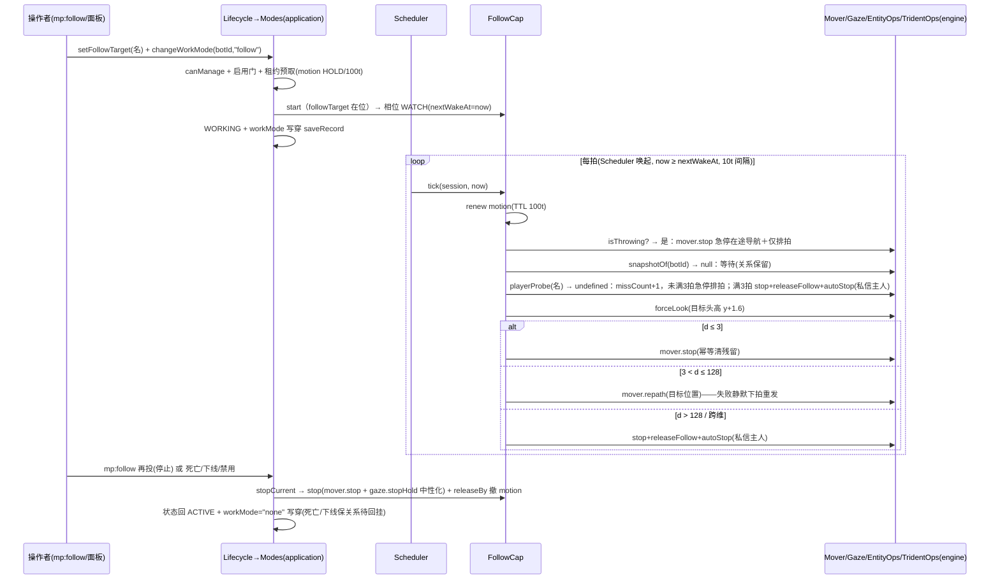

# 假人跟随（follow）功能介绍与流程

> 一句话:假人以 10 tick 节拍持续追踪指定真人——近距停走、远距寻路行走、眼睛随主而转，超距 128 格 / 跨维度 / 目标连续 3 拍解析不到即自动解除关系回空闲并通知主人，三叉戟投掷期整拍挂起并急停在途导航。

> 假人唯一的"持续位移"类工作模式（`WorkMode = "follow"`），机械距离带模型。文中 `文件 · 符号` 标注均对应 `scripts/` 下当前实现，逐条与代码行为核对。设计口径见 `../../../../docs/mockplayer/03-详细设计/04-能力体系与调度.md` §3.7（注意：该节"滞回/传送接力/低频重探"为旧口径，已被 `../../../../docs/mockplayer/11-归档源码对齐差异审查.md` 异3/异34 回归批定案覆盖）与 `07-专项机制.md` 三叉戟双任节。

## 0. 功能介绍

**跟随**让假人持续追踪一名真实玩家：每 `FOLLOW_TICK = 10` tick 重判一次 3D 距离带（`domain/FollowRules.ts`），按裁决停走或重发导航。命中/走行/卡死等引擎行为**不做回读监测**——`engine/Mover.ts` 的 `repath()` 是"每拍重发、失败静默"的一次性发起，与 `navigate()` 的"预检+监测+回读"单段执行体是两套原子（`Follow.ts` 头注、`Mover.repath()` 注释）。

- 目录定义：`domain/Catalog.ts` 的 `WORK_MODES` 表 `follow` 条目——label「跟随」，help「跟随指定玩家，距离带 3~128」，`requiresLeases: ["motion"]`，`tier: "base"`。
- **关系与模式是两层**：跟随关系是持久化记录字段 `BotRecord.followTarget`（`domain/Record.ts`，存目标真人**名字**字符串键，可 null）；follow 模式能力是执行者。关系是能力 `start()` 的前提，能力自动停机时反过来清关系（`CapabilityHost.releaseFollow` 缝）——"只停能力不清关系会在下次上线回挂复活"（`application/Capabilities/Common.ts` 接口注释）。
- 距离带裁决（`domain/FollowRules.ts` 的 `classifyFollowGap()`，无滞回死区、每拍独立判带）：

```
d = distance3d(假人位置, 目标位置)         （domain/Coords.ts 的 distance3d()，含 Y）
d ≤ 3(FOLLOW_STOP_DIST)   → stop    停走（每拍幂等清导航残留）+ 注视
3 < d ≤ 128(FOLLOW_MAX_DIST) → walk  重发导航 + 注视
d > 128                   → release 停走 + 清关系 + 自动落空闲 + 通知主人
```

- 特殊分支（`application/Capabilities/Follow.ts` 的 `FollowCap.tick()`）：**跨维度**（目标 `dimensionId` ≠ 假人 `dimensionId`）等同 release（直断关系，封堵"同坐标站桩"盲区，异3 定案）；**假人自身实体瞬断**（死亡窗口/换实体尾，`mover.snapshotOf` 返回 null）不断关系、只等待重探；**目标解析不到**（`playerProbe` 返回 undefined，含真离线与换维窗口等瞬态，二者当场不可区分）先每拍急停原地等，**连续 `FOLLOW_MISS_LIMIT = 3` 拍**（约 30 tick）才清关系落空闲——瞬态宽限，不再单拍直删；**投掷期**（`tridentOps.isThrowing`）整拍挂起——`mover.stop` **急停在途导航**，不重发、不判距（关系与相位保留）、不驱动注视（不抢抛掷朝向，异34 注③口径）。
- 前置条件（以代码为准）：假人在线即可起跑（离线只预置，见 §2）；操作者 `canManage`（`domain/Permissions.ts` 的 `canManage()`）；管理员未禁用（`workModeEnabled.follow`，当前默认表 `defaultEnabledModes()` 为**全开**）；`record.followTarget` 非空（`FollowCap.start()` 校验，缺失拒绝启动「未指定跟随目标」）。目标是否当下在线**不在启动校验内**——首个 WATCH 拍解析不到即入 missCount 宽限等待，连续 3 拍才断关系。

## 1. 术语速查

| 术语                                             | 指代                                                                                                                                                               | 位置                                                                                                 |
| ------------------------------------------------ | ------------------------------------------------------------------------------------------------------------------------------------------------------------------ | ---------------------------------------------------------------------------------------------------- |
| WATCH 单相位                                     | 本能力唯一相位——"每拍重判距离带"的循环；跨拍状态只有宽限计数 `missCount`，挂 `capability.data["follow"]`（D-01：能力全局单例、零实例字段，状态走 data 不走类字段） | `application/Capabilities/Follow.ts` 的 `FollowCap` 类、`FollowCtx` 与 `setWake()`                   |
| `FOLLOW_TICK = 10`                               | 距离带重判/导航重发节拍（tick），写死不入配置                                                                                                                      | `domain/FollowRules.ts`                                                                              |
| `FOLLOW_MISS_LIMIT = 3`                          | 目标连续解析不到的拍数上限（按 FOLLOW_TICK 节拍，约 30 tick），达到才解除关系；解析成功即归零                                                                      | `application/Capabilities/Follow.ts` 的 `FOLLOW_MISS_LIMIT`                                          |
| `FOLLOW_STOP_DIST = 3` / `FOLLOW_MAX_DIST = 128` | 停走线 / 超距断关系线                                                                                                                                              | `domain/FollowRules.ts`                                                                              |
| `classifyFollowGap()`                            | 三段纯裁决 stop/walk/release                                                                                                                                       | `domain/FollowRules.ts`                                                                              |
| `mover.repath()`                                 | 一次性寻路发起：直接 `bot.navigateToLocation(target, 1)`，**无 ≤16 格水平预检、无到达/停滞监测、失败静默**，引擎导航天然覆盖上一条                                 | `engine/Mover.ts` 的 `repath()`                                                                      |
| `mover.snapshotOf()`                             | 假人当下位置+维度即时真值（record 的维度是事件写穿镜像、可能滞后一拍）                                                                                             | `engine/Mover.ts` 的 `snapshotOf()`                                                                  |
| `ops.playerProbe()`                              | 目标真人快照：经 EntityGateway `findRealPlayer()` 按名解析（排除假人），返回 id/位置/维度纯数据上达，离线或读取抛穿一律 undefined                                  | `engine/EntityOps.ts` 的 `playerProbe()`、`engine/EntityGateway.ts` 的 `findRealPlayer()`            |
| `gaze.forceLook()`                               | 一次性 Continuous 注视，"调用方自持重发节奏，不进 HOLD 任务表、不与租约互抢单槽"——跟随每拍重发（10t < Instant 自回中约 2s），故视线持续咬住目标头部高度 `y + 1.6`  | `engine/Gaze.ts` 的 `forceLook()`，调用在 `FollowCap.tick()`                                         |
| motion 租约                                      | HOLD、TTL `ACTION_HOLD_TTL_TICKS = 100`，启动预取 + 每拍续租（10t 心跳 ≪ 100t TTL，匹配无失租窗口）；与导航/挥击类能力互斥显形                                     | `application/Modes.ts` 的 `change()` 租约预取段、`FollowCap.tick()` 续租段、`domain/Leases.ts`       |
| `tridentOps.isThrowing()`                        | 本假人投掷链是否进行中（按 botId 互斥的内存集合）；true 时跟随整拍挂起并每拍 `mover.stop` 急停在途导航                                                             | `engine/TridentOps.ts` 的 `isThrowing()` 与 `throwing` 集合                                          |
| `releaseFollow` / `autoStop`                     | 能力回空闲双出口：前者清 `record.followTarget` 写穿保存（ Composition 实现），后者通知主人私信 + `modes.change("none")`                                            | `application/Capabilities/Common.ts` 的 `CapabilityHost` 接口、`scripts/Composition.ts` 的 `capHost` |

## 2. 启用与配置入口

```
/mp:follow <假人>                    ──→ 双态：当前 workMode==="follow" 则清关系+切 none 停止；
                                        否则 setFollowTarget(执行者名) + changeWorkMode("follow")
/mp:work <假人> follow|跟随          ──→ 仅切模式（关系须已在，否则 start 拒「未指定跟随目标」）
假人面板 →「行为」→ 工作模式下拉「跟随」 ──→ 切入先写关系（目标=操作者），切出待模式切换成功后再清关系
管理面板 → 全局配置「跟随」开关        ──→ workModeEnabled.follow（禁用即停：在线假人批量回空闲）
```

- 命令：`interface/Commands.Behavior.ts` 的 `BEHAVIOR_COMMANDS` 表 `mp:follow` 条目——停止时"先清关系再切模式，避免离线记录残留 follow"；启动时关系保存失败即中止，模式切换失败原样回显拒绝原因；离线假人放行预置，回执"已为 X 设定跟随你（离线假人下次上线生效）"（在线判定 `interface/Commands.Lifecycle.ts` 的 `isOnline()`）。帮助行见 `interface/Panels/HelpGuide.ts`。
- 面板：`interface/Panels/Behavior.ts` 的 `showBehaviorPanel()`——切入 follow 即 `setFollowTarget(viewer, botId, viewer.key)` 写入执行者名字键；从 follow 切出时**待模式切换成功后**才清 null，切换被拒则保留关系（与 `mp:work` 口径一致，消除旧"先清后切"的失败连带丢关系问题）。
- 关系持久化缝：`application/Lifecycle.ts` 的 `setFollowTarget()`（存在性 + `canManage` + `saveRecord` 写穿）。
- 管理门：`interface/Panels/Admin.ts` 的 `MODE_META` 表 follow 条目与 `showGlobalConfig()` 的 `wm_follow` 开关。
- **无任何可调参数**：三个距离带常量与节拍全部写死在 `domain/FollowRules.ts`，不入 `domain/Config.ts`（配置面只有全局模式启用表一项）。

## 3. 启动序列（`Modes.change`，`application/Modes.ts` 的 `change()`）

```
mp:follow / changeWorkMode(viewer, botId, "follow")   （Lifecycle.changeWorkMode()：存在性 + canManage）
 └─ Modes.change(botId, "follow", now)                 （不经 Mailbox，同步切换）
     ├─ config.workModeEnabled.follow 关 → 拒「该模式已被管理员禁用」
     ├─ 无会话（离线）→ 只写穿 record.workMode + saveRecord + 日志 + 事件，
     │    下次上线/复活尾段 attachAfterRestore 回挂生效（关系早已随 followTarget 持久）
     ├─ 状态非 ACTIVE/WORKING → 拒「当前状态不可切换模式」
     ├─ 同模式且上下文在位 → 幂等成功
     ├─ stopCurrent(session)：先停旧能力
     ├─ 租约预取（D-02 冲突即拒）：motion 以 HOLD/TTL 100t acquire，
     │    被占 → 撤已得租约、拒「所需资源被占用（持有者：X）」
     ├─ 建上下文 {mode:"follow", phase:{name:"INIT", nextWakeAt:now}, data:{}}
     ├─ FollowCap.start：cap 缺失返「能力上下文缺失」；record.followTarget 为空返
     │    「未指定跟随目标」→ 撤租约、卸上下文、workMode 落 none、原因回显（change() 拒绝分支）
     │    否则相位置 WATCH、nextWakeAt = now（当拍即可被调度）
     └─ transitTo("startWork") → WORKING；record.workMode="follow" 写穿保存；
        console.warn 切换日志；emit botWorkModeChanged
```

## 4. 执行流程：WATCH 单相位节拍循环

主循环由 Scheduler 唯一驱动（`application/Scheduler.ts` 的 `runSession()`）：每 tick 先 `leases.expire` 清理，再对 `state === "WORKING"` 且 `now >= capability.phase.nextWakeAt` 的会话回调 `cap.tick`。tick 同步、短、无 await、无自旋（F-18/D-05）。

每一拍（`FollowCap.tick()`），按代码顺序：

1. **防御早退**：`session.capability` 缺失 → return；`record` 缺失（会话在而记录暂缺）→ 排下一拍再 return（等记录恢复或会话拆除自然收敛，不再逐拍空转）。
2. **关系守卫**：`record.followTarget` 为空（关系被外部解除）→ `autoStop("跟随目标已解除")`，return。
3. **续租心跳**：`leases.renew("motion", "follow", now, 100)`——先于挂起分支，投掷/瞬断期租约照续，不被过期撤销。
4. **投掷挂起**：`tridentOps.isThrowing(botId)` → `mover.stop`（急停在途导航——投掷起手时若正走长路径立即停下，不再任其跑到释放）+ `setWake(now + 10)`，return。不重发导航、不判距（关系与相位原样保留）、不驱动注视（不抢抛掷朝向，异34 注③口径）。
5. **自身瞬断**：`mover.snapshotOf(botId)` 为 null（死亡窗口/换实体尾）→ 仅 `setWake`，return。**关系保留**——这是"有语义的等待"（区别于伪装工作）。
6. **目标解析**：`ops.playerProbe(record.followTarget)` 为 undefined（真离线与换维窗口等瞬态一律归为解析失败，当场不可区分）→ `missCount+1`（`ctxOf(cap.data, "follow")`）：未满 `FOLLOW_MISS_LIMIT = 3` 拍仅 `mover.stop` 原地等待 + 排下一拍；连续满 3 拍才 `mover.stop` + `releaseFollow` + `autoStop("跟随目标已离线，停止跟随")`。解析成功则 `missCount` 归零。
7. **判带**：`target.dimensionId !== self.dimensionId` → 直接裁 `crossdim`；否则 `classifyFollowGap(distance3d(...))`。
8. **注视**（stop/walk 两档才发，release/跨维分支注视无意义）：`gaze.forceLook(botId, {x, y+1.6, z})`——目标头部高度，每拍 10t 重发 Continuous。
9. **执行**：

```
verdict  动作                                                      后续
────────────────────────────────────────────────────────────────────────
stop   → mover.stop(botId)（停走带每拍幂等清导航残留）             排下一拍 now+10
walk   → mover.repath(botId, target.location)（引擎导航覆盖上一条；
         失败静默——no_path/超引擎射程什么都不发生）                排下一拍 now+10
release→ mover.stop + releaseFollow + autoStop(
         "距离目标过远，停止跟随")                                  能力已卸，无下一拍
crossdim→ 同上，文案"跟随目标不在同一维度，停止跟随"               同上
```

文字流程图：

```
Modes.change("follow") ─→ [WATCH, nextWakeAt=now]
        │ Scheduler: WORKING 且 now ≥ nextWakeAt
        ▼
   tick: renew motion → 投掷中?──是──→ mover.stop 急停在途导航（10t 后再来，不重发不判距）
        │否
        ├─ 自身快照 null → 等待（10t 后再来，关系保留）
        ├─ 目标解析不到 → 每拍急停原地等，连续 3 拍才 stop+清关系+落空闲（私信主人）
        ▼
   forceLook(头高) → stop: mover.stop ／ walk: repath
        │                        （d>128 ／ 跨维：stop+清关系+落空闲）
        ▼
   排下一拍 now+10（永循环，直至手动停止/死亡/下线/禁用/tick 抛穿）
```

要点（均为代码事实）：

1. **单相位、极小 data**：`FollowCap` 无实例字段——全部状态 = `record.followTarget`（关系）+ `phase.nextWakeAt`（节拍）+ `capability.data["follow"]` 里的宽限计数 `missCount`（解析成功即归零），满足 D-01。
2. **导航失败无回退**：`repath` 不监测，"走不到"没有任何裁决参与——16 格外靠引擎导航自然行为（异42 裁定"Follow repath 10t 无限重发"，各能力导航失败分治、不发明统一回退）。
3. **无限重发的收敛性**：目标持续移动时，每拍 10t 的重发即"追踪制导"——路径终点永远取 `playerProbe` 的当下真值，上一条导航被天然覆盖，不存在旧路径漂移（投掷挂起期除外，见 §7）。
4. **掉线/死亡不对称**：假人自己瞬断**保关系等待**，目标解析不到**宽限 3 拍后断关系**——前者是实体换尾的常态；后者真离线仍按归档"不下线即删除"教义落空闲（异3 定案），只是换维窗口/瞬读失败等瞬态不再被单拍误杀。
5. **投掷衔接的完整语义**：挂起只发生在 WATCH 拍首，续租照常、每拍 `mover.stop` 急停在途导航——投掷链再长（每把约 2+20+20=42t）motion 租约也不会过期被撤；链毕 `throwing` 集合清除，下一拍自然恢复判距与重发（挂起期目标走远则转 walk 重新寻路）。

## 5. 停止与结束条件

| 触发                                                      | 路径                                                                                                                      | 现场清理                                                                                                                                                                                    |
| --------------------------------------------------------- | ------------------------------------------------------------------------------------------------------------------------- | ------------------------------------------------------------------------------------------------------------------------------------------------------------------------------------------- |
| 手动停止（`mp:follow` 再投 / 面板下拉「空闲」或其它模式） | `setFollowTarget(null)`（面板路径为切换成功后才清）+ `changeWorkMode("none")` → `stopCurrent`                             | `FollowCap.stop()` 幂等急停 `mover.stop` 清导航残留 + `gaze.stopHold` 中性化注视（甩向身体朝向远处，不回看旧目标）；motion 租约由 `stopCurrent` 强制 `releaseBy` 撤净；workMode="none" 写穿 |
| 超距（d>128）/ 跨维度 / 目标连续 3 拍解析不到             | `FollowCap.tick()` 各自分支：`mover.stop` + `host.releaseFollow`（清关系写穿）+ `host.autoStop`                           | autoStop（`Composition.ts` 的 `capHost`）私信主人「假人 X：…，已自动回到空闲」+ `modes.change("none")` 全套清场；关系已删，重开须重新 `mp:follow`                                           |
| 关系被外部解除                                            | tick 关系守卫 → `autoStop("跟随目标已解除")`                                                                              | 同上（此分支不重复清关系——已为 null）                                                                                                                                                       |
| 下线管线                                                  | `Lifecycle.offline()` 首步 `stopCurrent`                                                                                  | 会话销毁上下文随亡；**关系不清**（`followTarget` 留档），下次上线 `attachAfterRestore` 回挂复活（`Lifecycle` 上线步骤）                                                                     |
| 死亡                                                      | `handleDeath → stopCurrent` → DYING；自动重生则尾段 `attachAfterRestore` **回挂重跑** follow（`Lifecycle.respawnTail()`） | 死亡清场走通用管线；回挂失败私信主人原因并落空闲；`followTarget` 全程保留                                                                                                                   |
| 管理员禁用 follow                                         | `Admin.ts` 的 `showGlobalConfig()` 提交回调对在线假人批量切 none                                                          | 同手动停止                                                                                                                                                                                  |
| 能力 tick 抛穿                                            | `Scheduler.runSession()` catch → `stopCurrent` + `workMode="none"` 写盘 + 错误日志                                        | 关系**不清**（异常停机区别于自动停机）                                                                                                                                                      |
| 投掷期 / 假人自身瞬断                                     | **不是停止条件**：挂起/等待，关系与相位保留（`Follow.ts` 头注）                                                           | 死亡/下线另有管线负责清场                                                                                                                                                                   |

## 6. 与其它子系统的交互

- **Clock / Scheduler**（`engine/Clock.ts`、`application/Scheduler.ts`）：唯一时钟与唯一驱动者；跟随一切"等待"都表达为 `phase.nextWakeAt`（D-05）；每 tick 的 `leases.expire` 与 follow 的 10t 续租心跳构成 100t TTL 的安全网（忘续租 10t 内即被下一拍 renew 之前撤销的概率为零）。
- **导航（Mover / NavRules）**：只用 `repath/stop/snapshotOf` 三个原子，不碰 `navigate()`——`domain/NavRules.ts` 的 ≤16 预检、到达/停滞/超时监测**全部不参与**跟随裁决；注视走 `gaze.forceLook` 独立通道，不进 HOLD 任务表也不申请 gaze 租约（`Gaze.ts` 头注 F-06 的一次性 Continuous 豁免）。
- **三叉戟投掷（TridentOps）**：单向门控——投掷链进行中 `isThrowing()` 为 true，跟随 WATCH 拍整拍挂起（`FollowCap.tick()` 挂起分支），保护投掷时序（按下/蓄力/释放期间的位姿稳定）；投掷侧对跟随无感知（`interface/Panels/Trident.ts` 的 `doThrow()` 不传钩子）。
- **租约（Leases）**：motion 独占（`FollowCap.requires()`），与挖掘外一切走位/挥击能力（attack/fishing/wander/vault/harvest）互斥显形——冲突在 `Modes.change()` 预取时直接拒启动，运行中不打架。
- **EntityGateway / EntityOps**：`world.getPlayers` 只经 `engine/EntityGateway.ts`（分层纪律）；真人按名解析排除假人（`findRealPlayer()` 的 `isBot` 过滤）——目标键是名字，改名即失联。
- **SaveGate / Record**：关系（`followTarget`）与模式（`workMode`）均为写穿字段（`Lifecycle.setFollowTarget()`、`Modes.change()` 保存段），重启/离线后假人"记得"跟随关系；运行期无任何每拍世界写（读为主），Scheduler 每 100t 经验回写与脏字段冲刷照常。
- **Events / Notify**：`botWorkModeChanged` 仅领域事件留档；自动停机的对外显形 = 主人私信（`capHost.autoStop` → `ops.notifyPlayer`）+ 命令/面板回执 + 游戏日志。
- **Common.ts**：`releaseFollow` 缝是 follow 独有能力↔持久化唯一合法通道（能力不直接 import 保存层，Composition 实现）；`ctxOf` 用 `"follow"` 命名空间承载宽限计数 `missCount`（解析成功归零）。

## 7. 已知限制与引擎约束

- **无滞回死区**：3/128 两线机械判带，目标在 3 格边缘抖动时 stop/walk 逐拍切换属预期机械行为（`FollowRules.ts` 头注"机械模型无滞回死区"，异3 定案删死区）。
- **距离带与导航教义错位**：判带上限 128 ≫ `NAV_MAX_DISTANCE = 16`，而 `repath()` 又**不做**水平预检——3~~16 格内引擎寻路可靠，16~~128 格完全取决于引擎能否给出路径（跨未加载区块/无路径时静默失败原地站桩，每拍重发），脚本侧不感知、不接力（超距传送接力已随异3 退役）。
- **投掷挂起急停在途导航**：挂起分支每拍 `mover.stop`——投掷起手时若在走长路径会立即停下，不再任其跑到释放（旧口径"只 setWake、路径继续"已废止）；代价是投掷链每次停顿后链毕重新寻路，换来抛掷期位姿稳定。
- **目标瞬断有拍间宽限**：`playerProbe` 把"读位置抛穿""维度切换窗"等瞬态与真离线一律返回 undefined、当场不可区分——现先每拍急停原地等，**连续 `FOLLOW_MISS_LIMIT = 3` 拍**（约 30 tick）才解除关系落空闲；真离线仍按"不下线即删除"教义断，但瞬态不再被单拍误杀（旧口径"单拍即删"已废止）。
- **按名解析**：目标改名、重名幽灵或真人/假人撞名仲裁变化都可能即时失联（`findRealPlayer()` 以名字过滤），关系不做 id 校验。
- **停止后注视已中性化**：`FollowCap.stop()` 除 `mover.stop` 外还调 `gaze.stopHold(botId)`——把注视甩向当前身体朝向延长线远处（等效松手），不再残留"回看旧目标"；此前 forceLook 不进 HOLD 表、无中性化动作，约 2s 靠引擎自回中的口径已由 stop 兜底（F-06 中性化，`Gaze.ts` 的 `stopHold()`）。
- **tick 纪律 F-18**：每拍只有同步短操作（快照/判带/一次 navigateToLocation/一次 lookAt），无 await 无自旋；record 缺失分支排下一拍再返回（等记录恢复或会话拆除收敛，不再逐拍空转）。
- **D-01 纪律**：能力全局单例、零实例字段；新增状态一律走相位/`capability.data`，不得加类字段。
- **版本沿革提醒**：设计 04 章 §3.7 的"滞回距离带、超距传送接力、目标暂缺低频重探保关系"均为旧口径，已被异3 回归批整体覆盖为"直断"模型（目标解析不到现仅加 3 拍宽限，不改直断落空闲的最终语义）。

## 8. 时序图（启用→常驻循环→停止）


