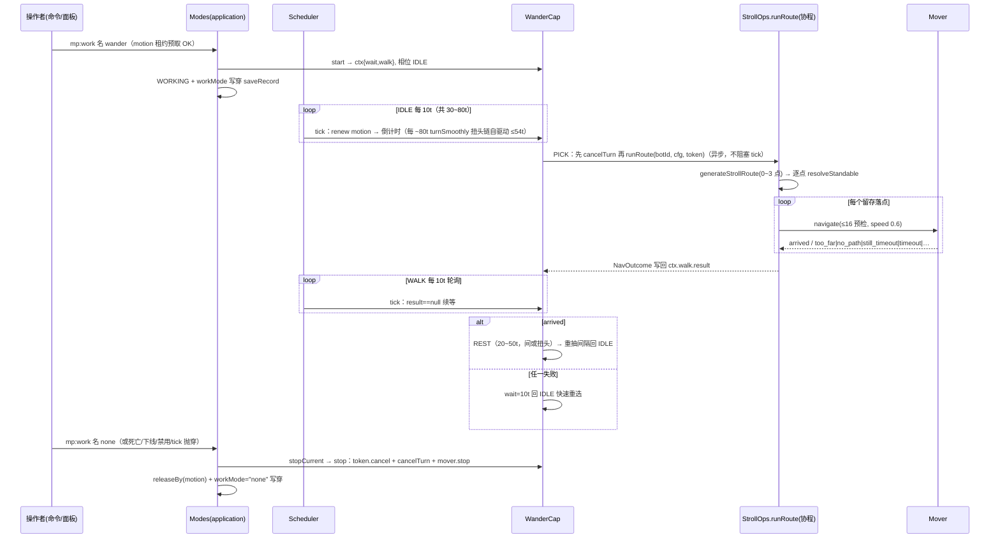

# 闲逛（wander）功能介绍与流程

> 一句话：切到闲逛模式后，假人以**当前站立点**为圆心、16 格半径内随机生成 0~3 个"顺延不折返、相邻点段距 ≤12"的路径点，经逐点地面修正后依次用全库统一的 ≤16 格普通导航走过去，到点后短暂休息、静止时节拍性扭头环顾，按"间隔—行走—短停"的走停节律永循环，不自停。

文中 `文件 · 符号` 标注对应 `scripts/` 下当前实现，逐条与代码行为核对。设计口径见 `docs/mockplayer/01-功能文档.md`（wander 行）与 `docs/mockplayer/11-归档源码对齐差异审查.md`【差异#41 长途导航整删、各调用方回归 ≤16 格单段导航】。目录中文名以 `scripts/domain/Catalog.ts` 的 `WORK_MODES` 表为准：id「wander」、label「闲逛」。

## 0. 概念速览

| 术语                               | 指代                                                                                                                                                                                                                                                                                                                                                                                                                                 | 位置                                                                                                                                            |
| ---------------------------------- | ------------------------------------------------------------------------------------------------------------------------------------------------------------------------------------------------------------------------------------------------------------------------------------------------------------------------------------------------------------------------------------------------------------------------------------ | ----------------------------------------------------------------------------------------------------------------------------------------------- |
| 走停节律相位机                     | 本能力全部状态：IDLE（间隔等待+偶发扭头）→ PICK（生成路线并发起路线协程）→ WALK（每 10t 轮询完成）→ REST（短停+扭头）→ 循环                                                                                                                                                                                                                                                                                                          | `application/Capabilities/Wander.ts` 的 `WanderCap` 类与 `WanderPhase` 类型                                                                     |
| 引擎周期 `WANDER_CYCLE_TICKS = 10` | 能力节拍粒度与配置节奏单位：一切"间隔/休息/重试"参数以引擎周期计，能力侧乘 10 换算 tick                                                                                                                                                                                                                                                                                                                                              | `application/Capabilities/Wander.ts` 的 `WANDER_CYCLE_TICKS` 常量                                                                               |
| `DEFAULT_WANDER_CONFIG`            | 节奏/范围/自然化参数唯一收敛点（写死、非运行时配置，"调参勿轻改"）：interval 3~~8、rest 2~~5、failRetry 1（单位=引擎周期），radius 16、minDist 3、路径点 0~3、speed 0.6，lookAroundInterval 8、lookSmallChance 0.7、lookSmallSpread 25°、lookTurnStepDeg 20°、lookTurnStepTicks 3t                                                                                                                                                   | `domain/Stroll.ts` 的 `WanderConfig` 接口与 `DEFAULT_WANDER_CONFIG` 常量                                                                        |
| 路线生成                           | 纯几何：第 1 点以前一点=圆心采样，60% 概率朝当前朝向 yaw±60°、水平距离 [minDist, max(minDist,radius)]（radius<minDist 异常配置防御钳到 minDist）；后续点**相对前一点**采样，水平距离 [minDist, STROLL_ROUTE_STEP_MAX=12]（直达导航上限 16 留余量），以前一点相对圆心的方位 ±60° 顺延（30% 兜底全向随机）；越出 radius 圆的点沿其与圆心连线收回圆沿——全部落圆内且相邻段距不超限；y 保留起点（地面修正归 engine）；0 点 = 本次保持不动 | `domain/Stroll.ts` 的 `generateStrollRoute()`、`STROLL_ROUTE_STEP_MAX` 常量                                                                     |
| 地面修正（可站立化）               | 对每个候选点从假人脚下层起**只向上**（≤`STROLL_MAX_RAISE = 8` 格）找"非固体头顶 + 下方稳定方块 + 非水"的真实站立位；失败点直接丢弃                                                                                                                                                                                                                                                                                                   | `engine/StrollOps.ts` 的 `StrollOps.resolveStandable()` 与 `domain/Stroll.ts` 的 `isStableBlockType()`（`UNSTABLE_MARKERS` 不完整方块黑名单）   |
| 路线协程                           | PICK 相位一次性发起的 async 单协程：逐点 `mover.navigate`（共享 CancelToken），任一点非 arrived 即整条中止；结果以 `NavOutcome` 枚举写回 `ctx.walk.result`，永不 reject                                                                                                                                                                                                                                                              | `engine/StrollOps.ts` 的 `StrollOps.runRoute()`                                                                                                 |
| ≤16 格普通导航                     | 全库统一单段导航原子（长途接力链已按差异#41 整删）：发起前水平距离预检不过即 `too_far` 直拒；10t 监测循环判到达（停下 + 水平 ≤1.5 + \|dy\|≤4）与停滞（连续两轮位置逐轴完全相同且未达标 → `still_timeout`）；总超时 600t                                                                                                                                                                                                              | `engine/Mover.ts` 的 `Mover.navigate()/watch()`、`domain/NavRules.ts` 的 `NAV_MAX_DISTANCE` 等常量与 `canNavigate()/isArrived()/isStuck()` 判定 |
| 分步平滑转身链                     | GameTest 无转速 API（F-18）：把一次转头拆成每 `lookTurnStepTicks`（3t）转 ≤20° 的 `teleport(原位, 新朝向)` 排程链，`clock.after` 自驱动、不走能力主循环；同一 bot 同时只跑一条链；PICK 发起路线前先 `cancelTurn()` 中止在途链，防跨相位叠加扭头                                                                                                                                                                                      | `engine/StrollOps.ts` 的 `StrollOps.turnSmoothly()/applyTurnStep()/cancelTurn()`、`domain/Stroll.ts` 的 `normalizeDeg()/pickLookTargetYaw()`    |
| motion 租约                        | 本能力唯一独占资源（HOLD，TTL 100t，tick 头每拍续租）：与跟随/钓鱼/宝库/采集/攻击等一切申请 motion 的模式互斥显形                                                                                                                                                                                                                                                                                                                    | `application/Capabilities/Wander.ts` 的 `requires()/tick()`、`domain/Leases.ts` 的 `ACTION_HOLD_TTL_TICKS`                                      |

## 1. 功能介绍

**闲逛**是一个工作模式（`WorkMode = "wander"`）：让假人在原地附近"有生活气息地"走动——不是巡逻、不是搬运、不产出任何业务效果，纯粹是模拟真人站着无聊四处溜达的表象行为（`docs/mockplayer/01-功能文档.md` wander 行"随机游走、休息、环顾"）。

- 目录定义：`domain/Catalog.ts` 的 `WORK_MODES` 表 `wander` 条目——label「闲逛」、help「以当前站位为中心的随机游走与休息」、`requiresLeases: ["motion"]`、`tier: "heavy"`（持续寻路/定时器，成本标记）。圆心即"每次选点时的当前站立点"，并无出生点锚定，长跑会随机漂移（见 §7）。
- 语义要点（以代码为准）：
  - **每次路线独立随机**：0~3 个点，0 点（概率约 1/4）本次什么都不做直接进休息——"原地发呆"也是节律的一部分（`generateStrollRoute()` 的 `count` 计算 + `StrollOps.runRoute()` 空表分支）。
  - **够不着即直拒**：所有距离口径回归差异#41 后的统一 ≤16 格普通导航——选点把各点收进圆心 16 格圆内（radius<minDist 的异常配置防御钳制），**相邻路径点段距同时在选点时约束**到 [3,12]（`STROLL_ROUTE_STEP_MAX`，越圆点收回圆沿），导航发起前再按水平距离预检兜底，正常选点不再产生够不着的目标（`domain/Stroll.ts` 的 `STROLL_DEFAULT_ROUTE_RADIUS` 注释"16 = 直达导航上限"、`Mover.navigate()` 的 `canNavigate` 预检）。
  - **慢速散步**：导航速度 0.6（`DEFAULT_WANDER_CONFIG.speed`），非全速行军。
  - **无业务交互**：不破坏、不放置、不攻击、不开容器、不拾取；行走途中被方块挡住就认输重选。
  - **永不自停**：无前提可失（不依赖物品/玩家/结构），导航失败只进"短等待回 IDLE 重选"的快速重试环，不落空闲（`WanderCap.walk()` 非 arrived 分支；对照 attack 文档 §6，`CapabilityHost.autoStop` 本能力不使用）。
- 前置条件：
  1. 假人**在线**（ACTIVE/WORKING 会话才能起跑；离线只预置记录，上线尾段回挂，见 §3）；
  2. 操作者 `canManage`（管理员或主人，`application/Lifecycle.ts` 的 `changeWorkMode()`）；
  3. 管理员未禁用（`workModeEnabled.wander`，`defaultEnabledModes()` 默认**开**；Admin 面板 tooltip 里"默认关闭"是旧文案，见 §8）；
  4. motion 租约空闲（被其它走位能力持有则拒绝启动并显示持有者）。

## 2. 启用与配置入口

```
/mp:work <假人名> wander           ──→ lifecycle.changeWorkMode → modes.change（在线即起跑/离线预置）
/mp:work <假人名> 闲逛              ──→ 中文别名同效（domain/Catalog.ts 的 modeAliasMap()）
/mp:work <假人名> [无参|list]       ──→ 渲染模式目录（wander 行 help「以当前站位为中心的随机游走与休息」）
假人面板 →「行为」→ 工作模式下拉「闲逛」 ──→ 同上 changeWorkMode（interface/Panels/Behavior.ts 的下拉按 workModeEnabled 过滤）
管理面板 → 全局配置 toggle `wm_wander`「⚠ 闲逛模式」 ──→ workModeEnabled.wander（禁用即停：在线假人批量切回空闲）
```

- 命令实现：`interface/Commands.Behavior.ts` 的 `BEHAVIOR_COMMANDS` 表 `mp:work` 条目；成功回执"已切换为 闲逛"，拒绝原因原样回显。
- 管理门：`interface/Panels/Admin.ts` 的 `MODE_META` 表 wander 条目（label/tooltip）与 `showGlobalConfig()`——toggle id 由 `wm_${m.id}` 派生；true→false 时对在线假人逐个 `changeWorkMode(…, "none")`。
- **没有任何可调参数入口**：节奏/半径/点数/速度/扭头全部收敛在 `DEFAULT_WANDER_CONFIG` 常量（逐假人配置项已删，单位=引擎周期），改行为只能改代码，且该常量自带"调参勿轻改"纪律注释。旧版 `wanderMode` 标签经 `domain/Migrate.ts` 的 `LEGACY_TAG_MODE` 表迁移为 `workMode="wander"`。

## 3. 启动序列（`Modes.change`，`application/Modes.ts` 的 `change()`）

```
changeWorkMode(viewer, botId, "wander")              （Lifecycle.changeWorkMode()：存在性 + canManage）
 └─ Modes.change(botId, "wander", now)
     ├─ config.workModeEnabled.wander 关 → 拒「该模式已被管理员禁用」
     ├─ 无会话（离线）→ 只写穿 record.workMode + saveRecord，下次上线/复活尾段
     │    attachAfterRestore → change 回挂生效
     ├─ 状态非 ACTIVE/WORKING → 拒「当前状态不可切换模式」
     ├─ 同模式且上下文在位 → 幂等成功
     ├─ stopCurrent(session)：先停旧能力（含在途路线协程的 cancel，见 §5）
     ├─ 租约预取（D-02）：motion HOLD / TTL 100t acquire；被占 → 拒「所需资源被占用（持有者：X）」
     ├─ 建上下文 {mode:"wander", phase:{name:"INIT", nextWakeAt:now}, data:{}}
     ├─ WanderCap.start：cap 缺失返「能力上下文缺失」；
     │    ctxOf 挂 data["wander"]：wait = randomBetween(3,8)×10（30~80t）、lookTick=0、
     │    walk={inFlight:false, token:null, result:null}；
     │    相位置 IDLE、nextWakeAt = now + 10（下一拍开始走节律）
     │    start 返错 → 撤租约、卸上下文、workMode 落 none、原因回显
     └─ transitTo("startWork") → WORKING；record.workMode="wander" 写穿保存；
        console.warn 切换日志；emit botWorkModeChanged（仅领域留档，无播报订阅）
```

## 4. 执行流程

### 4.1 主循环：Scheduler 驱动的 10t 节拍相位机

主循环由 Scheduler 唯一驱动（`application/Scheduler.ts` 的 `runSession()`）：每 tick 先 `leases.expire`，再对 `state === "WORKING"` 且 `now >= capability.phase.nextWakeAt` 的会话回调 `cap.tick`。tick 同步、短、无 await、无自旋（F-18/D-05）——所有"等待"唯一表达为 `phase.nextWakeAt`。

每一拍 `WanderCap.tick()` 的固定前奏：会话记录已被移除则直接停摆 return（管线负责收会话）；否则 `leases.renew("motion", …, ACTION_HOLD_TTL_TICKS)` 续租（10t 心跳 vs 100t TTL，十个拍的冗余），再按相位分派：

```
相位    每拍（10t）动作                                                    退出条件 → 去向
──────────────────────────────────────────────────────────────────────────────────────
IDLE   lookTick++；每满 lookAroundInterval(8) 拍（≈80t）扭头一次；        wait≤0 → PICK（nextWakeAt=now，
       wait -= 10                                                    下一拍即执行）
PICK   先 cancelTurn 中止在途扭头链（跨相位不叠加行走期 teleport）；新建       立即 → WALK（10t 后首查）
       CancelToken，ctx.walk 置在途；发起 strollOps.runRoute
       （radius/minDist/点数/速度取 DEFAULT_WANDER_CONFIG）；
       协程 then/catch 只把 NavOutcome 纯结果写回 ctx.walk.result
WALK   result 仍为 null → 原地续等（在途）；                           arrived → REST（wait=random(2,5)×10）
       非 null：清在途账；                                               其它 → IDLE（wait=failRetry×10=10t）
                                                                    （失败"快速重试"，不进长休息）
REST   同 IDLE：每 8 拍偶尔扭头；wait -= 10                            wait≤0 → 重抽 interval 回 IDLE
```

文字流程图：

```
Modes.change("wander") ─→ [IDLE, wait=30~80t]
   │（IDLE 每 10t：倒计时，每 ~80t 平滑扭头一次）
   ▼
 [PICK] ─ runRoute 协程发起 ─→ [WALK] ─ result=arrived ─→ [REST] ─→ [IDLE] …（循环节律）
   任一点导航失败/全点修正失败(no_path)/异常(error) ──→ 短等 10t 回 [IDLE] 重选路线
```

### 4.2 路线协程（engine `StrollOps.runRoute`，PICK 相位一次性发起）

```
runRoute(botId, req, token)
 ├─ botOf/botValid 不过 → "unavailable"（能力侧按失败快速重试，死亡/下线另有生命周期管线兜底）
 ├─ 读 bot.getRotation().y（抛穿按 0：路线照走，只是不带朝向偏置）
 ├─ generateStrollRoute(圆心=bot.location 实时位置, yaw, radius=16, minDist=3, 点数 0~3)
 │    第 1 点相对圆心采样；后续点相对前一点采样、水平段距 [3,12]；
 │    越出 radius 圆的点沿圆心连线收回圆沿（整条路线既在圆内、段段可达）
 │    空表 → 直接 "arrived"（本次保持不动 → 进 REST，发呆也是节律）
 ├─ 逐点 resolveStandable 地面修正：只向上 ≤8 格找"非固体头顶+下方稳定方块(非水、
 │    不在 UNSTABLE_MARKERS 黑名单)+头顶非液体"；命中则取格中心 (x+0.5, y, z+0.5)；
 │    区块未加载/抛穿/超修正上限/头顶是水 → 该点丢弃
 │    有生成但全失败 → "no_path"（回 IDLE 快速重试）
 └─ 对留存点【按生成顺序】逐点 await mover.navigate(point, {speed:0.6, token})
      任一点非 arrived（too_far/no_path/still_timeout/timeout/entity_invalid/error）
      → 整条路线就此中止，返回该结果（不换路、不重试后续点）
      全部到达 → "arrived"
 全函数 try-catch，异常归 "error"，永不 reject（防异步抛穿）
```

补充三点代码事实：

1. **发起路线前中止扭头链**：`WanderCap.pick` 先 `strollOps.cancelTurn(botId)`——IDLE/REST 末拍发起的扭头链（最长约 54t）会跨入行走相位，先中止它，行走期间不再叠加 teleport 扭头。
2. **行走目标值不参与选点**：路线链路只用几何约束（圆内+段距）与地面稳定方块筛选；`strollWalkValue()`/`selectStrollTarget()`/`pickDirectionalStrollPoint()`/`GRASS_BLOCK_BONUS` 当前仅被 `tests/domain.Stroll.test.ts` 引用，不在生产链路上（"官方算法"实际生效的只有稳定方块筛选半段）。
3. **段间距离口径**：相邻点段距在选点时即约束到 [minDist, STROLL_ROUTE_STEP_MAX=12]，越圆点收回圆沿——分居圆两侧相距 ~32 格导致整条路线 `too_far` 中止的情形已在源头消除；`Mover.navigate` 的实时站位预检保留为异常兜底。

### 4.3 导航原子（engine `Mover` + domain `NavRules`）

闲逛与普通走位能力共用同一套原子，无特化：

- **发起**（`Mover.issue()`）：`stopMoving()` 清残留 → `lookAtLocation`（一次性、失败吞）→ `navigateToLocation(target, 0.6)`；`isFullPath=false` 或抛穿 → `no_path`。
- **监测**（`Mover.watch()`，10t 一轮）：位置三轴 `!==` 精确比较判"未动"（**绝不含容差**——静止判定依赖引擎逐 tick 位置完全一致）；到达 = 已停下（连续静止 ≥`NAV_STILL_LIMIT=1` 轮）+ 水平 ≤1.5 + \|dy\| ≤4（F-14 纵向容差）；停下但未达标 → `isStuck` → `still_timeout`（即时上报，能力侧走失败重试）；总超时 600t → `timeout`；实体中途失效 → `entity_invalid`；token 取消 → `error`。
- **急停**：`Mover.stop()`（能力 stop 路径）。闲逛**不使用** nearby/onNear/onMoving 回调与 timeoutTicks 预算（全缺省）。

### 4.4 扭头与分步转身链（IDLE/REST 静止相位）

`WanderCap.lookAround()`：`ops.readPose` 读当前 yaw（读不到按 0）→ `pickLookTargetYaw(yaw, 0.7, 25°)`：七成小幅 ±25° 扭动、三成全向随机（360° 大转身）→ `strollOps.turnSmoothly(botId, target, 20°, 3t)`。

链本体（`turnSmoothly()/applyTurnStep()`）：`normalizeDeg(target−current)` 取最短弧；|Δ|<1° 不启动；`turns` Map 按 botId 防重入（在转即跳过）；每步 `teleport(原位, 新 yaw)` 转 ≤20°（pitch 回读现值），步间 `clock.after(3t)` 自驱动——**不走能力主循环、不占 nextWakeAt**；最长约 360/20×3=54t。实体失效/teleport 抛穿 → 剩余角直接放弃（链自然终止）。取消出口：`cancelTurn()`（删除 turns 表项即断链），`WanderCap.pick` 发起路线前与 `WanderCap.stop` 各调一次——跨相位扭头链不残留、行走期不叠加。

### 4.5 租约与互斥节拍

- 仅 motion 一类租约：启动预取（`Modes.change()` 循环）+ 每拍 `tick` 头 renew（含 WALK 在途期间，Scheduler 每 10t 必唤起能力）+ 卸载 `releaseBy` 必撤（`Modes.stopCurrent()`）。
- 与攻击（占位 motion）、跟随、钓鱼、宝库、采集等互斥**显形**：冲突在切换时直接拒绝并回显持有者，而非运行中打架。
- 转身链不持 gaze 租约（直接 teleport 写 rotation，绕开 F-06 租约化的例外口径）；靠"单假人同时只跑一个能力 + stop 必 cancelTurn + pick 发起路线前 cancelTurn"保证无竞争者。

## 5. 停止与结束条件

| 触发                                               | 路径                                                                                  | 现场清理                                                                                                                                                                                                                                                                 |
| -------------------------------------------------- | ------------------------------------------------------------------------------------- | ------------------------------------------------------------------------------------------------------------------------------------------------------------------------------------------------------------------------------------------------------------------------ |
| 手动切回空闲（`mp:work <名> none` / 面板「空闲」） | `Modes.change → stopCurrent`                                                          | `WanderCap.stop()`：`ctx.walk.token?.cancel()`（在途路线协程经 `sleepTicks` 的 token race 即刻返回 error 终止，逐段导航不再续发）+ `strollOps.cancelTurn(botId)`（断转身链）+ `mover.stop(botId)`（引擎急停）；随后 `stopCurrent` 撤净 motion 租约、workMode="none" 写穿 |
| 切换到其它模式                                     | 同上（先停闲逛再起新模式）                                                            | 同左；注意顺序不变量——stop 必须在 capability 仍挂位时执行（`Modes.stopCurrent()` 头注）                                                                                                                                                                                  |
| 下线管线                                           | `Lifecycle` 下线首步 `stopCurrent`                                                    | 会话销毁上下文随亡；物品/姿态走导出管线                                                                                                                                                                                                                                  |
| 死亡                                               | `handleDeath → stopCurrent` → DYING；自动重生则尾段 `attachAfterRestore` **回挂重逛** | 回挂失败私信主人原因并落空闲                                                                                                                                                                                                                                             |
| 管理员禁用 wander                                  | `Admin.ts` 的 `showGlobalConfig()` 提交回调对在线假人批量切 none                      | 同手动停止                                                                                                                                                                                                                                                               |
| 能力 tick 抛穿                                     | `Scheduler.runSession()` catch → `stopCurrent` + workMode="none" 写盘 + 错误日志      | 实际抛穿面极小（runRoute/turnSmoothly 内部已全量归枚举），只停该假人                                                                                                                                                                                                     |
| 记录被移除                                         | `tick()` 头 `runtime.record() === undefined` → 停摆 return                            | 不动世界，等管线收会话                                                                                                                                                                                                                                                   |

**不是**停止条件的情况：导航任何失败枚举（too_far/no_path/still_timeout/timeout/entity_invalid/error）与"全点地面修正失败"一律只触发 **10t 短等待回 IDLE 重选路线**（`WanderCap.walk()` 失败分支，头注"导航失败短等待回 IDLE 重选，不进长休息"）；`unavailable` 同理——瞬态离线窗自愈合，真死亡/下线由生命周期管线接管。租约 TTL 过期（忘续租）由 Scheduler `expire` 撤销，motion 过期无 engine 侧中性化副作用。

## 6. 与其它子系统的交互

- **Clock / Scheduler**（`engine/Clock.ts`、`application/Scheduler.ts`）：唯一时钟与唯一驱动者；能力等待全部表达为 `phase.nextWakeAt`（D-05），唯一例外是转身链经 `clock.after` 自驱动、路线协程经 `clock.sleep` 挂起（F-18 允许：不占 tick 回调）。经验回写/脏字段 debounce 冲刷与所有 WORKING 会话相同。
- **租约（Leases）**：见 §4.5，仅 motion。
- **SaveGate / 记录**：模式切换即写穿 `workMode`，重启/离线后假人"记得"自己是闲逛模式，上线自动回挂续逛；运行期闲逛本身**零业务落库**（不写位置——与跟随不同，`onMoving` 回调不挂）。
- **Events / Notify**：`botWorkModeChanged` 仅领域留档无播报；游走过程无游戏内广播。
- **ToolGuard / 手部 / 注视引擎（Gaze）/ 容器**：完全无关——不持 hands/breaking/gaze 租约，不调 `Gaze`/`ContainerOps`/`HarvestOps`；行走损耗饥饿由通用状态管线兜底，与本节拍循环无耦合。
- **EntityGateway / Atomic**：实体一律经 `botOf()` 解析、`botValid()` 校验；世界读（getRotation/getBlock/teleport/navigateToLocation）全部 try-catch 归枚举。

## 7. 已知限制与引擎约束

- **性能分级 heavy**：常驻随机寻路 + 每拍定时器轮询，多人同时开闲逛开销明显（Admin tooltip 明示）；这是 tier 标记，不是开关。
- **无出生点锚定**：圆心永远取发起选点时的实时站位，多轮路线可叠加漂移，理论上能越逛越远（Catalog help「以当前站位为中心」与实现口径一致）。
- **只向上修正、够不着即弃**：地面修正上限 8 格且无向下搜索——坑沿/坎下目标直接被弃；导航统一 ≤16 格普通口径（差异#41 定案，长途接力已整删），跨障能力就是引擎寻路本身，卡墙 10t 即 `still_timeout` 放弃本次路线。
- **段距在选点时即约束**：相邻点水平段距 [3,12]（`STROLL_ROUTE_STEP_MAX`），越圆点收回圆沿——不再产生"分居圆两侧相距 ~32 格"的超限段，整条路线因 `too_far` 中止的情形在源头消除；`Mover.navigate` 预检仅作异常兜底。
- **目标值不参与选点**：选点是纯几何随机 + 稳定方块筛选，光照/草方块加成（`strollWalkValue`/`GRASS_BLOCK_BONUS`）为仅测试引用的资产，不在生产链路（§4.2）。
- **参数不可运行时调**：`DEFAULT_WANDER_CONFIG` 硬编码；单位是引擎周期（10t）而非 tick，改值时注意换算。
- **纪律项**：D-01 单例零实例字段（状态全挂 `data["wander"]`）；F-18 tick 同步短小（路线在协程、转身在排程链）；F-14 到达判定 Y 容差 4；异步永不 reject（防引擎侧抛穿崩溃）。

## 8. 时序图（启用→常驻循环→停止）


